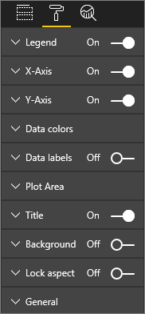

<properties
   pageTitle="The report editor...Take a tour"
   description="The report editor...Take a tour."
   services="powerbi"
   documentationCenter=""
   authors="mihart"
   manager="erikre"
   backup=""
   editor=""
   featuredVideoId="IkJda4O7oGs"
   tags=""
   qualityFocus="no"
   qualityDate=""/>

<tags
   ms.service="powerbi"
   ms.devlang="NA"
   ms.topic="article"
   ms.tgt_pltfrm="NA"
   ms.workload="powerbi"
   ms.date="05/16/2017"
   ms.author="mihart"/>
# The report editor...Take a tour

The report editor in Power BI service and the report editor in Power BI Desktop are very similar. The video shows the report editor in Power BI Desktop and this article shows the report editor in Power BI service. 

<iframe width="560" height="315" src="https://www.youtube.com/embed/IkJda4O7oGs" frameborder="0" allowfullscreen></iframe>

In Power BI service, the *report editor* is only available in [Editing View](powerbi-service-go-from-reading-view-to-editing-view.md). To open a report in Editing view, you must be a report owner.

The Power BI report editor is made up of 3 sections:  

1. **Fields**, **Visualizations**, and **Filters** panes
2. top navigation bars    
3. report canvas     

## 1. The report editor panes

There are 3 panes visible when you first open a report: Visualizations, Filters, and Fields. The panes on the left side, Visualizations and Filters, control what your visualizations look like -- type, colors, filtering, formatting.  And the pane on the right side, Fields, manages the underlying data being used in the visualizations. 

The content displayed in the report editor varies by selections you make in the report canvas.  For example, when you select an individual visual, 

|                                                             |         |
|---------------------------------------------- |---------|
|    | <ul><li>The top of the Visualization pane identifies  the type of visual in use; in this example,  a Clustered column chart.  </li> <li>The bottom of the Visualization pane  (you may have to scroll down) displays the  fields being used in the visual. This chart is  using FiscalMonth, DistrictManager, and  Total Sales Variance.   </li><li>The Filters pane (you may have to scroll down)  displays any filters that have been applied.   </li><li>The Fields pane lists the tables available and,  if you expand a table's name, the fields that  make up that table. Yellow font lets you know  that at least one field from that table is being  used in the visualization.  </li><li> To display the formatting pane, for  the selected visualization, select the  paint roller icon.  </li><li> To display the Analystics pane, select the magnifying glass icon.</ul>       |
|          |          |

## The Visualizations pane (from top to bottom)

Here is where you select a visualization type. The small pictures are called *templates*. In the image above, the Clustered bar chart is selected. If you don't select a visualization type first, but instead start building a visualization by selecting fields, Power BI will pick the visualization type for you. Yuo can keep Power BI's selection, or change the type by clicking a different template. Switch as many times as you need to find the visualization type that best represents your data.

### Manage the fields used in your visual.

The buckets (sometimes called *wells*) shown in this pane vary depending on what type of visualization you have selected.  For example, if you've selected a bar chart, you'll see buckets for: Values, Axis, and Legend. When you select a field, or drag it onto the canvas, Power BI adds that field to one of the buckets.  You can also drag fields from the Fields list directly into the buckets.  Some buckets are limited to certain types of data.  For example, **Values** won't accept non-numeric fields. So if you drag an **employeename** field into the **Values** bucket, Power BI changes it to **count of employeename**.

### Remove a field

To remove a field from the visualization, select the **X** to the right of the field name.

For more information, see [Add visualizations to a Power BI report](powerbi-service-add-visualizations-to-a-report-i.md)

### Format your visuals

Select the paint roller icon to display the Format pane. 

The formatting possibilities are almost endless.  To learn more, explore on your own, or visit these articles:

-   [Customizing  visualization title, background and legend](powerbi-service-tutorial-customize-visualization-title-background-and-legend.md)
-   [Color formatting](powerbi-service-getting-started-with-color-formatting-and-axis-properties.md)
-   [Customizing X-axis and Y-axis properties](powerbi-service-tutorial-customize-x-axis-and-y-axis-properties.md)

###   Add analytics to your visualizations

Select the magnifying glass icon to display the Analytics pane. 

    
With the Analytics pane in Power BI service, you can add dynamic reference lines to visualizations, and provide focus for important trends or insights. To learn more, see [Analytics pane in Power BI service](powerbi-service-analytics-pane.md) or [Analytics pane in Power BI Desktop](powerbi-desktop-analytics-pane.md).

* * *

## The Filters pane

View, set, and modify page, report, and visual-level filters.

For more information, see [Add a filter to a report](powerbi-service-add-a-filter-to-a-report.md).

* * *

## The Fields pane 

The Fields pane displays the tables and fields that exist in your data and are available for you to use to create visualizations.

|                                                             |         |
|---------------------------------------------- |---------|
|    | <ul><li>Drag a field onto the page to start a new  visualization.  You can also drag a field onto  an existing visualization to add the field to  that visualization.  </li> <li>When you add a checkmark next to a field,  Power BI adds that field to the active (or new)  visualization. And it also decides which bucket  to place that field into.  For example, should  the field be used a legend, axis,or value?  Power BI makes a best-guess and you can move  it from that bucket to another if necessary.   </li><li>Either way, each selected field is added to the Visualizations pane in the report editor.</li></ul>       |

**NOTE**: If you're using Power BI Desktop, you'll also have options to show/hide fields, add calculations etc.

### What do the field icons mean?

- **∑ Aggregates**
  An aggregate is a numeric value that will be summed or averaged, for example. Aggregates are imported with the data (defined in the data model your report is based on).
  For more information, see [Aggregates in Power BI reports](powerbi-service-aggregates.md).

-   **Calculated measures (also called calculated fields)**  
	Each calculated field has its own hard-coded formula. You can’t change the calculation, for example, if it’s a sum, it can only be a sum. For more information, [read Understanding measures](powerbi-desktop-measures.md)

-  **Unique fields**  
	Fields with this icon were imported from Excel and are set to show all values, even if they have duplicates. For example your data might have two records for people named 'John Smith', and each will be treated as unique -- they won't be summed.  

-  ** Geography fields**  
	Location fields can be used to create map visualizations. 

-  ** Hierarchy**  
    Select the arrow to reveal the fields that make up the hierarchy. 

* * *

## 2. The top navigation bar
The actions available from the top navigation bar are numerous; with new actions being added all the time. For information about a particular action, use the Power BI Documentation Table of Contents or Search box.

##    3. The report canvas

The report canvas is where your work displays. When you use the Fields, Filters, and Visualizations panes to create visuals, they are built and displayed on your report canvas. Each tab at the bottom of the canva represents a page in the report. Select a tab to open that page. 

## Next Steps:

[Create a report](powerbi-service-create-a-new-report.md)

[Edit a report](powerbi-service-interact-with-a-report-in-editing-view.md)

Read more about [reports in Power BI](powerbi-service-reports.md)

[Get started with Power BI](powerbi-service-get-started.md)

[Power BI - Basic Concepts](powerbi-service-basic-concepts.md)

More questions? [Try the Power BI Community](http://community.powerbi.com/)
