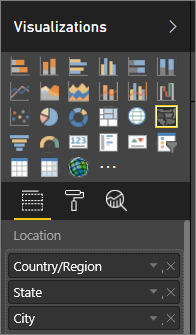
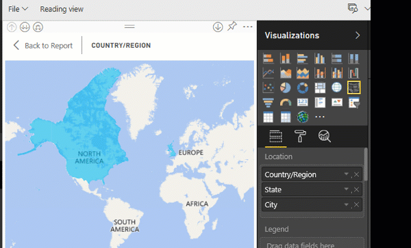

<properties
   pageTitle="Tips and Tricks for Power BI Map visualizations"
   description="Tips and Tricks for Power BI Map visualizations"
   services="powerbi"
   documentationCenter=""
   authors="mihart"
   manager="erikre"
   backup=""
   editor=""
   tags=""
   featuredVideoId="ajTPGNpthcg"
   qualityFocus="monitoring"
   qualityDate=""/>

<tags
   ms.service="powerbi"
   ms.devlang="NA"
   ms.topic="article"
   ms.tgt_pltfrm="NA"
   ms.workload="powerbi"
   ms.date="06/07/2017"
   ms.author="mihart"/>

# Tips and Tricks for Power BI Map visualizations

Power BI integrates with Bing to provide default map coordinates (a process called geo-coding) so you can create maps. Bing uses some algorithms and hints to try to get the right location, but it's a best guess. It first looks for data that has been categorized as a type of geo data and if none exists, it then uses column names to make a best guess.  

To increase the likelihood of correct geo-coding, use the following tips. The first set of tips is for you to use if you have access to the dataset itself. And the second set of tips is things you can do in Power BI if you don't have access to the dataset.

##    What is sent to Bing?
Power BI service and Power BI Desktop send Bing the geo data it needs to create the map visualization. This may include the data in the **Location**, **Latitude**, and **Longitude** buckets and geo fields in any of the **Report level**, **Page level**, or **Visual level** filter buckets. Exactly what is sent varies by map type.  

-    For maps (bubble maps), if latitude and longitude are provided then no data is sent to Bing. Otherwise, any data in the Location (and filter) buckets is sent to Bing.     
- Filled maps require a field in the Location bucket; even if latitude and longitude are provided. Whatever data is in the Location, Latitude, or Longitude buckets is sent to Bing.

    In the example below, the field **Vendor** is being used for geo-coding, so all vendor data is sent to Bing. Data from the **Size** and **Color saturation** buckets is not sent to Bing.

    

    In this second example below, the field **Territory** is being used for geo-coding, so all territory data is sent to Bing. Data from the **Legend** and **Color saturation** buckets is not sent to Bing.

    

##  In the dataset: tips to improve the underlying dataset

If you have access to the dataset that is being used to create the map visualization, there are a few things you can do to increase the likelihood of correct geo-coding.

**1. Categorize geographic fields in Power BI Desktop**

In Power BI Desktop, you can ensure fields are correctly geo-coded by setting the *Data Category* on the data fields. Select the desired table, go to the **Advanced** ribbon and then set the **Data Category** to **Address**, **City**, **Continent**, **Country/Region**, **Country**, **Postal Code**, **State** or **Province**. These data categories help Bing correctly encode the date. To learn more, see [Data categorization in Power BI Desktop](powerbi-desktop-data-categorization.md).

**2. Use more than one location column.**    
 Sometimes, even setting the data categories for mapping isn't enough for Bing to correctly guess your intent. Some designations are ambiguous because the location exists in multiple countries or regions. For example, there's a ***Southampton*** in England, Pennsylvania, and New York.

 If you only have a City column, Bing may have a hard time geo-coding. Add additional geo columns to make the location unambiguous.  Sometimes all it takes is adding one more location column to the dataset - in this case state/province. And don't forget to categorize it properly, see #1 above.

**3.  Use geo-hierarchies and your colleagues can then drill to different "levels" of location**

Power BI uses Bing's [unstructured URL template service](https://msdn.microsoft.com/library/ff701714.aspx) to get the latitude and longitude coordinates based on a set of address values for any country. If your data doesn't contain enough location data, add those columns and categorize them appropriately.

Used together in the Power BI **Location** bucket, these columns can become a geo-hierarchy. For example, columns for Country/Region, State/Province, and City. In Power BI your colleagues can drill up and down using the geo-hierarchy.

  

   

**3. Use specific Latitude and Longitude**

Add latitude and longitude values to your dataset. This removes any ambiguity and returns results more quickly. Latitude and Longitude fields must be in *Decimal Number* format, which you can set in the data model.

<iframe width="560" height="315" src="https://www.youtube.com/embed/ajTPGNpthcg" frameborder="0" allowfullscreen></iframe>

##  In Power BI: tips to get better results when using map visualizations

**1.    Use latitude and longitude fields (if they exist)**

In Power BI, if the dataset you are using has fields for longitude and latitude -- use them!  Power BI has special buckets to help make the map data unambiguous. Just drag the field that contains your latitude data into the **Visualizations > Latitude** area.  And do the same for your longitude data. When you do this, you also need to fill the *Location* field when creating your visualizations. Otherwise, the data is aggregated by default, so for example, the latitude and longitude would be paired at the state level, not the city level.

 

## See also

[Power Bi visualizations](powerbi-service-visualizations-for-reports.md)

More questions? [Try the Power BI Community](http://community.powerbi.com/)
