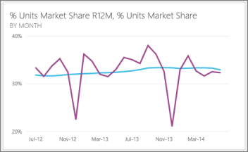
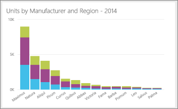
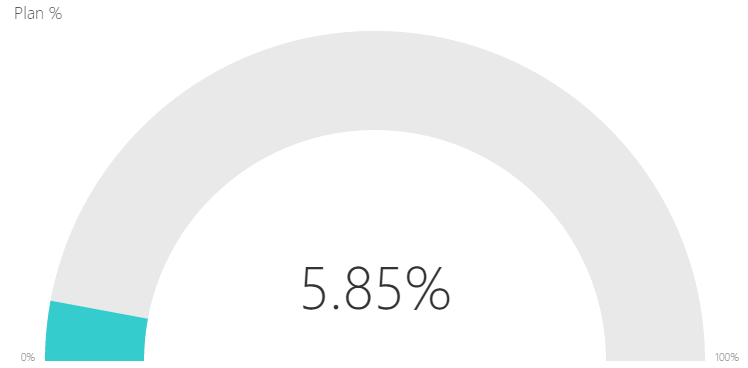

<properties pageTitle="Tips for designing a great Power BI dashboard" description="Tips for designing a great Power BI dashboard" services="powerbi" documentationCenter="" authors="v-anpasi" manager="mblythe" editor=""/>
<tags ms.service="powerbi" ms.devlang="NA" ms.topic="article" ms.tgt_pltfrm="NA" ms.workload="powerbi" ms.date="06/26/2015" ms.author="v-anpasi"/>
#Tips for designing a great Power BI dashboard

[← All about dashboards](https://support.powerbi.com/knowledgebase/topics/65158-all-about-dashboards)

Now that you've created a dashboard and added some tiles, think about how to make your dashboard not just pretty, but also functional. In general, that means making the most important information stand out, and making it clean and uncluttered.

Here are a few tips.

## What to put in a dashboard

Consider who your audience is. What are the key metrics that will help them make decisions?

Keep in mind that the dashboard is an overview, a single place to monitor the current state of the data. The dashboard is based on underlying reports and datasets, and those can contain loads of details. Your readers can drill into the reports from your dashboard. So don't put the detail on the dashboard unless that's what your readers need to monitor.

Where is the dashboard going to be displayed? If it will be on a large monitor, you can put more content on it. If readers will view it on their tablets, then fewer tiles will be more readable.

## Keep it to one screen

Because dashboards are meant to show important information at a glance, having all the tiles on one screen is best. Can you avoid scroll bars on your dashboard?

## Make the most important information biggest

If the text and visualizations on your dashboard are all the same size, your readers will have a hard time focusing on what's most important. For example, card visualizations are a good way to display an important number prominently:

Read about [creating a tile with just a number](http://support.powerbi.com/knowledgebase/articles/436733-pin-a-number-tile-to-a-dashboard).

## Put the most important information in the upper-left corner

Most people read from left to right and top to bottom, so the upper-left corner is where their eyes go first.

## Use the right visualization for the data

For example:
-   Line charts are often best for dates and for viewing trends over time.

    
    
-   Bar and column charts are great for comparing values in categories side by side. 
 
    

    Pay attention to how [charts are sorted](http://support.powerbi.com/knowledgebase/articles/441746-change-how-a-chart-is-sorted).  If you want to draw attention to the highest or lowest number, sort by the measure.  If you want people to be able to quickly find a particular category within many other categories, sort by the axis. 
    
-   Pie charts are best if they have fewer than eight categories. Because you can't compare values side by side, it’s harder to compare values in a pie chart than in bar and column charts. Pie charts can be good for viewing part-to-whole relationships rather than for comparing the parts.

-   Gauge charts are great for displaying the current status in the context of a goal.  
    
    

##See Also:

[Dashboards in Power BI](http://support.powerbi.com/knowledgebase/articles/424868-dashboards-in-power-bi)  
[Power BI - Basic Concepts](http://support.powerbi.com/knowledgebase/articles/487029-power-bi-preview-basic-concepts)

This is a draft topic in development. Feedback? Click **Contact support** on the right side of this page.  