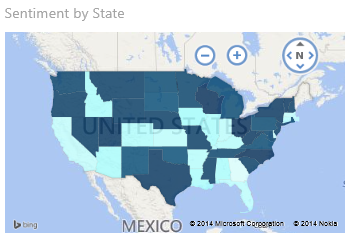
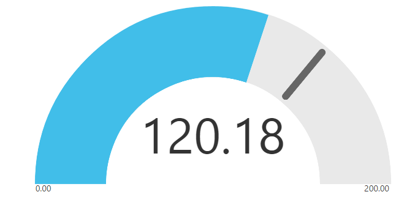
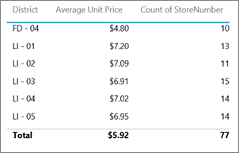
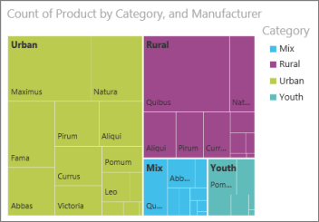

<properties pageTitle="Tips for Power BI visualizations" description="Tips for Power BI visualizations" services="powerbi" documentationCenter="" authors="v-anpasi" manager="mblythe" editor=""/>
<tags ms.service="powerbi" ms.devlang="NA" ms.topic="article" ms.tgt_pltfrm="NA" ms.workload="powerbi" ms.date="06/26/2015" ms.author="v-anpasi"/>
#Tips for Power BI visualizations
[← Visualizations in reports](https://support.powerbi.com/knowledgebase/topics/65160-visualizations-in-reports)

There are so many visualization types to choose from.  Use these tips to help you pick the right visualization for your data.  For the full list of Power BI visualization types, see [Visualization types available in Power BI reports](http://support.powerbi.com/knowledgebase/articles/469552-visualization-types-available-in-power-bi-reports).

-   **Filled maps (aka Choropleth):** are maps with the area filled in. The more intense the color, the larger the value.

    
    
-   **Funnels:** help visualize a process that has stages and items flow sequentially from one stage to the next. Use a funnel when there is a sequential flow between stages, such as a sales process that starts with leads and ends with purchase fulfillment.

      
-   **Gauge charts:** display current status in the context of a goal.

    
    
-   **Line charts:** emphasize the overall shape of an entire series of values, usually over time.

    
    
-   **Maps:** are used to associate both categorical and quantitative information with spatial locations.

      
-   **Scatter/bubble charts:** display relationships between 2 (scatter) or 3 (bubble) quantitative measures -- whether or not, in which way, and to what degree.

      
-   **Tables:** work well with quantitative comparisons among items where there are many categories.

      
-   **Tree maps:** are charts of colored rectangles, with size representing value. They can be hierarchical, with rectangles nested within the main rectangles.

    

##See Also:

[Visualizations in reports](http://support.powerbi.com/knowledgebase/articles/434821-visualizations-in-power-bi-reports)  
[Tips for designing dashboards](http://support.powerbi.com/knowledgebase/articles/433616-tips-for-designing-a-great-dashboard)  
[Power BI - Basic Concepts](http://support.powerbi.com/knowledgebase/articles/487029-power-bi-preview-basic-concepts)