<properties
   pageTitle="ArcGIS in Power BI (Tutorial)"
   description="Tutorial: ArcGIS in Power BI"
   services="powerbi"
   documentationCenter=""
   authors="mihart"
   manager="erikre"
   backup=""
   editor=""
   tags=""
   featuredVideoId="EKVvOZmxg9s"
   qualityFocus="no"
   qualityDate=""/>

<tags
   ms.service="powerbi"
   ms.devlang="NA"
   ms.topic="article"
   ms.tgt_pltfrm="NA"
   ms.workload="powerbi"
   ms.date="01/31/2017"
   ms.author="mihart"/>

# Tutorial: ArcGIS maps in Power BI (Preview)

ArcGIS Maps for Power BI (Preview) by [Esri](https://www.Esri.com/powerbi) geo-enables Power BI. ArcGIS Maps offer enhanced mapping capability, demographic data, and even more compelling map visualizations so you can tell your best story.

## User consent
ArcGIS Maps for Power BI is provided by [Esri](https://www.esri.com). Your use of ArcGIS Maps for Power BI is subject by Esri's terms and privacy policy. Power BI users wishing to use the ArcGIS Maps for Power BI visual, need to accept the consent dialog.

**Resources**

[Terms](https://go.microsoft.com/fwlink/?LinkID=826322)

[Privacy Policy](https://go.microsoft.com/fwlink/?LinkID=826323)

[ArcGIS Maps for Power BI product page](https://www.esri.com/powerbi)

 

## Enable the ArcGIS map preview

The ArcGIS map visual is in preview, and must be enabled in Power BI. This tutorial uses the [Retail Analysis sample](powerbi-sample-retail-analysis-take-a-tour.md). To enabled **ArcGIS Maps for Power BI**:

1. Select **File > Options and Settings > Options > Preview Features**.

2. Select the **ArcGIS Maps for Power BI** checkbox. You'll need to restart Power BI after you make the selection.

    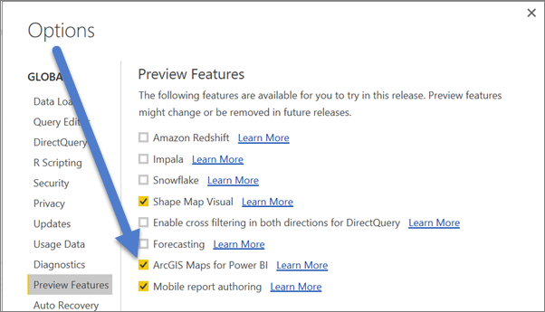

3. Open a report in Editing view and select the ArcGIS Maps for Power BI icon from the Visualizations pane.

    

4. Power BI displays the user consent dialog, select **OK** to continue.

    

5. Power BI adds an empty ArcGIS map template to the report canvas.

    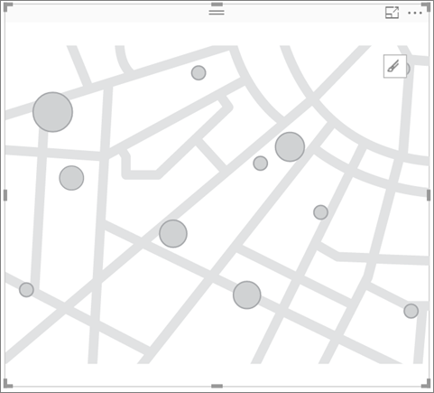

 

## Create an AcrGIS map visual
Watch Will create a few different ArcGIS map visualizations and then use the steps below to try it out yourself.

<iframe width="560" height="315" src="https://www.youtube.com/embed/EKVvOZmxg9s" frameborder="0" allowfullscreen></iframe>

1. From the **Fields** pane, drag a data field to the **Location** or **Latitude** and **Longitude** buckets.

    >[AZURE.NOTE] ArcGIS Maps for Power BI will automatically detect if the fields you've selected are best viewed as a shape or a point on a map. You can adjust the default in the settings (see below).

    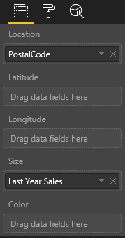

2.  From the **Fields** pane, drag a measure to the **Size** or **Color** buckets to adjust how the data is shown.
   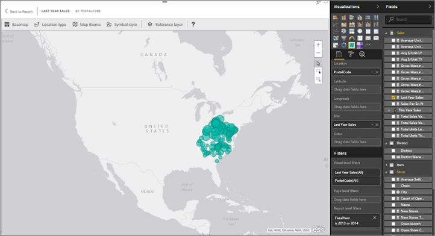

 

## Settings and formatting for AcrGIS maps
To access **ArcGIS Maps for Power BI** formatting features:

1. Select the In-Focus edit mode icon within the visual.

   

2. Access additional features through the ribbon contained within the visual. Each feature, when selected, opens a task pane that provides detailed options. 

   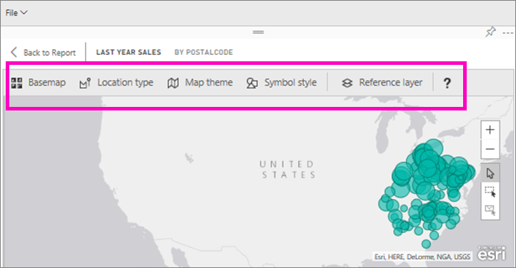

   >  [AZURE.NOTE]  For more information about the settings and features, see **Detailed documentation** below.

3. To return to the report, select **Back to Report** from the top-left corner of your report canvas.

 

## Detailed documentation
**Esri** provides [comprehensive documentation](https://go.microsoft.com/fwlink/?LinkID=828772) on the feature set of **ArcGIS Maps for Power BI**.

### Features overview

#### Base Maps
Four base maps are provided: Dark Gray Canvas, Light Gray Canvas, OpenStreetMap, and Streets.  Streets is ArcGIS's standard base map.

To apply a base map select it in the task pane.

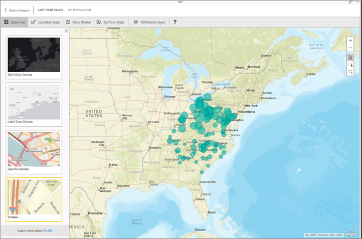

#### Location type
ArgGIS Maps for Power BI automatically detects the best way to show data on the map. It selects from Points or Boundaries. The Location type options allow you to fine tune these selections.

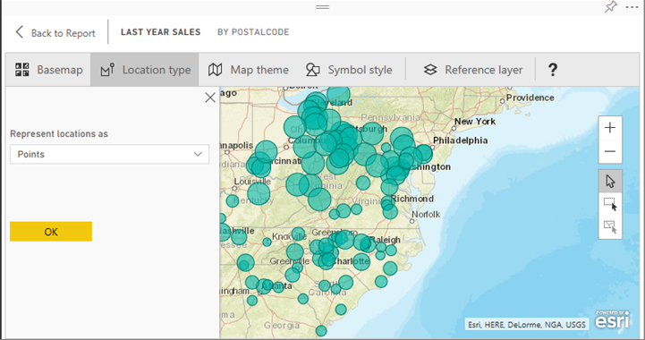

**Boundaries** will only work if your data contains standard geographic values. Esri automatically figures out the shape to show on the map. Standard geographic values include countries, provinces, zip codes, etc. But just like with GeoCoding, Power BI may not detect the field should be a boundary by default, or it may not have a boundary for your data.  

#### Map theme
Four map themes are provided. Location only and Size themes are automatically chosen based on the fields you bind to the location and size buckets in the Fields pane. We're currently using **Size**, so let's change to **Heat map**.  

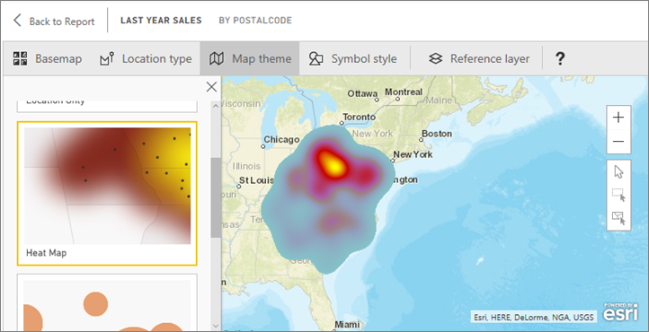

<table>
<tr><th>Theme</th><th>Description</th>
<tr>
<td>Location Only</td>
<td>Plots data points or filled boundaries on the map based on the settings in Location Type.</td>
</tr>
<tr>
<td>Heat Map</td>
<td>Plots an intensity plot of data on the map.</td>
</tr>
<tr>
<td>Size</td>
<td>Plots data points on the map based that are sized based on the value in the size bucket in the fields pane.</td>
</tr>
<tr>
<td>Clustering</td>
<td>Plot the count of data points in regions on the map. </td>
</tr>
</table>

#### Symbol style
Symbol styles enable you to fine tune how data is presented on the map. Symbol styles are context sensitive based on the selected Location type and Map theme.

### Reference Layer

####  Reference layer - Demographics
ArcGIS Maps for Power BI provides a selection of demographic layers that help contextualize data from Power BI.

1. Select the **Reference layer** tab and choose **Demographics**.

2. Each layer listed has a checkbox. Add a checkmark to add that layer to the map.  In this example we've added average household income. 

   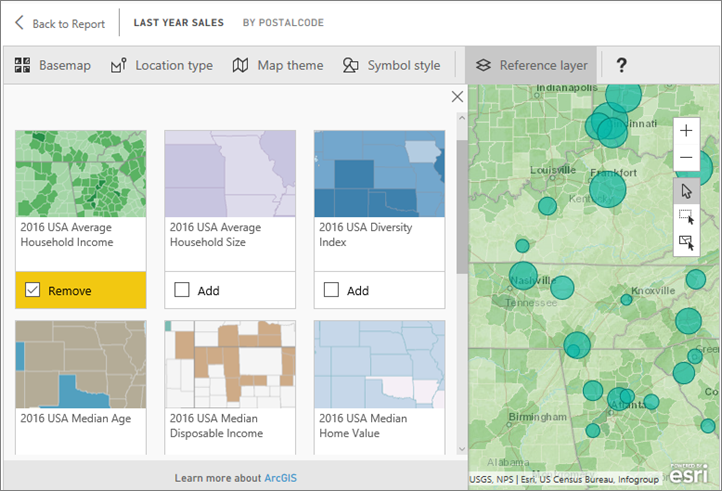

2. Each layer is interactive as well. Just as you can hover over a bubble to see the details, you can click a shaded area on the map to see the details. 

   

#### Reference layer - ArcGIS
ArcGIS Online provides the ability for organizations to publish public web maps. Additionally, Esri provides a curated set of web maps through Living Atlas. In the ArcGIS tab, you can search all public web maps or Living Atlas maps, and add them to the map as reference layers.

1. Select the **Reference layer** tab and choose **ArcGIS**.

2. Enter search terms and then select a map layer. In this example we've chosen USA Congressional districts.

    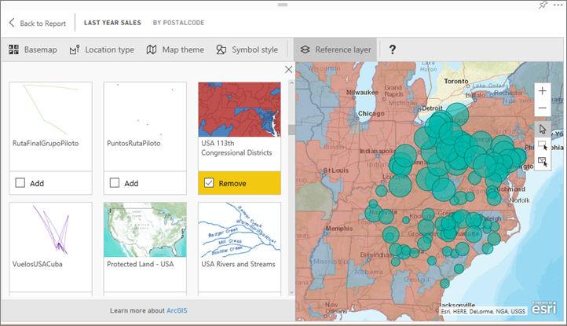 

3. To see the details, select a shaded area to open the
_Select from reference layer_: Use the reference layer selection tool to selection boundaries or objects on the reference layer.

 

## Selecting Data points
ArcGIS Maps for Power BI allows three selection modes.

Change the selection mode using switch:

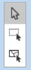

 Select individual data points.

 Draws a rectangle on the map and selects the contained data points.

 Allows boundaries or polygons within reference layers to be used to select contained data points.

**Note:** a maximum of 250 data points can be selected at a time.

 

## Getting help
**Esri** provides [comprehensive documentation](https://go.microsoft.com/fwlink/?LinkID=828772) on the feature set of **ArcGIS Maps for Power BI**.

You can ask questions and find answers on the Power BI [community thread related to **ArcGIS Maps for Power BI**](https://go.microsoft.com/fwlink/?LinkID=828771) to find the latest information or to report issues.

If you have a suggestion for an improvement, please submit them to [Power BI's ideas list](https://ideas.powerbi.com).

 

## Managing use of ArcGIS Maps for Power BI within your organization

Power BI provides the ability for users, tenant administrators, and IT administrators to manage whether to use ArcGIS Maps for Power BI.

**User options**
In Power BI Desktop, users can stop using ArcGIS Maps for Power BI by disabling it on the security tab in options. When disabled, ArcGIS Maps will not load by default.

In Power BI service, users can stop using ArcGIS Maps for Power BI by disabling it on the ArcGIS Maps for Power BI (Preview) tab in user Settings. When disabled, ArcGIS Maps will not load by default.

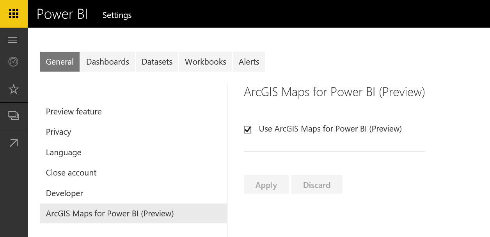

**Tenant admin options**
In PowerBI.com, tenant administrators can prevent all tenant users from using ArcGIS Maps for Power BI by disabling. When this happens, Power BI will no longer see the ArcGIS Maps for Power BI icon in the visualizations pane.

**IT Administrator options**
Power BI Desktop supports using **Group Policy** to disable ArcGIS Maps for Power BI across an organization's deployed computers.

<table>
<tr><th>Attribute</th><th>Value</th>
</tr>
<tr>
<td>key</td>
<td>Software\Policies\Microsoft\Power BI Desktop\</td>
</tr>
<tr>
<td>valueName</td>
<td>EnableArcGISMaps</td>
</tr>
</table>

A value of 1 (decimal) enables ArcGIS Maps for Power BI.

A value of 0 (decimal) disable ArcGIS Maps for Power BI.

You can use the provided **Group Policy** templates to quickly add the required configuration to your **Group Policy**.

**Template**

[PowerBIEsri.adml](./groupPolicyTemplates/PowerBIEsri.adml)

[PowerBIEsri.admx](./groupPolicyTemplates/PowerBIEsri.admx)

 

## Limitations
ArcGIS Maps for Power BI (Preview) is available in the following services and applications:

<table>
<tr><th>Service/App</th><th>Availability</th></tr>
<tr>
<td>Power BI Desktop</td>
<td>Yes</td>
</tr>
<tr>
<td>Power BI service (PowerBI.com)</td>
<td>Yes</td>
</tr>
<tr>
<td>Power BI mobile applications</td>
<td>Yes</td>
</tr>
<tr>
<td>Power BI publish to web</td>
<td>No</td>
</tr>
<tr>
<td>Power BI Embedded</td>
<td>No</td>
</tr>
<tr>
<td>Power BI service embedding (PowerBI.com)</td>
<td>No</td>
</tr>
</table>

In services or applications where ArcGIS Maps for Power BI (Preview) is not available, the visualization will show as an empty visual with the Power BI logo.

When geocoding street addresses, only the first 1500 addresses are geocoded. Geocoding place names or countries is not subject to the 1500 address limit.

 

## Common questions
**Is there any charge for using ArcGIS Maps for Power BI?**

The ArcGIS Map for Power BI (Preview) is available to all Power BI users at no additional cost. It is a component provided by **Esri** and your use is subject to the terms and privacy policy provided by **Esri** as noted earlier in this article.

**Does ArcGIS Maps for Power BI support Esri Shapefiles?**

ArcGIS Maps for Power BI automatically detects standard boundaries like countries/regions, states/provinces, and zip/postal codes. If you need to provide your own shapes you can do so using the [Shape Maps for Power BI Desktop (Preview)](powerbi-desktop-shape-map.md).

**Can I connect to my ArcGIS Online account from Power BI?**

Not yet. [Vote for this idea](https://ideas.powerbi.com/forums/265200-power-bi-ideas/suggestions/9154765-arcgis-geodatabases ) and we'll send you an email when we start working on this feature.  

More questions? [Try the Power BI Community](http://community.powerbi.com/)
