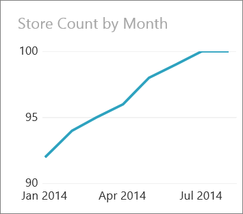
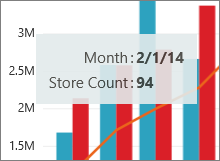

<properties pageTitle="Tutorial: Combo Chart (Merge visualizations) in Power BI" description="Tutorial: Combo Chart (Merge visualizations) in Power BI" services="powerbi" documentationCenter="" authors="v-anpasi" manager="mblythe" editor=""/>
<tags ms.service="powerbi" ms.devlang="NA" ms.topic="article" ms.tgt_pltfrm="NA" ms.workload="powerbi" ms.date="06/26/2015" ms.author="v-anpasi"/>
# Tutorial: Combo Chart (Merge visualizations) in Power BI

[← Visualizations in reports](https://support.powerbi.com/knowledgebase/topics/65160-visualizations-in-reports)

In Power BI, a Combo Chart is a single visualization that combines a line chart and a column chart. Combining the 2 charts into one lets you make a quicker comparison of the data. 

Combo charts can have one or two axes.

In this tutorial we'll merge (and un-merge) two different chart types and add a secondary axis.

> **NOTE**: This tutorial applies to the Power BI service and not to Power BI Designer or Power View. 

## When to use a Combo Chart

Combo Charts are a great choice:

-   when you have a line chart and a column chart with the same X axis.
-   to compare multiple measures with different value ranges.
-   to illustrate the correlation between two measures in one visualization.
-   to conserve canvas space.

## Working with Combo Charts

Combo Charts:

-   Can be pinned from reports.
-   Can be sorted.
-   Can be highlighted and cross-filtered by other visualizations on the same report page.
-   Can be used to highlight and cross-filter other visualizations on the same report page.
-   Cannot be created if either chart contains a hierarchy, and the current state of the chart is "drilled down."  You will need to drill all the way back up before combining.

## Create a basic, single-axis, Combo Chart

To follow along, sign in to powerBI.com and select **Get Data \>Retail Analysis Sample**.

1. From the "Retail Analysis Sample" workbook, select the **Total Stores** tile to open the "Retail Analysis Sample" report.

2. Select **Edit Report** to open the report in Editing View.

3. Add a new report page.

4. Create a column chart that displays this year's sales and sales goal by month.

    1.  From the **Fields** pane, select **Sales** \> **This Year Sales**.
    2.  Drag **Sales** \> **This Years Sales Goal** to the **Value** well.
    3.  Select **Time** \> **Month** to add it to the **Axis** well.

5. Create a line chart that displays last year's sales to sales goals, by month.
    1.  From the **Fields** pane, select **Sales** \> **Last Year Sales**.
    2.  Drag **Time** \> **Month** to the **Axis** well.
    3.  [Convert the bar chart to a line chart](http://support.powerbi.com/knowledgebase/articles/444663-change-the-type-of-visualization-in-a-report).

6. Select one of the charts and move it on top of the other chart until their centers are roughly aligned.  

7. When you let go, a combo chart is created

	

8. To separate the combo chart into the 2 original charts, select and shake the combo chart back and forth to break it.  

    > **TIP**: shake (move the visualization back and forth) at medium speed approximately 2-3 times.  
    
      
 
## Create a Combo Chart with two axes

In the task above, the Y axes of both visualizations used the same units of measurement, and the values along the Y axes were within a similar range.  But what happens when you combine two visualizations where the values being measured use different units (e.g., dollars vs. percent)?  Or when the units are the same (e.g., volume) but are not close (hundreds of items vs. millions of items).  That's what we'll find out in the next task.

In this task, we'll see what impact store count has on sales.

1.  Create a new visualization that tracks store count by month.  In January there were 92 stores and by July there were 100.  Will we see an increase in sales that corresponds to the increase in stores?

    
    
2.  Combine this line chart with the bar chart created above ("This Years Sales, and This Years Sales Goal, by Month").  The scale of **Store Count** is much smaller than the scale of **Sales** which makes it difficult to compare.  To make the Combo Chart easier to read and interpret, Power BI will create two axes, thus allowing the data sets to be scaled differently.  

	The new Combo Chart displays 2 axes:  the left measures dollars and the right measures count of stores.

    

3.  Hovering over a bar or line displays a tooltip with the details; in February there were 94 stores.

    
    
4.  [Add the Combo Chart as a dashboard tile](http://support.powerbi.com/knowledgebase/articles/425669-tiles-in-power-bi).
5.  [Save the report](http://support.powerbi.com/knowledgebase/articles/444112-save-a-report).

## Highlighting and cross-filtering

For information about using the Filters pane, see [Add a filter to a report](http://support.powerbi.com/knowledgebase/articles/464704-add-a-filter-to-a-report).

Highlighting a column or line in a Combo Chart cross-filters the other visualizations on the report page... and vice versa.

1.  Copy the new dual-axis Combo Chart to the "Stores Sales Overview" page of the report.

2.  On the Combo Chart, select one of the "This  Year Sales" bars -- this selects and highlights all the "This Year Sales" bars. In a Combo Chart I cannot individually select data points. Highlighting the Combo Chart highlights the pie chart and filters the bubble chart on the page.     
    
3.  In the pie chart, highlight **Lindseys** to highlight other visualizations on the page, including the Combo Chart.

## Tips and Troubleshooting

-   If one of the charts to be combined has a hierarchy, and you've drilled down, you will not be able to combine that chart until you drill back up.

## See Also:

[Add a visualization to a report](https://powerbi.uservoice.com/knowledgebase/articles/441777)  
[Visualizations in Power BI reports](http://support.powerbi.com/knowledgebase/articles/434821-visualizations-in-power-bi-reports)  
[Visualization types in Power BI](http://support.powerbi.com/knowledgebase/articles/469552-visualization-types-available-in-power-bi-reports)  
[Power BI - Basic Concepts](http://support.powerbi.com/knowledgebase/articles/487029-power-bi-preview-basic-concepts)  
[Try it out - it's free!](https://powerbi.com/)  

This is a draft topic in development. Feedback? Click **Contact support** on the right side of this page.