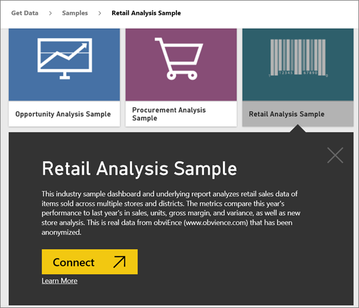
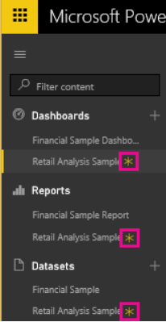

<properties
   pageTitle="Tutorial: Connect to the Power BI samples"
   description="Tutorial: Connect to the Power BI samples"
   services="powerbi"
   documentationCenter=""
   authors="mihart"
   manager="mblythe"
   editor=""
   tags="power bi"/>

<tags
   ms.service="powerbi"
   ms.devlang="NA"
   ms.topic="article"
   ms.tgt_pltfrm="NA"
   ms.workload="powerbi"
   ms.date="11/01/2015"
   ms.author="mihart"/>
# Tutorial: Connect to the Power BI samples  

Want to try Power BI with sample data?  Use our sample content packs or one of our Excel datasets to learn how Power BI keeps you in the know and focused on what matters to run your business.  The samples use real data from obviEnce (www.obvience.com) that has been anonymized.

This tutorial uses the **Retail Analysis sample** content pack. The Retail Analysis sample content pack consists of a dashboard, report, and dataset. Use these instructions to download one of the samples and then take a tour of the downloaded sample to see how Power BI highlights important retail data.
   **Take a tour**:

- [Retail Analysis sample](powerbi-sample-retail-analysis-take-a-tour)
- [HR](powerbi-sample-human-resources-take-a-tour)
- [Opportunity Analysis](powerbi-sample-opportunity-analysis-take-a-tour)
- [Procurement Analysis](powerbi-sample-procurement-analysis-take-a-tour)
- [Sales and Marketing](powerbi-sample-sales-and-marketing-take-a-tour)
- [Supplier Quality sample](powerbi-sample-suppllier-quality-analysis-take-a-tour)
- [IT Spend Analysis sample](powerbi-sample-it-spend-analysis-take-a-tour)

1. Select **Get Data** at the bottom of the left navigation pane.

  

2. Select **Samples**.

  

3. Select the Retail Analysis sample, and choose **Connect**.

  

4. Power BI installs the dashboard, report, and dataset for the Retail Analysis sample. Because they're new, they're marked with a yellow asterisk.

  

5. Now explore the dashboard and report on your own, or check out the [tour of the Retail Analysis sample](powerbi-sample-retail-analysis-take-a-tour.md).

## See Also  
[Samples in Power BI](powerbi-service-dashboards.md)  
[Power BI - Basic Concepts](powerbi-service-basic-concepts.md)  
