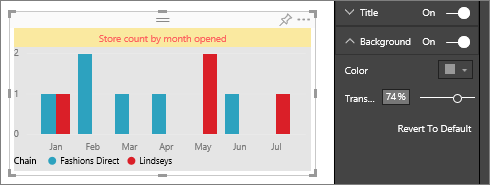

<properties 
   pageTitle="Tutorial: Customize visualization title, background, and legend"
   description="Tutorial: Customize visualization title, background, and legend"
   services="powerbi" 
   documentationCenter="" 
   authors="jastru" 
   manager="mblythe" 
   editor=""
   tags=""/>
 
<tags
   ms.service="powerbi"
   ms.devlang="NA"
   ms.topic="article"
   ms.tgt_pltfrm="NA"
   ms.workload="powerbi"
   ms.date="10/15/2015"
   ms.author="jastru"/>

# Tutorial: Customize visualization title, background, and legend  
[← Visualizations in reports](https://support.powerbi.com/knowledgebase/topics/65160-visualizations-in-reports)

In this tutorial you'll learn many different ways to customize the title of your visualizations. Not all visualizations can be customized, [see the complete list](637423.html#list).  Specifically, this tutorial covers customizing (in reports and on dashboards):  
-   visualization titles  
-   visualization title backgrounds  
-   visualization title legends

## Customize visualization titles in reports    
I’ve signed in to the Power BI service and I’m starting with the Retail Analysis Sample report in [Editing View](http://support.powerbi.com/knowledgebase/articles/443094). To follow along, [connect to the Retail Analysis sample](http://support.powerbi.com/knowledgebase/articles/514904).

>**Note:**  
>When you pin a visualization to a dashboard, it becomes a dashboard tile.  The tiles themselves can also be customized with new titles and subtitles, hyperlinks, and resized.

1.  Navigate to the "New Stores" page of the report and select the "Open Store Count by Open Month..." column chart.

2.  In the Visualizations and Filters pane, select the paintbrush icon  to reveal the customization options.  
	

3.  Turn the title on and off by selecting the On (or Off) slider. For now, leave it **On**.  
	

4.  Change the title text by typing **Store count by month opened** in the text field.  
	

5.  Change the text color to orange and the text background to yellow.
	
	-   Select the dropdown and choose a color from the **Theme Colors**, **Recent Colors**, or **Custom color**.

	-   Select the dropdown to close the color window.  
	

	You can always revert to the default colors by selecting **Revert to default** in the color window.

6.  The last customization we'll make to the chart title is to align it in the center of the visualization. The title position defaults to left-aligned.  

	At this point in the tutorial, your column chart should look like this:  
	

	To revert all the title customization we've done so far, select **Revert To Default**, at the bottom of the **Title** customization pane.  
	

## Customize visualization backgrounds  
With the same column chart selected, expand the Background options.

1.  Turn the background on and off by selecting the On (or Off) slider. For now, leave it **On**.

2.  Change the background color to 75% grey.

    -   Select the dropdown and choose a color from the **Theme Colors**, **Recent Colors**, or **Custom color**.

    -   Select the dropdown to close the color window.

3.  When you select a background color, Power BI defaults to 50% transparency. Change Transparency to 74%.   
    

    To revert all the title background customization we've done so far, select **Revert To Default**, at the bottom of the **Background **customization pane.

## Customize visualization legends  
To customize a legend, select "This Year Sales by FiscalMonth and Name" line chart.  In the Visualization tab, expand the Legend options.

1.  Turn the legend on and off by selecting the On (or Off) slider. For now, leave it **On**.

2.  Move the legend to the right of the visualization.  Legend position options are: top, bottom, left, right. 

    -   Select the dropdown and choose **Right**.

    -   Select the dropdown to close the legend position window.

3.  Add a legend title by toggling **Title** to **On **and, in the Text field, typing "Store Name"  
    

    To revert all the legend customization we've done so far, select **Revert To Default**, at the bottom of the **Legend **customization pane.

## Visualization types that can be customized  
|Visualization|Title|Background|Legend|
|---|---|---|---|
|area|yes|yes|yes|
|bar|yes|yes|yes|
|card|yes|yes|n/a|
|Multi Row Card|yes|yes|n/a|
|| | | |
|column|yes|yes|yes|
|combo|yes|yes|yes|
|donut|yes|yes|yes|
|filled map|yes|yes|yes|
|funnel|yes|yes|n/a|
|gauge|yes|yes|n/a|
| | | | |
|line|yes|yes|yes|
|map|yes|yes|yes|
|matrix|yes|yes|n/a|
|pie|yes|yes|yes|
|scatter|yes|yes|yes|
|table|yes|yes|n/a|
|textbox|no|yes|n/a|
|treemap|yes|yes|yes|
|waterfall|yes|yes|yes|

## See Also  
More about [Visualizations in Power BI reports](http://support.powerbi.com/knowledgebase/articles/434821-visualizations-in-power-bi-reports)  
[Customize X-axis and Y-axis](https://support.powerbi.com/knowledgebase/articles/637429%0A)  
[Customize data point labels](https://support.powerbi.com/knowledgebase/articles/637417%0A)  
[Customize colors and axis properties](https://support.powerbi.com/knowledgebase/articles/666325)  
[Power BI - Basic Concepts](http://support.powerbi.com/knowledgebase/articles/487029-power-bi-preview-basic-concepts)  