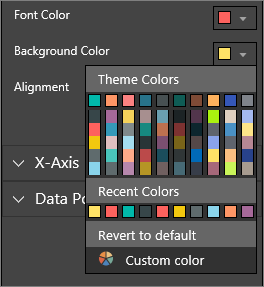

<properties
   pageTitle="Tutorial: Customize visual titles, legends, and backgrounds. "
   description="Tutorial: Customize visualization title, background, and legend"
   services="powerbi"
   documentationCenter=""
   authors="mihart"
   manager="mblythe"
   backup=""
   editor=""
   tags=""
   qualityFocus="monitoring"
   qualityDate=""/>

<tags
   ms.service="powerbi"
   ms.devlang="NA"
   ms.topic="article"
   ms.tgt_pltfrm="NA"
   ms.workload="powerbi"
   ms.date="08/01/2016"
   ms.author="mihart"/>

# Tutorial: Customize visualization title, background, and legend

In this tutorial you'll learn many different ways to customize your visualizations. Not all visualizations can be customized, [see the complete list](#list).  Specifically, this tutorial covers customizing:  
-   visualization titles  
-   visualization backgrounds  
-   visualization legends

## Customize visualization titles in reports    
I’ve signed in to the Power BI service and I’m starting with the Retail Analysis Sample report in [Editing View](powerbi-service-interact-with-a-report-in-editing-view.md). To follow along, [connect to the Retail Analysis sample](powerbi-sample-downloads.md).

>**Note:**  
>When you pin a visualization to a dashboard, it becomes a dashboard tile.  The tiles themselves can also be customized with [new titles and subtitles, hyperlinks, and resized](powerbi-service-edit-a-tile-in-a-dashboard.md).

1.  Navigate to the "New Stores" page of the report and select the "Open Store Count by Open Month..." column chart.

2.  In the Visualizations and Filters pane, select the paintbrush icon  to reveal the formatting options and select **Title** to expand that section.  
	

3.  Turn  **Title** on and off by selecting the On (or Off) slider. For now, leave it **On**.  
	

4.  Change **Title Text** by typing **Store count by month opened** in the text field.  

5.  Change **Font color** to orange and **Background Color** to yellow.

	-   Select the dropdown and choose a color from the **Theme Colors**, **Recent Colors**, or **Custom color**.

	-   Select the dropdown to close the color window.  
	

	You can always revert to the default colors by selecting **Revert to default** in the color window.

6.  The last customization we'll make to the chart title is to align it in the center of the visualization. The title position defaults to left-aligned.  

	At this point in the tutorial, your column chart **title** should look like something like this:  
	

	To revert all the title customization we've done so far, select **Revert To Default**, at the bottom of the **Title** customization pane.  
	

## Customize visualization backgrounds  
With the same column chart selected, expand the Background options.

1.  Turn the background on and off by selecting the On (or Off) slider. For now, leave it **On**.

2.  Change the background color to 74% grey.

    -   Select the dropdown and choose a grey color from the **Theme Colors**, **Recent Colors**, or **Custom color**.

    -    Change Transparency to 74%.   
    

    To revert all the title background customization we've done so far, select **Revert To Default**, at the bottom of the **Background** customization pane.

## Customize visualization legends  

1. Open the **Overview** report page and select the "Total Sales Variance by FiscalMonth and District Manager" chart.

2. In the Visualization tab, select the paintbrush icon to open the formatting pane.  

3. Expand **Legend** options.

      

3.  Turn the legend on and off by selecting the On (or Off) slider. For now, leave it **On**.

4.  Move the legend to the left side of the visualization.    

3.  Add a legend title by toggling **Title** to **On** and, in the **Legend name** field, typing **Managers**.
    

    To revert all the legend customization we've done so far, select **Revert To Default**, at the bottom of the **Legend** customization pane.

## Visualization types that can be customized  
| Visualization  | Title  | Background | Legend |
|:---------------|:-------|:-----------|:-------|
| area           | yes    | yes        | yes    |
| bar            | yes    | yes        | yes    |
| card           | yes    | yes        | n/a    |
| multi row card | yes    | yes        | n/a    |
| column         | yes    | yes        | yes    |
| combo          | yes    | yes        | yes    |
| donut          | yes    | yes        | yes    |
| filled map     | yes    | yes        | yes    |
| funnel         | yes    | yes        | n/a    |
| gauge          | yes    | yes        | n/a    |
| kpi            | yes    | yes        | n/a    |
| line           | yes    | yes        | yes    |
| map            | yes    | yes        | yes    |
| matrix         | yes    | yes        | n/a    |
| pie            | yes    | yes        | yes    |
| scatter        | yes    | yes        | yes    |
| slicer         | yes    | yes        | n/a    |
| table          | yes    | yes        | n/a    |
| textbox        | no     | yes        | n/a    |
| treemap        | yes    | yes        | yes    |
| waterfall      | yes    | yes        | yes    |

## See also  
More about [Visualizations in Power BI reports](powerbi-service-visualizations-for-reports.md)  
[Customize X-axis and Y-axis](powerbi-service-tutorial-customize-x-axis-and-y-axis-properties.md)  
[Customize colors and axis properties](powerbi-service-getting-started-with-color-formatting-and-axis-properties.md)  
[Power BI - Basic Concepts](powerbi-service-basic-concepts.md)  
