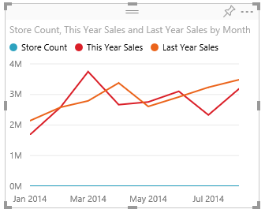

<properties 
   pageTitle="Tutorial: Customize X-axis and Y-axis properties"
   description="Tutorial: Customize X-axis and Y-axis properties"
   services="powerbi" 
   documentationCenter="" 
   authors="pcw3187" 
   manager="mblythe" 
   editor=""
   tags=""/>
 
<tags
   ms.service="powerbi"
   ms.devlang="NA"
   ms.topic="article"
   ms.tgt_pltfrm="NA"
   ms.workload="powerbi"
   ms.date="10/14/2015"
   ms.author="v-pawrig"/>
# Tutorial: Customize X-axis and Y-axis properties

[← Visualizations in reports](https://support.powerbi.com/knowledgebase/topics/65160-visualizations-in-reports)

In this tutorial you'll learn many different ways to customize the X-axis and Y-axis of your visualizations. Not all visualizations have axes and/or can be customized; Pie charts, for example, don't have axes.  

>**Note**: These customizations available when the **Format** icon is selected are also available in Power BI Desktop.

## Customizing visualization X-axes in reports

I’ve signed in to the Power BI service and I’m starting with the **Retail Analysis Sample** report in [Editing View](http://support.powerbi.com/knowledgebase/articles/443094). To follow along, [connect to the Retail Analysis sample](http://support.powerbi.com/knowledgebase/articles/514904).

1.  Create a new column chart that shows this year's sales and last year's sales by month. 

2.  In the Visualizations and Filters pane, select **Format** (the paintbrush icon  ) to reveal the customization options.

3.  Expand the X-Axis options.

4.  Turn the X-axis on and off by selecting the On (or Off) slider. For now, leave it **On**.  Turning the X-axis off removes the X-axis label and saves space for more data.

    

5.  Change the X-axis type to **Continuous.**  The choices are **Continuous, Categorical,** or **Auto (default)**.

6.  Turn the X-axis title **On** and display the name of the X axis -- in this case, **Month**.  

    After all these customizations, your column chart should look like this:

     

    >**NOTE**: If the X-axis is string/Boolean, the **Type** option will not display. 

To revert all the X-axis customization we've done so far, select **Revert To Default **at the bottom of the **X-axis** customization pane.

## Customizing visualization Y-axes in reports

Some visualizations have Y-axes and these too can be customized. There are even some visualizations that have dual Y-axes, and we'll learn how to customize those as well.

1.  From the Retail Analysis Sample report, select the chart "This Year Sales by FiscalMonth and Name."

    

2.  Expand the Y-Axis options and ensure that the Y-Axis slider is toggled to **On**.

     

3.  Change the Y-axis Position to **Right** to move it away from the legend and easier to read.

4.  Change the Start and End range to display only the companies with the higher sales.

    -   Set Start to **35,000**

    -   Set End to **100,000**

5.  Turn the Title **On** so that colleagues can see at-a-glance what is being measured. And set the **Style** to **Show title** **only** (instead of **Show both** or **Show unit only**) since the Y-axis already shows that the unit of measurement is thousands of dollars.

6.  After all these customizations, your line chart should look like this:

    

    To revert all the Y-axis customization we've done so far, select **Revert To Default**, at the bottom of the **Y-axis** customization pane.

## Customizing visualizations with dual Y-axes

First we'll create a Combo chart that looks at the impact store count has on sales.  This is the same chart that is created in the [Combo chart Tutorial](https://support.powerbi.com/knowledgebase/articles/436737). Then we'll format the dual Y-axes.

### Create a chart with two Y-axes

1. Create a new line chart that tracks store count by month.

	-   From the **Sales** table, select **Store Count**.

	-   From the **Time** table, select **Month**.

	

2. Add **This Year Sales** and **Last Year Sales** to the line chart. The scale of **Store Count** is much smaller than the scale of **Sales** which makes it difficult to compare. The scale is so different that Store Count appears as a flat blue line.     

	

3. To make the visual easier to read and interpret, convert the line chart to a Line and Stacked Column chart. 

	

4. Drag **Store Count** from **Column Values** into **Line Values**. Power BI creates two axes, thus allowing the data sets to be scaled differently; the left measures dollars and the right measures count of stores.

	

  
### Format the secondary Y-axis

1.  In the **Visualizations** pane, select the paintbrush icon to display the formatting options.

2.  Expand the Y-Axis options by selecting the down arrow.

3.  The only option you have for the secondary axis is to turn it on and off.  Turning it **Off** removes the second Y-axis -- and, in this case, makes the visual difficult to understand.  

    

    

    Toggle **Show Secondary** to **On**.

4.  The rest of the options for Y-Axis apply to the primary Y-axis, which is the axis for the Column chart.  If you switch Position to Right, then the two axes switch positions; the axis for the columns moves to the right and the axis for the line moves to the left side.

### Add titles to both axes

With a visualization this complicated, it helps to add axes titles.  Titles help your colleagues understand the story your visualization is telling.

1.  Toggle **Title** to **On**.

2.  Set **Style** to **Show title only**.

    

3.  Your Combo chart now displays dual axes, both with titles.
	

For more information, see the following article:

-   [Tips and tricks for color formatting, labeling, and axis properties](https://support.powerbi.com/knowledgebase/articles/666355)

See Also:

More about [Visualizations in Power BI reports](http://support.powerbi.com/knowledgebase/articles/434821-visualizations-in-power-bi-reports)

[Customize d](https://support.powerbi.com/knowledgebase/articles/637417%0A)[ata point labels](https://support.powerbi.com/knowledgebase/articles/637417%0A)

[Customize t](https://support.powerbi.com/knowledgebase/articles/637423)[itles, backgrounds, and legends](https://support.powerbi.com/knowledgebase/articles/637423)

[Customize colors and axis properties](https://support.powerbi.com/knowledgebase/articles/666325)

[Power BI - Basic Concepts](http://support.powerbi.com/knowledgebase/articles/487029-power-bi-preview-basic-concepts)

