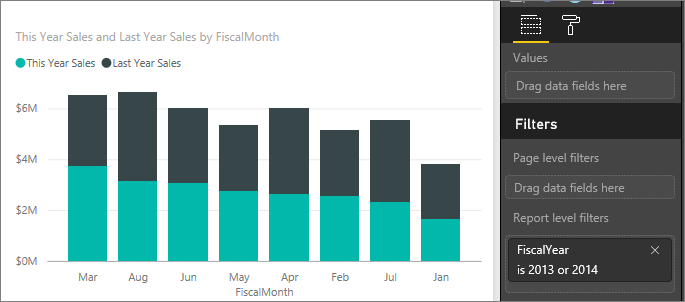
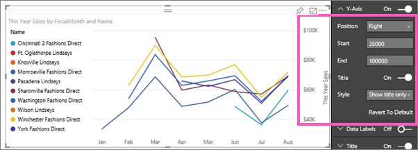
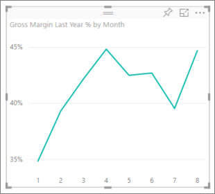
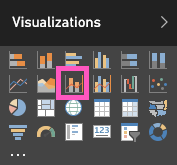
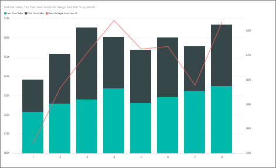
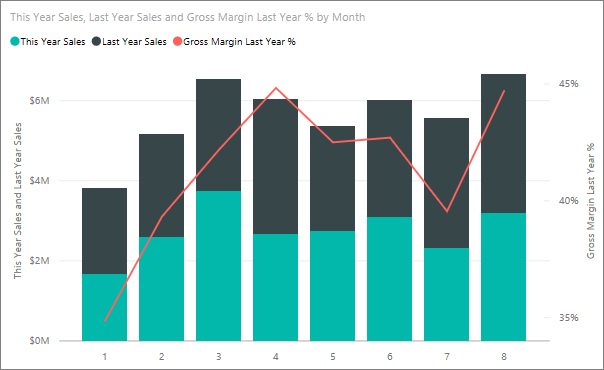

<properties
   pageTitle="Tutorial: Customize X-axis and Y-axis properties"
   description="Tutorial: Customize X-axis and Y-axis properties"
   services="powerbi"
   documentationCenter=""
   authors="mihart"
   manager="mblythe"
   backup=""
   editor=""
   tags=""
   qualityFocus="monitoring"
   qualityDate="05/23/2016"/>

<tags
   ms.service="powerbi"
   ms.devlang="NA"
   ms.topic="article"
   ms.tgt_pltfrm="NA"
   ms.workload="powerbi"
   ms.date="10/05/2016"
   ms.author="mihart"/>
# Tutorial: Customize X-axis and Y-axis properties

In this tutorial you'll learn many different ways to customize the X-axis and Y-axis of your visuals. Not all visuals have axes or can be customized; Pie charts, for example, don't have axes. And customization options vary from visual to visual, too many options to cover in a single article. So we'll take a look at some of the most-used axes customizations and get you comfortable using the visual formatting tab in the Power BI report canvas.  

>**Note**: This page applies to both Power BI service and Power BI Desktop. These customizations, which are available when the **Format** (the paint roller icon  ) is selected, are also available in Power BI Desktop.  

## Customizing visualization X-axes in reports

Sign in to the Power BI service and open the **Retail Analysis Sample** report in [Editing View](powerbi-service-interact-with-a-report-in-editing-view.md). To follow along, [connect to the Retail Analysis sample](powerbi-sample-downloads.md).

1.  Create a new column chart that shows this year's sales and last year's sales by fiscal month. 

2. Convert it to a Stacked column chart.

3.  In the Visualizations and Filters pane, select **Format** (the paint roller icon  ) to reveal the customization options.

4.  Expand the X-Axis options.

5.  Turn the X-axis on and off by selecting the On (or Off) slider. For now, leave it **On**.  Turning the X-axis off removes the X-axis label and saves space for more data.

    

6.  Turn the X-axis title **On** and display the name of the X axis -- in this case, **FiscalMonth**.  

    After all these customizations, your column chart should look something like this:

     

    >**NOTE**: If the X-axis is categorized by the report owner as a date type, the **Type** option will display and you can select between continuous or categorical. 

To revert all the X-axis customization you've done so far, select **Revert To Default **at the bottom of the **X-axis** customization pane.

## Customizing visualization Y-axes in reports

Some visualizations have Y-axes and these too can be customized. There are even some visualizations that have dual Y-axes, and you'll learn how to customize those as well.

1.  From the **New Stores** tab of the Retail Analysis Sample report, select the chart "This Year Sales by FiscalMonth."

   

2. From the Fields pane, select **Store** > **Name** to add it as a **Legend**.

    

3.  In the Visualizations and Filters pane, select **Format** (the paint roller icon.
     ) to reveal the customization options.

4. Expand the Y-Axis options and ensure that the Y-Axis slider is toggled to **On**.

     

4.  Turn the Title **On** so that colleagues can see at-a-glance what is being measured. And set the **Style** to **Show title** **only** (instead of **Show both** or **Show unit only**) since the Y-axis already shows that the unit of measurement is thousands of dollars.

3.  Change the Y-axis Position to **Right** to move it away from the legend and easier to read.

4.  Change the Start and End range to display only the companies with the higher sales.

    -   Set Start to **35,000**

    -   Set End to **100,000**

6.  After all these customizations, your line chart should look like this:

    

    To revert all the Y-axis customization you've done so far, select **Revert To Default**, at the bottom of the **Y-axis** customization pane.

## Customizing visualizations with dual Y-axes

First you'll create a Combo chart that looks at the impact store count has on sales.  This is the same chart that is created in the [Combo chart Tutorial](powerbi-service-tutorial-combo-chart-merge-visualizations.md). Then you'll format the dual Y-axes.

### Create a chart with two Y-axes

1.  Create a new line chart that tracks **Sales > Gross Margin last year %** by **Time > Month**. 

2. Sort the visual by month by selecting the ellipses (...) and choosing **Sort by Month**

    

3. In January GM% was 35%, peaked at 45% in April, dropped in July and peaked again in August. Will we see a similar pattern in sales last year and this year?

4.  Add **This Year Sales > Value** and **Last Year Sales** to the line chart. The scale of **GM% Last Year** is much smaller than the scale of **Sales** which makes it difficult to compare.      

    

5.  To make the visual easier to read and interpret, convert the line chart to a Line and Stacked Column chart.

    

4.  Drag **Gross Margin Last Year %** from **Column Values** into **Line Values**. Power BI creates two axes, thus allowing the datasets to be scaled differently; the left measures dollars and the right measures percentage.

    

  
### Format the secondary Y-axis

1.  In the **Visualizations** pane, select the paint roller icon to display the formatting options.

2.  Expand the Y-Axis options by selecting the down arrow.

3.  Scroll through the list until you find the options for **Show secondary**. Toggle **Show Secondary** from **Off** to **On**.

    

    

4.  (Optional) Customize the two axes. If you switch **Position** for either the column axis or the line axis, then the two axes switch sides.
   

### Add titles to both axes

With a visualization this complicated, it helps to add axes titles.  Titles help your colleagues understand the story your visualization is telling.

1.  Toggle **Title** to **On** for **Y-Axis (Column)** and the **Y-Axis (Line)**.

2.  Set **Style** to **Show title only**.

    

3.  Your Combo chart now displays dual axes, both with titles.

    

For more information, see [Tips and tricks for color formatting, labeling, and axis properties](powerbi-service-tips-and-tricks-for-color-formatting.md).

## See also

More about [Visualizations in Power BI reports](powerbi-service-visualizations-for-reports.md)

[Customize t](powerbi-service-tutorial-customize-visualization-title-background-and-legend.md)[itles, backgrounds, and legends](powerbi-service-tutorial-customize-visualization-title-background-and-legend.md)

[Customize colors and axis properties](powerbi-service-getting-started-with-color-formatting-and-axis-properties.md)

[Power BI - Basic Concepts](powerbi-service-basic-concepts.md)
