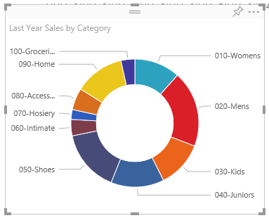

<properties 
   pageTitle="Tutorial: Doughnut charts in Power BI"
   description="Tutorial: Doughnut charts in Power BI"
   services="powerbi" 
   documentationCenter="" 
   authors="v-aljenk" 
   manager="mblythe" 
   editor=""
   tags=""/>
 
<tags
   ms.service="powerbi"
   ms.devlang="NA"
   ms.topic="article"
   ms.tgt_pltfrm="NA"
   ms.workload="powerbi"
   ms.date="10/14/2015"
   ms.author="v-aljenk"/>

# Tutorial: Doughnut charts in Power BI

A  doughnut chart is similar to a pie chart in that it shows the relationship of parts to a whole. The only difference is that the center is blank and allows space for a label or icon.

## Create a Doughnut Chart

To follow along, sign in to Power BI and select Get Data \> Samples \> Retail Analysis Sample. 

1. From the "Retail Analysis Sample" dashboard, select the Total Stores tile to open the "Retail Analysis Sample" report.

2. Select Edit Report to open the report in Editing View.

3. Add a new report page.

4. Create a Waterfall chart that displays this year's sales by category.

 1.  From the Fields pane, select Sales \> Last Year Sales.

 2.  Convert to a Doughnut chart. If Last Year Sales is not in the **Values** area, drag it there.

    

 3.  Select Item \> Category to add it to the Legend area. 

    

## Tips and Tricks for Doughnut Charts

-   The sum of the doughnut chart values must add up to 100%.

-   Too many categories make it difficult to read and interpret.

-   Doughnut charts are best used to compare a particular section to the whole, rather than comparing individual sections with each other. 

## See Also:

[Reports in Power BI](https://support.powerbi.com/knowledgebase/articles/425684)

[Visualizations in Power BI reports](http://support.powerbi.com/knowledgebase/articles/434821-visualizations-in-power-bi-reports)

[Power BI - Basic Concepts](http://support.powerbi.com/knowledgebase/articles/487029-power-bi-preview-basic-concepts)

