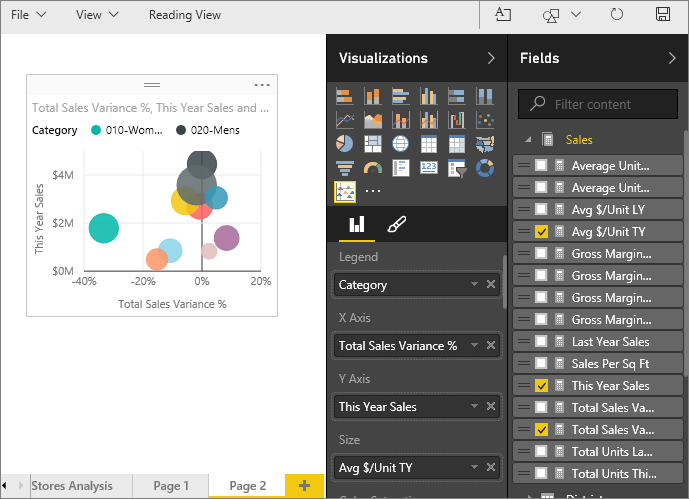

<properties
   pageTitle="Tutorial: Enhanced Scatter charts in Power BI"
   description="Tutorial: Enhanced Scatter charts in Power BI"
   services="powerbi"
   documentationCenter=""
   authors="mihart"
   manager="mblythe"
   editor=""
   tags="Visualizations"/>

<tags
   ms.service="powerbi"
   ms.devlang="NA"
   ms.topic="article"
   ms.tgt_pltfrm="NA"
   ms.workload="powerbi"
   ms.date="11/24/2015"
   ms.author="mihart"/>

# Tutorial: Enhanced Scatter charts in Power BI

An Enchanced Scatter chart is similar to a Scatter chart in that it displays the relationship between 2 to 3 variables. The  difference is that you are not limited to circles (bubbles).

## Create an Enhanced Scatter chart

This tutorial uses the Retail Analysis sample. To follow along, sign in to Power BI and select Get Data \> Samples \> Retail Analysis Sample. 

1. [Download the Enhanced Scatter visualization](powerbi-custom-visuals-download-from-the-gallery.md) and [add it to the report](powerbi-custom-visuals-add-to-report.md).

2. Open the "Retail Analysis Sample" report in Editing View and add a blank page.

3. Add an Enhanced Scatter chart to the page by selecting the icon      from the **Visualizations** pane.

    

4. Create an enhanced scatter chart that displays this year's sales by category.

 a. From the Fields pane, select **Item** \> **Category** and drag it to  **Legends**.

 b.  From the **Sales** table, select **Total Sales Variance %** to add it as the **X Axis**, **This Year Sales** to add it as the **Y Axis**, and **Avg $/Unit TY** and drag it to the **Size** field.

    

 c.  Select Item \> Category to add it to the Legend area. 

## Tips and Tricks for Enhanced Scatter Charts

  - coming soon!

## See also

[Reports in Power BI](powerbi-service-reports.md)

[Visualization types in Power BI](powerbi-service-visualization-types-for-reports-and-q-and-a.md)

[Visualizations in Power BI reports](powerbi-service-visualizations-for-reports.md)

[Power BI - Basic Concepts](powerbi-service-basic-concepts.md)
