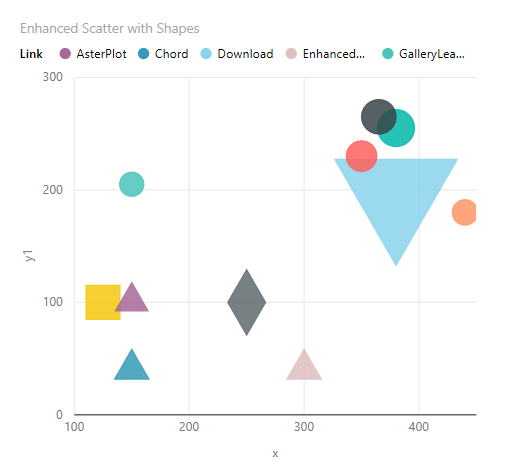
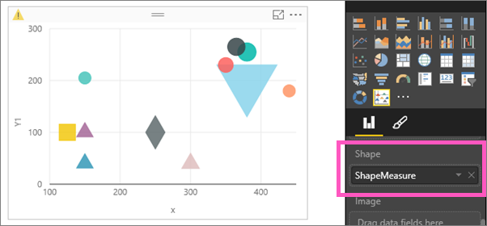
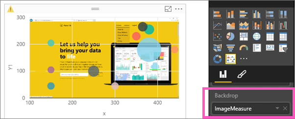
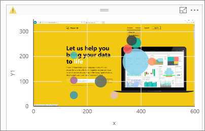
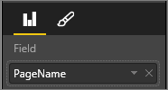
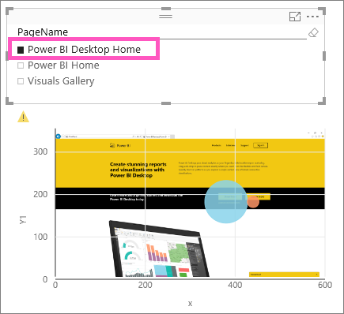
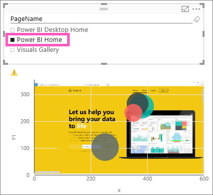
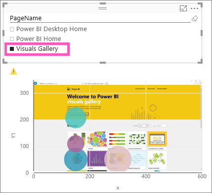

<properties
   pageTitle="Tutorial: Enhanced Scatter charts in Power BI"
   description="Tutorial: Enhanced Scatter charts in Power BI."
   services="powerbi"
   documentationCenter=""
   authors="mihart"
   manager="mblythe"
   editor=""
   tags="Visualizations"/>

<tags
   ms.service="powerbi"
   ms.devlang="NA"
   ms.topic="article"
   ms.tgt_pltfrm="NA"
   ms.workload="powerbi"
   ms.date="12/15/2015"
   ms.author="mihart"/>

# Tutorial: Enhanced Scatter charts in Power BI

The Enhanced Scatter chart is just one of the Microsoft-created custom visuals available for download from the [Power BI Visuals gallery](https://app.powerbi.com/visuals).  An Enchanced Scatter chart is similar to a standard Scatter or Bubble chart in that it displays the relationship between 2 to 3 variables. The  difference is that you are not limited to circles (bubbles). You can display shapes, images, add images to the background, and much more.

For more information, watch this video about [Enhanced Scatter](https://youtu.be/xCfM0cjM4do?list=PL1N57mwBHtN1vIjfvuBIzZllrmKo-Vz6x).

Follow these steps to create an Enhanced Scatter chart that maps page clicks by number and location on a web page. Unfortunately, the dataset used in this tutorial is not available for download.

## Start by creating a basic Bubble chart

The Bubble chart will display website traffic details.

1. Open a report in Editing View and add a blank page.

2. Add an empty Scatter chart to the canvas by selecting the Scatter chart icon.

3. From the Fields pane, select **Page Usage** \> **PageNum** to add it to  **Details**.

4. Select **Link**, and then the **x** and **Y1** coordinates for those links. Ensure Power BI adds **Link** to **Legend**, **x** to **X Axis**, and **Y1** to **Y Axis**.

5. Finally, add **Clicks** to **Size**.

      

I've created a typical bubble chart. The next steps demonstrate the advanced capabilities of the Enhanced Scatter.  

## Convert the Bubble chart to an Enhanced Scatter chart

1. [Download the Enhanced Scatter visualization](powerbi-custom-visuals-download-from-the-gallery.md) and [add it to the report](powerbi-custom-visuals-add-to-report.md).

2. I may receive a message asking me to enable custom visuals. Read the warning and select **Enable custom visuals**.

3. Select the Bubble chart and convert it to an Enhanced Scatter chart by selecting the Enhanced Scatter chart icon     from the **Visualizations** pane.

    

  At this point, the chart should look exactly the same.  If it does not, check to see that the fields in the Visualization buckets didn't change.  If they did, move them back to their original buckets.  For example, if **Y1** moved from **Y Axis** to **Size**, move it back to **Y Axis**, etc.

## Add shapes, images, rotation, and background

The Enhanced Scatter packs even more information into a single visualization. In these steps I'll add shapes, images, rotation, and a background.

>**IMPORTANT**  These visualization fields require your dataset to have measures that returns a text value. If you have a column containing the shape name or image URLs, then you need to create a measure to return the first non-blank row (or any other logic that would return one text value and use that in this visualization field bucket).

1. Add shapes that visually identifies the type of link: Download, Learn More, Pricing, Homepage, etc. Drag **ShapeMeasure** to **Shape**.  Power BI allows: circle, cross, diamond, square, triangle-up, triangle-down, star, hexagon, x, up arrow, and down arrow. These values must already exist in (or be added to) your dataset.

    

    These shapes are meaningful to me, but if I share this report, my colleagues will not understand what each shape represents.  Luckily, my dataset contains another field that has more intuitive graphics.

2. Remove **ShapeMeasure** from the **Shape** area and drag **LinkImageMeasure** to **Image**.

    

3. To communicate even more information graphically, I drag **Trend** to **Rotation**.  The rotation of each image indicates whether the number of clicks is trending up or down.

    

4. To make this chart even easier to read, I can add an image of the actual web page as a background.  In this example I'm not simply adding a single image, but a measure that controls which web page displays.
Remove **LinkImageMeasure** and drag **PageLayout** > **ImageMeasure** to **Backdrop**.

    

5. Use the xmin, xmax, ymin, and ymax areas to align the background image with the x and y coordinates used to plot the data.
  - drag **xmin** to **X Start**.
  - drag **xmax** to **X End**.
  - drag **ymin** to **Y Start**
  - drag **ymax** to **Y End**

    

## Add a slicer

Right now, this visualization is not useful since it's displaying total clicks for all 3 webpages onto a single webpage image.  So I'll add a Slicer to control which webpage (and data) to display.

1. Add a Slicer to a blank area of the report canvas by selecting the Slicer icon .

2. Select **PageName** to add it to the **Field** area.

    

    

3. Slice the Enhanced Scatter chart to display click data for each web page -- one at a time.

    

    

    

## See also

[Reports in Power BI](powerbi-service-reports.md)

[Visualization types in Power BI](powerbi-service-visualization-types-for-reports-and-q-and-a.md)

[Visualizations in Power BI reports](powerbi-service-visualizations-for-reports.md)

[Power BI - Basic Concepts](powerbi-service-basic-concepts.md)
