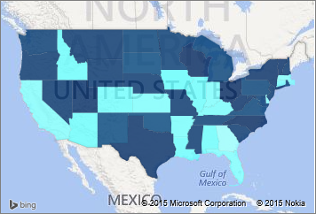
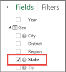
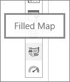
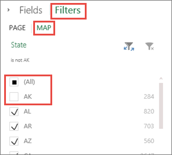
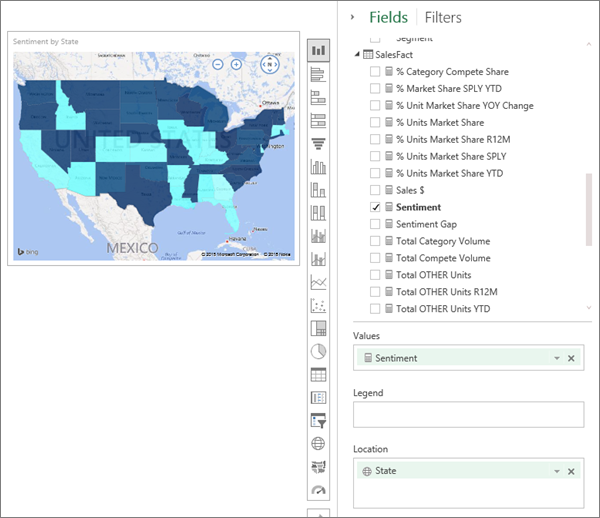
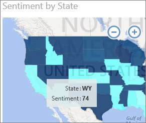
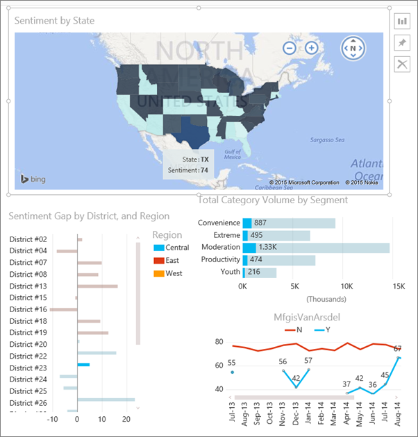

<properties pageTitle="Tutorial: Filled Maps (Choropleths) in Power BI" description="Tutorial: Filled Maps (Choropleths) in Power BI" services="powerbi" documentationCenter="" authors="v-anpasi" manager="mblythe" editor=""/>
<tags ms.service="powerbi" ms.devlang="NA" ms.topic="article" ms.tgt_pltfrm="NA" ms.workload="powerbi" ms.date="06/26/2015" ms.author="v-anpasi"/>
# Tutorial: Filled Maps (Choropleths) in Power BI
[← Visualizations in reports](https://support.powerbi.com/knowledgebase/topics/65160-visualizations-in-reports)

A Filled Map uses shading or tinting or patterns to display how a value differs in proportion across a geography or region.  Quickly display these relative differences with shading that ranges from light (less-frequent/lower) to dark (more-frequent/more).    

**NOTE**: This tutorial applies to the Power BI service and not to Power BI Designer. 

## When to use a Filled Map

Filled Maps are a great choice:

-   to display quantitative information on a map.
-   to show spatial patterns and relationships.
-   when your data is standardized.
-   when working with socioeconomic data.
-   when defined regions are important.
-   to get an overview of the distribution across the geographic locations.

## Working with Filled Maps

Filled Maps:

-   Can be created in reports and in Q&A, but cannot yet be pinned to dashboards.
-   Can be highlighted and cross-filtered by other visualizations on the same report page.
-   Can be used to highlight and cross-filter other visualizations on the same report page.
-   Support multi-select; hold down the CTRL button to select more than one region.
-   Can have a legend.

## Create a basic Filled Map

We'll create a Filled Map that shows sentiment data by state.  
These instructions use the Sales and Marketing Sample. To follow along, [download the sample](http://support.powerbi.com/knowledgebase/articles/514904-download-samples), sign in to powerBI.com and select **Get Data \> Excel Workbook \>  Connect \> Sales and Marketing Sample**.**xlsx**.

1.  Start on a [blank report page ](http://support.powerbi.com/knowledgebase/articles/474804-add-a-page-to-a-power-bi-report)in [Editing View](http://support.powerbi.com/knowledgebase/articles/443094-edit-a-report)and select the **Geo** \> **State** field.  
    
    
    
2.  [Convert the chart](http://support.powerbi.com/knowledgebase/articles/444663-change-the-type-of-visualization-in-a-report) to a Filled Map. Notice that **State** is now in the **Location** well. Bing Maps uses the field in the **Location** well to create the map.  The location can be either a valid named location (e.g., Australia, London) or a geographic coordinate using latitude and longitude.
    
	  
3.  Filter the map to display only the continental United States.
    1.  Select **Filters** to open the Filters pane.
    2.  Select **State**
    3.  Place a checkmark next to **All** and remove the checkmark next to **AK**.

		

    4.  Select **Fields** to display the Fields pane.

4.  Select **SalesFact** \> **Sentiment** to add it to the **Values** well. The field in the **Values** well controls the map shading.

    
    
5.  The Filled Map is shaded in blue, with light blue representing the lower sentiment numbers and dark blue representing the higher, more-positive sentiment.  Here I've highlighted the state of Wyoming (WY) and see that Sentiment is very good, 74.

    

6.  [Add the Filled Map as a dashboard tile](http://support.powerbi.com/knowledgebase/articles/425669-tiles-in-power-bi). 
7.  [Save the report](http://support.powerbi.com/knowledgebase/articles/444112-save-a-report).

## Highlighting and cross-filtering

For information about using the Filters pane, see [Add a filter to a report](https://support.powerbi.com/knowledgebase/articles/464704-add-a-filter-to-a-report).

Highlighting a Location in a Filled Map filters the other visualizations on the report page... and vice versa.

1.  On the Filled Map, select a state.  This highlights the other visualizations on the page. Selecting **Texas**, for example, shows me that Sentiment is 74, Texas is in the Central District \#23, and that most of the sales volume comes from the Moderation and Convenience segments.

    
2.  On the line chart, toggle between **No** and **Yes**. This filters the Filled Map to show Sentiment for VanArsdel and for VanArsdel's competition.

## See also:

[Add a visualization to a report](https://powerbi.uservoice.com/knowledgebase/articles/441777)  
[Pin a visualization to a dashboard](http://support.powerbi.com/knowledgebase/articles/430323-pin-a-tile-to-a-dashboard-from-a-report)  
[Power BI - Basic Concepts](http://support.powerbi.com/knowledgebase/articles/487029-power-bi-preview-basic-concepts)  
[Try it out -- it's free!](https://powerbi.com/)