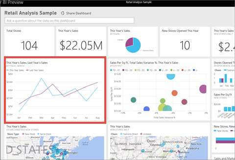
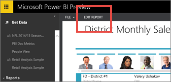
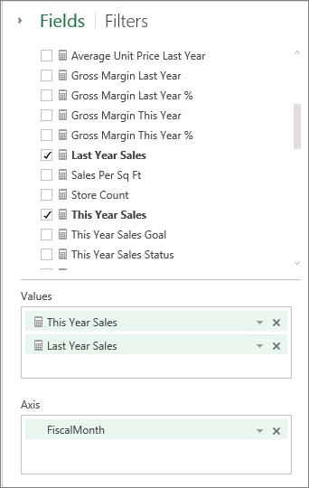
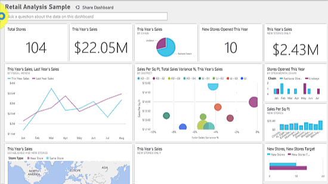

<properties pageTitle="Tutorial: Introduction to Power BI Q&A" description="Tutorial: Introduction to Power BI Q&A" services="powerbi" documentationCenter="" authors="v-anpasi" manager="mblythe" editor=""/>
<tags ms.service="powerbi" ms.devlang="NA" ms.topic="article" ms.tgt_pltfrm="NA" ms.workload="powerbi" ms.date="06/26/2015" ms.author="v-anpasi"/>
# Tutorial: Introduction to Power BI Q&A

[← Q&A in Power BI](https://support.powerbi.com/knowledgebase/topics/70394-q-a-in-power-bi)

Sometimes the fastest way to get an answer from your data is to ask a question using natural language.  In this tutorial we'll look at 2 different ways of creating the same visualization: building it in a report and asking a question with Q&A.  

1. From your Power BI workspace, select **Get Data** \> **Retail Analysis Sample**.

	

2. The dashboard contains a line chart tile for "This Year's Sales, Last Year's Sales."  Select this tile.
    -   If this tile was created with Q&A, selecting the tile will open Q&A. 
    -   But this tile was created in a report, so the report opens to the page that contains this visualization.

3. Open the report in Editing View by selecting **Edit Report**.

	

4. Select the line chart and review the settings in the **Fields** pane.  The report creator built this chart by selecting these 3 values and organizing them in the **Values** and **Axis** wells.  

    

## How would we go about creating this same line chart using Q&A?

1.  Navigate back to your Power BI workspace.

2.  Using natural language, type something like this into the question box:

    **what were this year sales and last year sales by month as line chart**

    As you type your question, Q&A picks the best visualization to display your answer; and the visualization changes dynamically as you modify the question. Also, Q&A helps you format your question with suggestions, auto-complete, and spelling corrections.

    When you finish typing your question, the result is the exact same line chart that we saw in the report.  But creating it this way was much faster!  

    

3.  To pin the chart to your dashboard, select the pin icon.

## See Also:

[Power Bi - Basic Concepts](http://support.powerbi.com/knowledgebase/articles/487029-power-bi-preview-basic-concepts)  
[Get started with Power BI](http://support.powerbi.com/knowledgebase/articles/430814-get-started-with-power-bi)  
[What type of questions can I ask Q&A?](http://support.powerbi.com/knowledgebase/articles/474566-q-a-in-power-bi)  
[Q&A in Power BI](http://support.powerbi.com/knowledgebase/articles/474566-q-a-in-power-bi)  
[Make your data work well with Q&A in Power BI](http://support.powerbi.com/knowledgebase/articles/474690-make-your-data-work-well-with-q-a)  
[Ask the right questions of Salesforce data in Power BI](http://support.powerbi.com/knowledgebase/articles/475138-ask-the-right-questions-of-salesforce-data)  
[preparing a workbook for Q&A](http://support.powerbi.com/knowledgebase/articles/474690-how-to-make-q-a-work-with-your-data)  
[pinning a tile to the dashboard from Q&A](http://support.powerbi.com/knowledgebase/articles/424874-pin-a-tile-to-a-dashboard-from-the-question-box)