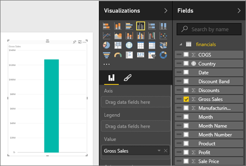
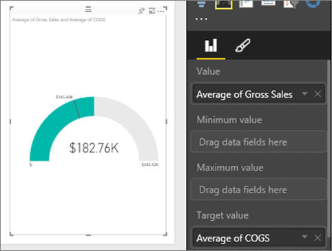
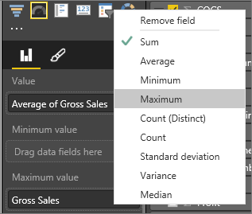
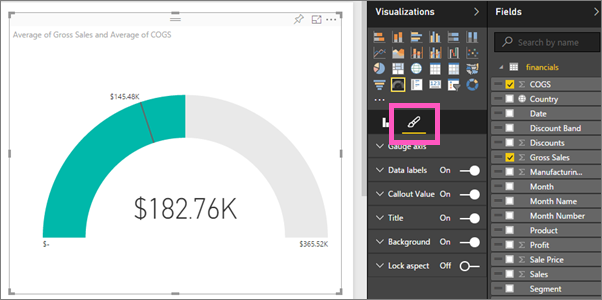
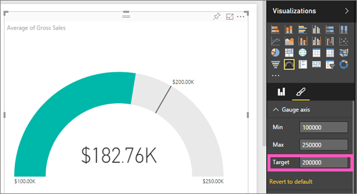

<properties
   pageTitle="Tutorial: Radial Gauge charts in Power BI"
   description="Tutorial: Radial Gauge charts in Power BI"
   services="powerbi"
   documentationCenter=""
   authors="mihart"
   manager="mblythe"
   editor=""
   tags=""/>

<tags
   ms.service="powerbi"
   ms.devlang="NA"
   ms.topic="article"
   ms.tgt_pltfrm="NA"
   ms.workload="powerbi"
   ms.date="12/11/2015"
   ms.author="mihart"/>

# Tutorial: Radial Gauge charts in Power BI

A Radial Gauge chart has a circular arc and displays a single value that measures progress toward a goal/KPI.  The goal, or target value, is represented by the line (needle). Progress toward that goal is represented by the shading.  And the value that represents that progress is shown in bold inside the arc. All possible values are spread evenly along the arc, from the minimum (left-most value) to the maximum (right-most value).

In the example below, we are a car retailer, tracking our Sales team's average sales per month. Our goal is 140 and represented by the black needle.  The minimum possible average sales is 0 and we've set the maximum as 200.  The blue shading shows that we're currently averaging approximately 120 sales this month. Luckily, we still have another week to reach our goal.

## When to use a Radial Gauge

Radial Gauges are a great choice to:

-   show progress toward a goal.

-   represent a percentile measure, like a KPI.

-   show the health of a single measure.

-   display information that can be quickly scanned and understood.

## Create a basic Radial Gauge

These instructions use the Financial Sample. To follow along, [download the sample](http://go.microsoft.com/fwlink/?LinkID=521962) to your computer, sign in to Power BI and select **Get Data \> Files \>  Local File > Open**. 

### Step 1: Open the Financial Sample Excel file.

1.  Open the file in Power BI by selecting **Get Data \> Files** and browsing to the location where you saved the file. The Financial Sample is added to your workspace navigation pane under **Datasets**.

    

2.  Select **Financial Sample** to open it in Explore mode.

### Step 2: Create a Gauge to track Gross Sales

1.  In the **Fields** pane, select **Gross Sales**.

    

2.  Change the aggregation to **Average**.

    

3.  Select the Gauge icon  to convert the Column Chart to a Gauge.

  By default, Power BI creates a Gauge chart where the current value (in this case, Average of Gross Sales) is assumed to be at the halfway point on the gauge. Since the Average Gross Sales is $182.76K, the start value (Minimum) is set to 0 and the end value (Maximum) is set to double the current value.

  

### Step 3: Set a target value

1. Drag **COGS** to the **Target value** well.

2.  Change the aggregation to **Average**.

  Power BI adds a needle to represent our target value of **$145.48K**. Notice that we've exceeded our target.

      

    >NOTE: You can also manually enter a target value.  See "Use formatting options to manually set Minimum, Maximum, and Target values" below.

### Step 4: Set a maximum value

In Step 2, Power BI used the Value field to automatically set minimum (start) and maximum (end).  But what if you want to set your own maximum value?  Let's say that instead of using double the current value as the maximum possible value, you want to set it to the highest Gross Sales number in your dataset? 

1.  Drag **Gross Sales** from the **Fields** list to the **Maximum Value** well.

2.  Change the aggregation to **Maximum**.

    

    The Gauge is redrawn with a new end value, 1.21 million in gross sales.

### Step 5: Save your report

6.  [Save the report](powerbi-service-save-a-report.md).

7. [Add the Gauge chart as a dashboard tile](powerbi-service-dashboard-tiles.md). 

## Use formatting options to manually set Minimum, Maximum, and Target values

1. Open the formatting pane by selecting the paintbrush icon.

    

2. Expand the **Gauge axis** and enter values for **Min** and **Max**.

    

3. Remove the current target value by removing the checkmark next to **COGS**.

    

4. When the **Target** field appears under **Gauge axis**, enter a value.

    

5. Optionally, continue formatting your Gauge chart.

## See also

[Reports in Power BI](powerbi-service-reports.md)

[Visualization types in Power BI](powerbi-service-visualization-types-for-reports-and-q-and-a.md)

[Add a visualization to a report](https://powerbi.uservoice.com/knowledgebase/articles/441777)

[Pin a visualization to a dashboard](powerbi-service-pin-a-tile-to-a-dashboard-from-a-report.md)

[ Power BI - Basic Concepts](powerbi-service-basic-concepts.md)
