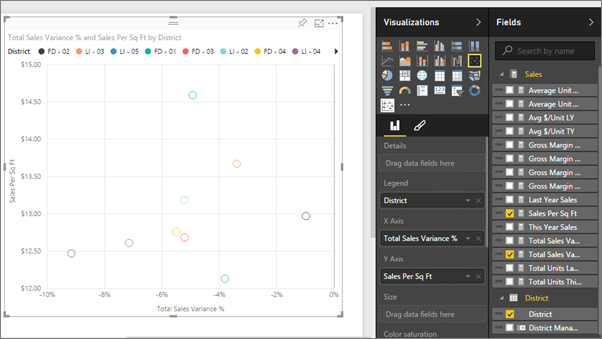

<properties
   pageTitle="Tutorial: Scatter Charts in Power BI"
   description="Tutorial: Scatter Charts in Power BI"
   services="powerbi"
   documentationCenter=""
   authors="mihart"
   manager="mblythe"
   editor=""
   tags=""/>

<tags
   ms.service="powerbi"
   ms.devlang="NA"
   ms.topic="article"
   ms.tgt_pltfrm="NA"
   ms.workload="powerbi"
   ms.date="12/01/2015"
   ms.author="mihart"/>

# Tutorial: Scatter charts and Bubble charts in Power BI  

A Scatter chart always has two value axes to show one set of numerical data along a horizontal axis and another set of numerical values along a vertical axis. The chart displays points at the intersection of an x and y numerical value, combining these values into single data points. These data points may be distributed evenly or unevenly across the horizontal axis, depending on the data.

A Bubble chart replaces the data points with bubbles, with the bubble *size* representing an additional dimension of the data.

  

## When to use a Scatter chart or Bubble chart

### Scatter charts are a great choice:

-   to show relationships between 2 (scatter) or 3 (bubble) **numerical** values.

-  To plot two groups of numbers as one series of xy coordinates.

-  instead of a line chart when you want to change the scale of the horizontal axis    

- to turn the horizontal axis into a logarithmic scale.

- to display worksheet data that includes pairs or grouped sets of values. In a scatter chart, you can adjust the independent scales of the axes to reveal more information about the grouped values.

- to show patterns in large sets of data, for example by showing linear or non-linear trends, clusters, and outliers.

- to compare large numbers of data points without regard to time    The more data that you include in a scatter chart, the better the comparisons that you can make.

### Bubble charts are a great choice:

- if your data has 3 data series that each contain a set of values.

- to present financial data.  Different bubble sizes are useful to visually emphasize specific values.

- to use with quadrants.

## Create a Scatter chart

1.  Open the Retail Analysis Sample in [Editing View](powerbi-service-interact-with-a-report-in-editing-view.md) and [add a new report page](powerbi-service-add-a-page-to-a-report.md).

2. From the Fields pane, select **Sales** > **Sales Per Sq Ft** and **Sales** > **Total Sales Variance %**.

3. From the Fields pane, select **District > District Manager**. 

  

3. Convert to a Scatter chart. In the Visualization pane, select the Scatter chart icon .

4. Drag **District** from **Details** to **Legend**.

  

We now have a Scatter chart that plots Total Sales Variance % along the Y axis, and plots Sales Per Square Feet along the X axis.  The data point colors represent districts.  Now let's add a third dimension.

## Create a Bubble chart

1.  From the Fields pane, drag **Sales** > **This Year Sales** to the **Size** area. 

  

2. Hover over a bubble.  The size of the bubble reflects the value of **This Year Sales**.  

  

3. Optionally, [format the visualization colors, labels, titles, background, and more](powerbi-service-getting-started-with-color-formatting-and-axis-properties.md).

## Troubleshooting

### **Your Scatter chart has only one data point**  

- Have you added a field to the **Details** or **Legend** area?

- Numeric fields marked with the **∑** icon are aggregated in some way (e.g., summed, averaged). Are one or both of the chart fields being aggregated?  

There are several ways to do this:

  1. Change the aggregation setting for the field.

  2. Add a field to the **Details** area to tell Power BI how to group the values.

  3. Use an ID field, if you have one.

  4. Add an ID field. Use the Query Editor to add an Index Column to your dataset.  Then add this column to the **Details** area of your visualization.

  For more information, see [Change the aggregation in a chart](powerbi-service-change-the-aggregation-in-a-chart) and [Aggregates in reports](powerbi-service-aggregates-in-reports.md).

## See also  
 [Add a visualization to a report](powerbi-service-add-visualizations-to-a-report-i.md)  

 [Visualization types in Power BI](powerbi-service-visualization-types-for-reports-and-q-and-a.md)

 [Power BI - Basic Concepts](powerbi-service-basic-concepts.md)  

[Try it out -- it's free!](https://powerbi.com/)  
