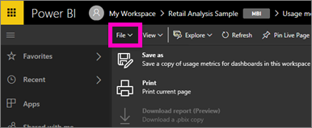
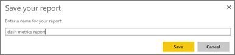

<properties
   pageTitle="Usage metrics for dashboards and reports"
   description="Documentation on how to view usage metrics for Power BI dashboards and reports"
   services="powerbi"
   documentationCenter=""
   authors="mihart"
   manager="erikre"
   backup=""
   editor=""
   tags=""
   featuredVideoId=""
   qualityFocus="no"
   qualityDate=""/>

<tags
   ms.service="powerbi"
   ms.devlang="NA"
   ms.topic="article"
   ms.tgt_pltfrm="NA"
   ms.workload="powerbi"
   ms.date="05/16/2017"
   ms.author="mihart"/>

# Usage metrics for dashboards and reports

##    Why are usage metrics important to me?
If you create dashboards and reports, usage metrics help you understand their impact. When you run usage metrics you'll discover how those dashboards and reports are being used throughout your organization. Knowing how your content is being used helps you demonstrate your impact and prioritize your efforts. Your usage metrics may show that one of your reports is used daily by a huge segment of the organization and it may show that a dashboard you created isn't being viewed at all. This type of feedback is invaluable in guiding your work efforts.

>**NOTE**: Usage metrics is a Power BI Pro feature. 

## About the Usage Metrics report
Selecting **Usage metrics** or the icon  generates a report for the last 90 days.  The report looks very similar to the Power BI reports you're already familiar with, but it's designed to be informational -- not interactive.  To dig down into the report data, use **Save as** (see below). 

The Usage Metrics report won't show up in **Recent**, **Workspaces**, **Favorites**, or other content lists. It cannot be added to an app. If you pin a tile from the usage metrics report to a dashboard, that dashboard cannot be added to an app.

##    Create a Usage Metrics report for a dashboard or report

1. Start in the workspace that contains the dashboard or report. 

2. From either the workspace content list or from the dashboard or report itself, select the icon for **Usage metrics**  .

    

    

3. Power BI creates the usage metrics report and lets you know when it's ready.

        

4. Select **View usage metrics** to open the results.
  

##    What metrics are reported?

|Metric  |Dashboard  |Report  |Description    |
|---------|---------|---------|---------|
|Distribution method slicer | yes  | yes        |  There are 2 ways to distribute a dashboard or report:  as part of an [app workspace](powerbi-service-the-new-power-bi-experience.md) or by [sharing](powerbi-service-share-unshare-dashboard.md).  |
|Platforms slicer     | yes    | yes |  Was the dashboard or report accessed via the Power BI service (powerbi.com) or a mobile device?     |
|Report page slicer    | no    | yes    | If the report has more than 1 page, slice the report by the page(s) that was viewed.    |
|Views per day     |   yes         |  yes       | Total number of views per day - a view is defined as a user loading the report or dashboard.   |
|Unique viewers per day     |   yes      |   yes      | Number of *different* users who viewed the dashboard or report (based on the AAD user account).
|Shares per day     |   yes      |  no       | Number of times the dashboard was shared with another user.
|Total views     |   yes      |   yes      | Number of views in the past 90 days.
|Total viewers     |   yes      |  yes       | Number of unique viewers in the past 90 days.
| Total shares    | yes    | no   | Number of times the dashboard or report was shared in the past 90 days.
|Total in organization| yes   | yes   | Count of all dashboards or reports in the entire organization.  Used to calculate rank.   |
|Rank: Total views    | yes   |  yes  | For total views of all dashboards or reports in the organization over the past 90 days, where does this dashboard or report rank. 
| Rank: Total viewers   | yes   | yes   | For total unique viewers of all dashboards or reports in the organization over the past 90 days, where does this dashboard or report rank.|
|Rank: Total shares    | yes   |  no  | For total shares of all dashboards in the organization over the past 90 days, where does this dashboard or report rank.

###    Dashboard Usage Metrics report

###    Report Usage Metrics report

##    Save the Usage Metrics report as a full-featured Power BI report
Use **Save as** to convert the usage metrics report to a full-featured Power BI report that can be customized and shared. 

When Power BI creates the full-featured report, it also creates a new dataset **made up of all the datasets used in the current workspace** (the workspace that contains the report or dashboard you ran usage metrics on). You have the option to either open and customize the report, starting with what was included in the usage metrics report or you can open the dataset and start with a blank report canvas. Either way you'll have access to usage metrics for all datasets in the current workspace.

1. From the usage metrics report, select **File > Save As**. Power BI converts the usage metrics report into a full-featured Power BI report.

    

2. Open the report in Editing view and [interact with it as you would with any other Power BI report](powerbi-service-interact-with-a-report-in-editing-view.md). For example, add new pages and build new visualizations, add filters, format the fonts and colors, etc.

    

3. Save the report with a new name. Select **File > Save As** and give it a meaningful name.

    

4. The new report is saved in the current workspace and also added to the **Recent** content list.

    

##    Considerations and limitations
Q:    I can't run usage metrics on a dashboard or report
A:    You can only see usage metrics for content you own or have permissions to edit.

Q:    I can't run usage metrics on any content.
A1:    Admins have the option to turn off this feature for their organization.  Contact your Admin to see if this is the case. 
A2:    Usage metrics is a Power BI Pro feature.

Q:    The data doesn't seem up-to-date
A:    It can take up to 24 hours for data to update.

## Next steps

[Favorite a dashboard](powerbi-service-favorite-dashboards.md)

More questions? [Try the Power BI Community](http://community.powerbi.com/)
