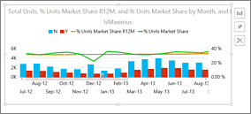
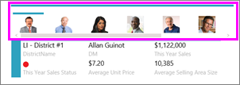
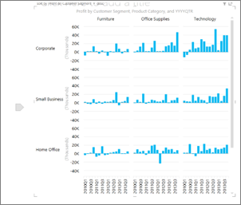
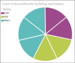
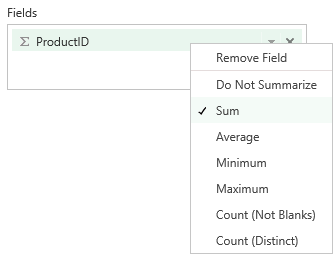

<properties pageTitle="Visualization types available in Power BI reports and Q&A" description="Visualization types available in Power BI reports and Q&A" services="powerbi" documentationCenter="" authors="v-anpasi" manager="mblythe" editor=""/>
<tags ms.service="powerbi" ms.devlang="NA" ms.topic="article" ms.tgt_pltfrm="NA" ms.workload="powerbi" ms.date="06/26/2015" ms.author="v-anpasi"/>
# Visualization types available in Power BI reports and Q&A

[← Visualizations in reports](https://support.powerbi.com/knowledgebase/topics/65160-visualizations-in-reports)  
## Power BI report visualizations

This is the current list of visualizations that can be added to Power BI reports. We'll be adding new visualizations as well, stay tuned!  All of these can be added to a Power BI report but [not all of these can be pinned to a dashboard](https://support.powerbi.com/knowledgebase/articles/611046) and [not all of these are recognized by Q&A](https://support.powerbi.com/knowledgebase/articles/469552#pinqa) (see list below).

### Bar and column charts

    

### Single number card tiles

### Combo charts

For more information, see [Tutorial: Combo Charts in Power BI](https://support.powerbi.com/knowledgebase/articles/436737-tutorial-combo-chart-merge-visualizations-in-po).

### Funnel charts

For more information, see [Tutorial: Funnel Charts in Power BI](https://support.powerbi.com/knowledgebase/articles/556197-tutorial-funnel-charts-in-power-bi).

### Gauge charts

  

For more information, see [Tutorial: Gauge Charts in Power BI](https://support.powerbi.com/knowledgebase/articles/556188).

### Line charts

### Maps (basic)

### Filled Maps (Choropleth)

For more information, see [Tutorial:  Filled Maps in Power BI](https://support.powerbi.com/knowledgebase/articles/556194).

### Pie charts

### Scatter and bubble charts

### Slicer

### Small Multiples

### Standalone images

### Tables

### Tree Maps

## Visualizations you can specify with Q&A

When typing natural language queries with Power BI Q&A, there are some visualization types that you can specify in the query.  For example:

"***sales by state as a treemap***"

The visualization types that currently work with Q&A are:

-   Bar and column charts: Clustered, stacked
-   Cards (Cards and Callout Cards without KPIs or images)
-   Line charts
-   Maps (basic)
-   Pie charts with a legend but without details  
    This pie chart has no details:

    

    This pie chart has details subdividing each slice:

    
-   Scatter and bubble charts
-   Tables or matrixes with no images or KPIs
-   Single-number card tiles (made from the question box or a card with a single measure. If you're using a Card, make sure you have set an aggregation in the Field Well rather than 'Do Not Summarize')

    
-   Tree maps (for more information, see [Tutorial: Treemaps in Power BI](https://support.powerbi.com/knowledgebase/articles/556200))

## See Also:

[Visualizations in Power BI reports](http://support.powerbi.com/knowledgebase/articles/434821-visualizations-in-power-bi-reports)  
[Visualizations that can be pinned to a dashboard](https://support.powerbi.com/knowledgebase/articles/611046)  
[Power BI - Basic Concepts](http://support.powerbi.com/knowledgebase/articles/487029-power-bi-preview-basic-concepts)  

This is a draft topic in development. Feedback? Click **Contact support** on the right side of this page.