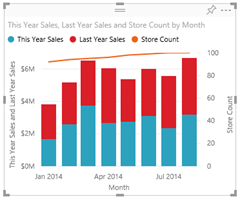

<properties 
   pageTitle="Visualization types in Power BI"
   description="Visualization types in Power BI"
   services="powerbi" 
   documentationCenter="" 
   authors="v-anpasi" 
   manager="mblythe" 
   editor=""
   tags=""/>
 
<tags
   ms.service="powerbi"
   ms.devlang="NA"
   ms.topic="article"
   ms.tgt_pltfrm="NA"
   ms.workload="powerbi"
   ms.date="09/28/2015"
   ms.author="v-anpasi"/>
# Visualization types in Power BI

## Power BI visualizations

We'll be adding new visualizations, stay tuned!  

## List of visualizations available in Power BI

All of these visualizations can be added to Power BI reports, specified in Q&A, and pinned to dashboards.

### Bar and column charts

  

### Basic (Layered) Area chart

**Tip**: The Area chart is based on the line chart with the area between the axis and line filled in.

For more information, see [Tutorial: Basic Area chart](powerbi-service-tutorial-basic-area-chart.md-tutorial-basic-area-chart).

### Single number card tiles

### Combo charts

**Tip**: A Combo chart combines a column chart and a line chart.

For more information, see [Tutorial: Combo charts in Power BI](powerbi-service-tutorial-combo-chart-merge-visualizations.md).

### Doughnut charts

**Tip**: Doughnut charts are similar to Pie charts.  They show the relationship of parts to a whole.

For more information, see [Tutorial: Doughnut charts in Power BI](powerbi-service-tutorial-doughnut-charts.md)

### Funnel charts

**Tip**: Funnels help visualize a process that has stages and items flow sequentially from one stage to the next.  Use a funnel when there is a sequential flow between stages, such as a sales process that starts with leads and ends with purchase fulfillment.

For more information, see [Tutorial: Funnel Charts in Power BI](powerbi-service-tutorial-funnel-charts.md-tutorial-funnel-charts-in-power-bi).

### Gauge charts

**Tip**: Displays current status in the context of a goal.

For more information, see [Tutorial: Gauge Charts in Power BI](powerbi-service-tutorial-radial-gauge-charts.md).

### Line charts

**Tip**: emphasize the overall shape of an entire series of values, usually over time.

### Maps (basic)

**Tip**: are used to associate both categorical and quantitative information with spatial locations.

### Matrix

Filled Maps (Choropleth)

**Tip**: The more intense the color, the larger the value.

For more information, see [Tutorial: Filled Maps in Power BI](powerbi-service-tutorial-filled-maps-choropleths.md).

### Pie charts

### Scatter and bubble charts

**Tip**: display relationships between 2 (scatter) or 3 (bubble) quantitative measures -- whether or not, in which 

### Standalone images

### Tables

**Tip**: work well with quantitative comparisons among items where there are many categories.

### Tree Maps

**Tip**: are charts of colored rectangles, with size representing value.  They can be hierarchical, with rectangles nested within the main rectangles.

### Waterfall charts

**Tip**: Waterfall charts show a running total as values are added or subtracted.

For more information, see [Tutorial Waterfall charts in Power BI](powerbi-service-tutorial-waterfall-charts.md-tutorial-waterfall-charts-in-power-bi).

### 

## Tell Q&A which visualization to use

When typing natural language queries with Power BI Q&A, you can specify the visualization type in your query.  For example:

"***sales by state as a treemap***"

## See Also:

[Visualizations in Power BI reports](powerbi-service-visualizations-for-reports.md)

[Reports in Power BI](powerbi-service-reports.md)

[Power BI - Basic Concepts](powerbi-service-basic-concepts.md)

