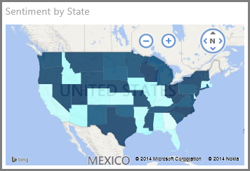

<properties
   pageTitle="Visualizations in Power BI"
   description="Visualizations in Power BI"
   services="powerbi"
   documentationCenter=""
   authors="mihart"
   manager="mblythe"
   editor=""
   tags=""/>

<tags
   ms.service="powerbi"
   ms.devlang="NA"
   ms.topic="article"
   ms.tgt_pltfrm="NA"
   ms.workload="powerbi"
   ms.date="10/15/2015"
   ms.author="mihart"/>

# Visualizations in Power BI  

Data visualizations allow you to interact with your data to find business insights. Create and modify visualizations in your reports, and then pin them to your dashboards.   

## Add a visualization in Power BI  
[Create visualizations](powerbi-service-add-visualizations-to-a-report-i.md)on the pages of your reports. Browse the [list of available visualizations and available visualization tutorials.](powerbi-service-visualization-types-for-reports-and-q-and-a.md) 

## Upload a custom visualization and use it in Power BI
Add a custom visualization that you created yourself or that you found in the [community gallery](http://visuals.powerbi.com). Feeling creative? Dig into our source code and use our developer tools to create a new visualization type and [share it with the community](http://visuals.powerbi.com)

## Change the visualization type  
Try [changing the type of visualization](powerbi-service-change-the-type-of-visualization-in-a-report.md) to see which works best with your data.

## Pin the visualization  
When you have the visualization the way you want it, you can [pin it to a dashboard](powerbi-service-pin-a-tile-to-a-dashboard-from-a-report.md) as a tile. If you change the visualization in the report after you pin it, the tile on the dashboard doesn't change.

## Move and resize a visualization  
Organize your report pages by [moving and resizing visualizations](powerbi-service-move-and-resize-a-visualization.md).

## Copy and paste a visualization  
[Copy and paste visualizations](powerbi-service-copy-and-paste-a-visualization.md)on the same report page or on new report pages. 

## Change how a visualization is sorted  
You can [sort a visualization](powerbi-service-change-how-a-chart-is-sorted.md) by the different fields in the visualization, or reverse the order -- A to Z or Z to A.

## Change the aggregation in a visualization  
[Change the aggregation in a chart](powerbi-service-change-the-aggregation-in-a-chart.md)(sum, average, maximum, etc.)

## Delete a visualization  
[Remove unwanted visualizations](powerbi-service-delete-a-visualization.md)from your report.

## Add a hyperlink to a table  
Learn how to [create and add links to table visualizations](powerbi-service-hyperlinks-in-tables.md).

## Tutorials  
-   [Customize visualization title, background, and legend](powerbi-service-tutorial-customize-visualization-title-background-and-legend.md)

-   [Customize X-axis and Y-axis properties](powerbi-service-tutorial-customize-x-axis-and-y-axis-properties.md)

-   [Basic Area charts](powerbi-service-tutorial-basic-area-chart.md)

-   [Combo charts](powerbi-service-tutorial-combo-chart-merge-visualizations.md)

-   [Doughnut charts](powerbi-service-tutorial-doughnut-charts.md)

-   [Filled Maps](powerbi-service-tutorial-filled-maps-choropleths.md) (Choropleths)

-   [Funnel charts](powerbi-service-tutorial-funnel-charts.md)

-   [Radial Gauge charts](powerbi-service-tutorial-radial-gauge-charts.md)

- [Slicers](powerbi-service-tutorial-slicers.md)

-   [Treemaps](powerbi-service-tutorial-treemaps.md)

-   [Waterfall charts](powerbi-service-tutorial-waterfall-charts.md)

## See also  
[Visualization types in Power BI](powerbi-service-visualization-types-for-reports-and-q-and-a.md)
[Reports in Power BI](powerbi-service-reports.md)  
[Dashboards in Power BI](powerbi-service-dashboards.md)  
[Power BI - Basic Concepts](powerbi-service-basic-concepts.md)  
