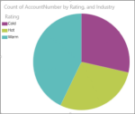

<properties pageTitle="Visualizations that can be pinned to a dashboard" description="Visualizations that can be pinned to a dashboard" services="powerbi" documentationCenter="" authors="v-anpasi" manager="mblythe" editor=""/>
<tags ms.service="powerbi" ms.devlang="NA" ms.topic="article" ms.tgt_pltfrm="NA" ms.workload="powerbi" ms.date="06/26/2015" ms.author="v-anpasi"/>
# Visualizations that can be pinned to a dashboard

[← Visualizations in reports](https://support.powerbi.com/knowledgebase/topics/65160-visualizations-in-reports)  
## Visualizations you **can** pin to a dashboard

Not all of the [visualizations that you can add to Power BI reports](http://support.powerbi.com/knowledgebase/articles/469552) can be pinned to a dashboard. The current list of pin-able visualizations:

-   Bar and column charts: Clustered, stacked, and 100% stacked
-   Cards (Cards and Callout Cards without KPIs or images)  
-   Combo charts (For more information, see [Tutorial: Combo Charts in Power BI](https://support.powerbi.com/knowledgebase/articles/436737-tutorial-combo-chart-merge-visualizations-in-po))  
-   Funnel charts (For more information, see [Tutorial: Funnel Charts in Power BI](https://support.powerbi.com/knowledgebase/articles/556197-tutorial-funnel-charts-in-power-bi))  
-   Gauge charts (For more information, see [Tutorial: Gauge Charts in Power BI](https://support.powerbi.com/knowledgebase/articles/556188))
-   Line charts
-   Maps (basic)  
-   Pie charts with a legend but without details  
    This pie chart has no details:  
      
    This pie chart has details subdividing each slice:  
      
-   Scatter and bubble charts
-   Standalone images
-   Tables or matrixes with no images or KPIs
-   Single-number card tiles (made from the question box or a card with a single measure. If you're using a Card, make sure you have set an aggregation in the Field Well rather than 'Do Not Summarize')  
      
-   Tree maps (For more information, see [Tutorial: Treemaps in Power BI](https://support.powerbi.com/knowledgebase/articles/556188))
    

## See Also:

[Visualizations in Power BI reports](http://support.powerbi.com/knowledgebase/articles/434821-visualizations-in-power-bi-reports)  
[Types of visualizations available in Power BI reports and Q&A](http://support.powerbi.com/knowledgebase/articles/469552)  
[Power BI - Basic Concepts](http://support.powerbi.com/knowledgebase/articles/487029-power-bi-preview-basic-concepts)  

This is a draft topic in development. Feedback? Click **Contact support** on the right side of this page.