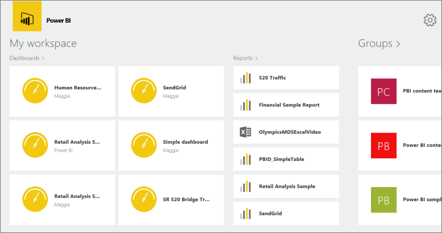
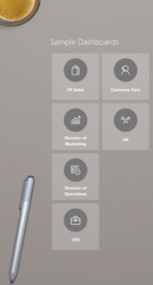
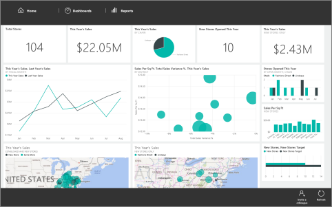

<properties 
   pageTitle="Get started with the Power BI for Windows app"
   description="Get started with the Power BI for Windows app"
   services="powerbi" 
   documentationCenter="" 
   authors="v-anpasi" 
   manager="mblythe" 
   editor=""
   tags=""/>
 
<tags
   ms.service="powerbi"
   ms.devlang="NA"
   ms.topic="article"
   ms.tgt_pltfrm="NA"
   ms.workload="powerbi"
   ms.date="09/28/2015"
   ms.author="v-anpasi"/>
# Get started with the Power BI for Windows app

The Microsoft Power BI for Windows app adds to the Power BI experience. It provides live, touch-enabled mobile access to your important business information, so you can view and interact with your company dashboards and reports easily, from anywhere. Explore the data in your dashboards, and share them with your colleagues in email.

Bring your data together by creating [dashboards and reports in Power BI](powerbi-service-get-started.md). Then experience them in the Windows app.

### Get the app

Download the [Power BI for Windows app from the Windows Store](powerbi-mobile-get-the-windows-app.md).

### Open the app

Add the app to Windows Start so you can just tap to open it.

### Try the samples

Even without signing up for or signing in with a Power Bi account, you can play with the samples. The first time you start the app, you can either sign in or view the samples. 

You can get back to the samples at any time.

-   From the app home page, tap the role and explore the sample dashboard for that role.

    NOTE: Not all features are available in these samples. For example, you can't view the sample reports that underlie these dashboards.

### Show the app bars

-   Swipe down from the top of the screen or up from the bottom to show the app bars.

    The app bars show different options, depending on where you are.

    

### Keep going

-   Get the [Power BI for Windows app](powerbi-mobile-get-the-windows-app.md)

-   View your [dashboards](powerbi-mobile-dashboards-in-the-windows-app.md).

-   Interact with [tiles on your dashboards](powerbi-mobile-tiles-in-the-windows-app.md). 

-   Open [reports](powerbi-mobile-reports-in-the-windows-app.md). 

-   Share [dashboards](powerbi-mobile-share-dashboards-from-the-windows-app.md).

-   Collaborate using [Groups](powerbi-mobile-groups-in-the-windows-app.md).

-   [Refresh the data](powerbi-mobile-refresh-the-windows-app.md) in the Power BI for Windows app.

-   Annotate and share [snapshots of tiles](powerbi-mobile-annotate-and-share-a-snapshot-from-the-windows-app.md).

### Supported devices

The Microsoft Power BI for Windows app runs on all Windows 8.1 and Windows 10 devices. It doesn't run on Windows phones or on Windows RT devices. 

