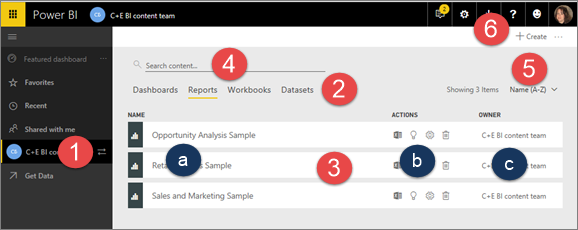

<properties
   pageTitle="Workspaces in Power BI"
   description="documentation for workspaces in Power BI"
   services="powerbi"
   documentationCenter=""
   authors="mihart"
   manager="mblythe"
   backup=""
   editor=""
   tags=""
   qualityFocus="no"
   qualityDate=""/>

<tags
   ms.service="powerbi"
   ms.devlang="NA"
   ms.topic="article"
   ms.tgt_pltfrm="NA"
   ms.workload="powerbi"
   ms.date="11/10/2016"
   ms.author="mihart"/>

# Workspaces in Power BI service
## My Workspace
Power BI content is made up of dashboards, reports, workbooks, and datasets. And each piece of content is associated with a ***workspace***. Workspaces are where you create and manage content you own and [group content](powerbi-service-new-create-a-group-in-power-bi.md).

>[AZURE.NOTE] Content that has been shared with you will **not** show up in a workspace. Instead, you'll [find it in **Shared with me**](powerbi-service-shared-with-me.md).

When you open Power BI for the first time, you'll have one top-level workspace named **My Workspace**. You can [create and add new workspaces](powerbi-service-manage-workspaces.md), and those will be organized as **Group Workspaces**.

Need help understanding the building blocks that make up Power BI?  See [Power BI - Basic Concepts](powerbi-service-basic-concepts.md).

## Group workspaces
Group workspaces "hold" content for members of a group. A group can have one or more members. So if the Sales department wants a workspace for all of their dashboards, reports, workbooks, and datasets related to 2016, they can [create a group ](powerbi-service-new-create-a-group-in-power-bi.md) and name it "Sales 2016". Power BI creates a corresponding empty group workspace also named "Sales 2016". Now the Sales team can add and collaborates on content in that group workspace.

>[AZURE.TIP]For more information about groups, see [Groups in Power BI](powerbi-service-new-create-a-group-in-power-bi.md)

Any [Power BI Pro](powerbi-power-bi-pro-content-what-is-it.md) user can [create a group](powerbi-service-new-create-a-group-in-power-bi.md) and [be a member of a group](powerbi-service-share-unshare-dashboard). And if a colleague creates a group and adds you as a member, Power BI adds that group workspace as well.

## Switch between workspaces

Workspaces are organized in their own Power BI pane. The name of the active workspace displays in the left navbar and the top navbar.

1. Expand the left navbar by selecting the global navigation button   .

    

2.  Select the double arrows  to open the workspaces pane.

    

    **My Workspace** is always at the top and the group workspaces are below, listed alphabetically.

3.  To open a workspace, just select it. The workspace opens with the **Dashoards** tab displayed.

    

## Take a tour of a workspace
Workspaces are made up of 4 tabs: Dashboards, Reports, Workbooks, and Datasets. Across these tabs, workspaces share some common features. We'll use a Reports tab for our example.

1. The name of the current active workspace.

2. The 4 tabs: Dashboards, Reports, Workbooks, and Datasets. **Reports** is currently selected.

3. The information display area is similar for dashboards, workbooks and datasets.

   a. The name (of the report, dashboard, workbook, or dataset)

   b. The actions you can take

4. This workspace has only a few reports, but workspaces can get crowded. Use **Search** to find what you need.

5. Want to sort the list in reverse order?  Select the arrow or just click **Name (A-Z)**.

6. Select **Create** to add a new dashboard or dataset.  And select the ellipses (...) to review or modify group information.

##  See also
[Create a workspace](powerbi-service-new-create-a-group-in-power-bi.md)

[Delete a workspace](powerbi-service-delete.md)

[Power BI - Basic Concepts](powerbi-service-basic-concepts.md)

More questions? [Try the Power BI Community](http://community.powerbi.com/)
