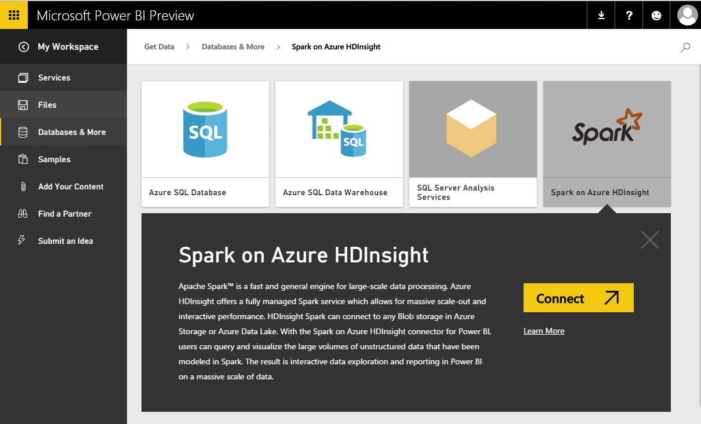
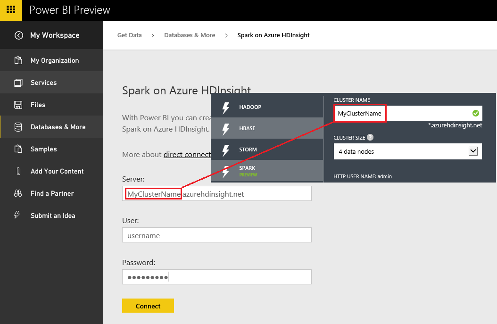

<properties 
   pageTitle="Spark on HDInsight with direct connect"
   description="Spark on HDInsight with direct connect"
   services="powerbi" 
   documentationCenter="" 
   authors="jastru" 
   manager="mblythe" 
   editor=""
   tags=""/>
 
<tags
   ms.service="powerbi"
   ms.devlang="NA"
   ms.topic="article"
   ms.tgt_pltfrm="NA"
   ms.workload="powerbi"
   ms.date="10/15/2015"
   ms.author="jastru"/>

# Spark on HDInsight with direct connect  

Spark on Azure HDInsight with direct connect allows you to create dynamic reports based on data and metric you already have in your Spark cluster. With direct connect, queries are sent back to your Azure HDInsight Spark cluster as you explore the data in the report view. This experience is suggested for users who are familiar with the entities they connect to.

>**Notes:**  
>-   Every action such as selecting a column or adding a filter will send a query back to the database – before selecting very large fields, consider choosing an appropriate visual type.
>-   Tiles are refreshed every 15 mins.
>-   Q&A is not available for direct connect datasets.
>-   Schema changes are not picked up automatically.
>-   Groups are only available with [Power BI Pro](https://support.powerbi.com/knowledgebase/articles/685479).

These restrictions and notes may change as we continue to improve the experiences. The steps to connect are detailed below.  Additional documentation can be found at [Use BI tools with Apache Spark on Azure HDInsight](https://azure.microsoft.com/documentation/articles/hdinsight-apache-spark-use-bi-tools/%20)

1. Select **Get Data** at the bottom of the left navigation pane.  
 	  
 
2. Select **Databases & More**.  
 	
   
3. Select the **Spark on HDInsight** connector and choose **Connect**.  
 	  
 
4. Enter the name of the **server** you want to connect to, as well as your **username** and **password**. The server is always in the form \<clustername\>.azurehdinsight.net, see more details about finding these values below.  
 	  
 
5. Once connected, you'll see a new dataset with named “SparkDataset”. You can also access the dataset through the placeholder tile that is created.  
 	  
 
6. Drilling into the dataset, you can explore all of the tables and columns in your database. Selecting a column will send a query back to the source, dynamically creating your visual. These visuals can be saved in a new report, and pinned back to your dashboard.

## Finding your Spark on HDInsight parameters  
The server is always in the form \<clustername\>.azurehdinsight.net, and can be found in your portal:  
	

The username and password can also be found in the portal.

## Troubleshooting  
If you're hitting issues executing queries against your cluster, verify the application is still running and restart if necessary.

You can also allocate additional resources in the Resource Manager:  
	

## See Also  
[Get started with Power BI](powerbi-service-get-started.md)  
[Get Data for Power BI](powerbi-service-get-data.md)  