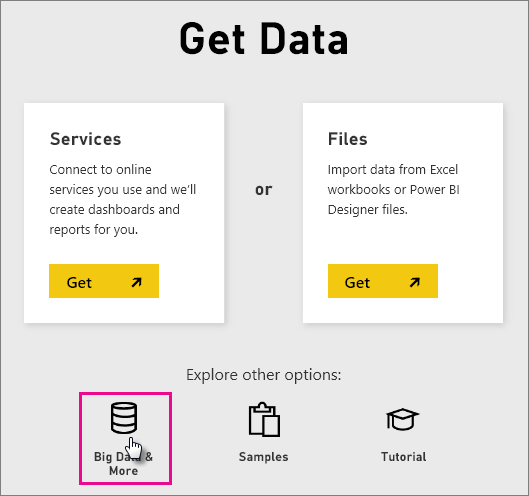
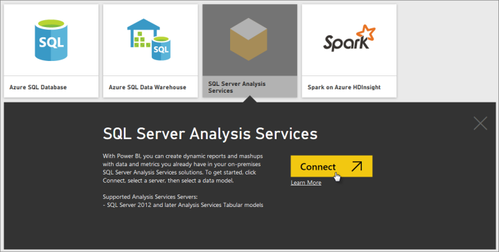
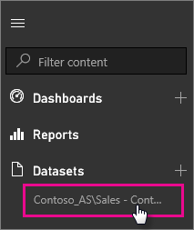

<properties
   pageTitle="SQL Server Analysis Services live data in Power BI"
   description="SQL Server Analysis Services live data in Power BI. This is done via a data source that was configured for an enterprise gateway."
   services="powerbi"
   documentationCenter=""
   authors="guyinacube"
   manager="mblythe"
   editor=""
   tags=""
   qualityFocus="no"
   qualityDate=""/>

<tags
   ms.service="powerbi"
   ms.devlang="NA"
   ms.topic="article"
   ms.tgt_pltfrm="NA"
   ms.workload="powerbi"
   ms.date="04/25/2016"
   ms.author="asaxton"/>
# SQL Server Analysis Services live data in Power BI

In Power BI, there are two ways you can connect to a live SQL Server Analysis Services server. In Get data, you can connect to a SQL Server Analysis Services server, or you can connect to a [Power BI Desktop file](powerbi-service-powerbi-desktop-files.md), or [Excel workbook](powerbi-service-excel-data.md), that already connects to an Analysis Services server. 

  **Important:**

-   In order to connect to a live Analysis Services server, a Power BI Gateway - Enterprise must be installed and configured by an administrator. For more information, see [Configure a Power BI Analysis Services Connector](powerbi-gateway-enterprise.md).

-   When you use the gateway, your data remains on-premises.  The reports you create based on that data are saved in the Power BI service. 

-   Q&A natural language querying is not currently available for live connections.  Only cloud-based datasets are supported for Q&A.

 > **Note**: Working with live Analysis Services servers, along with Groups, are Pro features. [Learn more](powerbi-power-bi-pro-content-what-is-it.md).

## To connect to a model from Get data

1.  In **My Workspace**, click **Get data**. You can also change to a group workspace, if one is available.

	

2.  Select **Databases & More.**

	

3.  Click **SQL Server Analysis Services** connector. \> **Connect**. 

	

4.  Select a server. If you don't see any servers listed here, it means either a gateway, and data source, are not configured, or your account is not listed in the **Users** tab of the data source, in the gateway. Check with your adminsitrator.

5.  Select the model you want to connect to. This could be either Tabular or Multidimensional.

After you connect to the model, it will appear in your Power BI site in **My Workspace/Datasets**. If you were swtiched to a group workspace, then the dataset will appear within the group.

If you pin visuals from a report to the dashboard, the pinned tiles are automatically refreshed every 10 minutes. If the data in your on-premises Analysis Services server is updated, the tiles will get auto-updated after 10 minutes.

## See also

[Power BI Gateway - Enterprise](powerbi-gateway-enterprise.md)

[Manage Analysis Services data sources](powerbi-gateway-enterprise-manage-ssas.md)

[Troubleshooting the Power BI Gateway - Enterprise](powerbi-gateway-enterprise-tshoot.md)