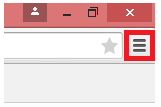
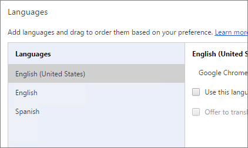
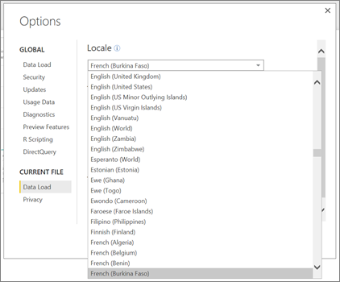

<properties 
   pageTitle="Supported languages and countries/regions for Power BI"
   description="Supported languages and countries/regions for Power BI"
   services="powerbi" 
   documentationCenter="" 
   authors="maggiesMSFT" 
   manager="mblythe" 
   backup=""
   editor=""
   tags=""
   qualityFocus="complete"
   qualityDate="05/02/2016"/>
 
<tags
   ms.service="powerbi"
   ms.devlang="NA"
   ms.topic="get-started-article"
   ms.tgt_pltfrm="NA"
   ms.workload="powerbi"
   ms.date="10/03/2016"
   ms.author="maggies"/>
# Supported languages and countries/regions for Power BI

## Countries and regions where Power BI is available
For a list of countries and regions where Power BI is available, see the [international availability list](https://products.office.com/business/international-availability). 

## Languages for the Power BI service
Power BI (in your browser) is available in the following 42 languages:

-   Arabic
-   Basque - Basque
-   Bulgarian - Български
-   Catalan - català
-   Chinese (Simplified) - 中文(简体)
-   Chinese (Traditional) - 中文(繁體)
-   Croatian - hrvatski
-   Czech - čeština
-   Danish - dansk
-   Dutch - Nederlands
-   English - English
-   Estonian - eesti
-   Finnish - suomi
-   French - français
-   Galician - galego
-   German - Deutsch
-   Greek - Ελληνικά
-   Hebrew
-   Hindi - हिंदी
-   Hungarian - magyar
-   Indonesian - Bahasa Indonesia
-   Italian - italiano
-   Japanese - 日本語
-   Kazakh - Қазақ
-   Korean - 한국어
-   Latvian - latviešu
-   Lithuanian - lietuvių
-   Malay - Bahasa Melayu
-   Norwegian (Bokmål) - norsk (bokmål)
-   Polish - Polski
-   Portuguese (Brazil) - Português
-   Portuguese (Portugal) - português
-   Romanian - română
-   Russian - Русский
-   Serbian (Cyrillic) - српски
-   Serbian (Latin) - srpski
-   Slovak - slovenčina
-   Slovenian - slovenski
-   Spanish - español
-   Swedish - svenska
-   Thai - ไทย
-   Turkish - Türkçe
-   Ukrainian - українська
-   Vietnamese - Tiếng Việt

## What's translated

Menus, buttons, messages, and other elements of the experience are translated into your language, making it easier to navigate and interact with Power BI.

At this time, a few features are available in English only:

-   Dashboards and reports that Power BI creates for you when you connect to services such as Microsoft Dynamics CRM, Google Analytics, Salesforce, and so on. (You can still create your own dashboards and reports in your own language.)

-   Exploring your data with Q&A.

-   Help content for Power BI. We will add localized help content over time.

Stay tuned as we work to bring additional features to other languages. 

## Choose your language in the Power BI service

1. In the Power BI service, select the **Settings** icon  > **Settings**.

2. On the **General** tab > **Language**.

3. Select your language > **Apply**.

## Choose your language in the browser

Power BI detects your language based on the language preferences on your computer. The way you access and change these preferences may vary depending on your operating system and browser. Here's how to access these preferences from Internet Explorer and Google Chrome.

### Internet Explorer (version 11)

1.  Click the Tools button in the top-right corner of your browser window:

    

2.  Click **Internet Options**.

3.  In the Internet Options dialog, on the General tab under Appearance, click the **Languages** button.

### Google Chrome (version 42)

1.  Click the menu button in the top-right corner of your browser window:

    

2.  Click **Settings**.

3.  Click **Show advanced settings**.

4.  Under Languages, click the **Language and input settings** button.

5.  Click **Add**, select a language, and click **OK**.

    

    The new language is at the end of the list. 

6.  Drag the new language to the top of the list, and click **Display Google Chrome in this language**.

    

    You may need to close and reopen your browser to see the change.

## Choose your language when you download Power BI Desktop

You have the option to select a language when you download Power BI Desktop. 

-  Go to the [Power BI Desktop download page](https://www.microsoft.com/download/details.aspx?id=45331).

The only way to change the language in Power BI Desktop is to go back to the download page and download it in a different language.

## Choose the locale of a report in Power BI Desktop

You can set the locale (the date and number formats) for a specific report to be something other than the locale in your version of Power BI Desktop. 

1.  Go to **File** > **Options and settings** > **Options**.
2.  Under **Current file**, select **Regional Settings**.
3.  In the **Locale** box, select a different locale. 

    

4.  Select **OK**.

### See also 
* Questions? Try asking the [Power BI Community](http://community.powerbi.com/).

