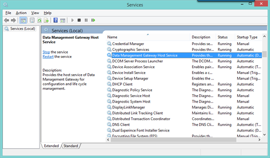
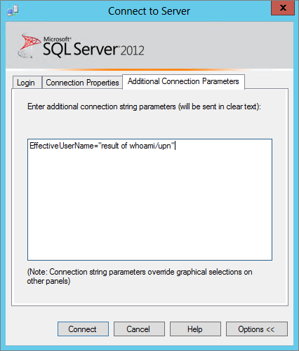

<properties pageTitle="Troubleshooting the Power BI Analysis Service Connector" description="Troubleshooting the Power BI Analysis Service Connector" services="powerbi" documentationCenter="" authors="v-anpasi" manager="mblythe" editor=""/>
<tags ms.service="powerbi" ms.devlang="NA" ms.topic="article" ms.tgt_pltfrm="NA" ms.workload="powerbi" ms.date="06/16/2015" ms.author="v-anpasi"/>
# Troubleshooting the Power BI Analysis Service Connector

[← Troubleshooting](https://support.powerbi.com/knowledgebase/topics/65779-troubleshooting)

If you're having issues using the Power BI Analysis Services Connector, be sure check out these troubleshooting tips.

**Connector installation fails -** If you run into issues during the connector installation:

1.   Check if you can sign in to Power BI with the account you used when configuring the connector.

2.   Try connecting to the AS server with Excel or SSMS from the machine you are trying to install the connector on. If this doesn't work, then the connector won't connect either.

3.   Check if the 'Data Management Gateway Host Service' is running. Restarting the service can sometimes help.

**Connector configuration gives the following error -**

This error  means that your Power BI username does not match your on-premises username. Hence the effective user name mechanism that Power BI relies on to connect to the Analysis Services Server could not work. To fix it, you'll have to ensure you use your work email address with Power BI or synchronize your on-premises Active Directory with Azure Active Directory. [Learn more](http://support.powerbi.com/knowledgebase/articles/546004-power-bi-analysis-services-connector-in-depth) about the Analysis Services Connector Services Connector to understand the role the effective user name plays & why the Active Director to Azure Active Directory sync is needed.


**Connector installed successfully, but doesn't work with Power BI -** If you see errors when trying to connect to Analysis Services data through Power BI :
1.   If you used an .onmicrosoft.com email address with Power BI, you may need to set up DirSync between your on-premises Active Directory and Azure Active Directory.

2.   Check if the 'Data Management Gateway Host Service' is running. Restarting the service may help.

3.   Confirm the AS server is running. 

4.   Check in Windows Event Viewer log. You'll see Data Management Gateway under Applications and Services Logs.

> 

If you see the following error:

  Unable to access the data from Data Management Gateway: System.Runtime.InteropServices.InvalidComObjectException: Failed to load COM interface IMDExternalConnection ---\> System.Runtime.InteropServices.COMException: Error HRESULT E\_FAIL has been returned from a call to a COM component. at Microsoft.DataTransfer.DIAgentCommon.DataAccess.Msolap.IMDExternalDataChannel.OpenConnection(String in\_bstrConnectionString, String in\_bstrAuthInfo, Object& out\_ppConnection) at Microsoft.DataTransfer.DIAgentCommon.DataAccess.Msolap.MsolapHandler.CheckConnection() ).

This means the EffectiveUserName property is not working. This can happen because:

-   You are using an .ommicrosoft.com e-mail to login and you don't have your on-premises Active Directory synchronized with Azure Active Directory with DirSync.

-   You are using a work e-mail address but the username returned by Azure Active Directory doesn't match the username in your on-premises Active Directory.

-   You are using a work e-mail address, but the domain names in Azure Active Directory and your on-premises Active Directory don't match.  

You can test locally from the computer the AS Connector is installed on:

- Using whoami/UPN: From a command prompt, type 'whoami/upn'. If the return result doesn't match the e-mail address used with the Power BI account, the AS Connector won't work
- Using SSMS: In SQL Server Management Studio (SSMS), in the connect to server dialog for Analysis Services server, choose 'Options\>\>'

Then in the Additional Connection Parameters set EffectiveUserName=\<work email address used to login to PowerBI\> or the result of the whoami/upn). Then click Connect.

If connecting to the Analysis Services Server does not work, then the AS Connector will not work either.

There are many reasons why this might not work. Multiple domains, asymmetric trust relationships between domains, etc. In all of these cases, if the Analysis Services server cannot resolve the username of the cloud identity (used to log into Power BI), the AS Connector will not work.

**Connector installed successfully and reports work, but tiles don't get updated:**

1.  Power BI automatically updates report tiles connected to an Analysis Services server. The update frequency is every 10 minutes.

2.  Check you're able to open the report and see latest data.

3.  Check if you're able to pin the visual from Report and check if the latest data is showing in the tile on the dashboard.

4.  Start SQL Profiler and check if there are queries being sent to the Analysis Services tabular database.

If you've followed all these steps and are still having problems, click  in the main Power BI page, then click **Contact Support.** Send us:

-   Any logs that are generated during installation, if there were errors.
-   Any error messages you’re seeing (including the Technical Details) during configuration.
-   Any errors that appear under Data Management Gateway in Event Viewer.
-   Any ‘Audit Failure’ events in the Windows Security log related to the account you’re using to connect to Analysis Services.
-   Any errors you see in SQL Profiler while trying to connect from Power BI
