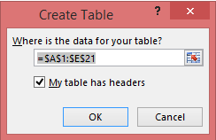

<properties pageTitle=""We couldn't find any data in your Excel workbook"" description=""We couldn't find any data in your Excel workbook"" services="powerbi" documentationCenter="" authors="v-anpasi" manager="mblythe" editor=""/>
<tags ms.service="powerbi" ms.devlang="NA" ms.topic="article" ms.tgt_pltfrm="NA" ms.workload="powerbi" ms.date="06/16/2015" ms.author="v-anpasi"/>
#"We couldn't find any data in your Excel workbook"

[← Troubleshooting](https://support.powerbi.com/knowledgebase/topics/65779-troubleshooting)

##Problem

When you import an Excel workbook into Power BI, you may see the following error:

##Quick solution

1. Edit your workbook in Excel.
2. Select the range of cells that contain your data. The first row should contain your column headers (the column names).
3. Press **Ctrl + T** to create a table.
4. Save your workbook.
5. Return to Power BI and import your workbook again.

##Details

###Cause

In Excel, you can create a **table** out of a range of cells, which makes it easier to sort, filter, and format data.

When you import an Excel workbook, Power BI looks for these tables and imports them into a dataset; if it doesn't find any tables, you'll see this error message.

###Solution

1. Open your workbook in Excel. (Note: The pictures here are of Excel 2013. If you're using Excel 2007 or 2010, things may look a little different, but the steps are the same.)

  

2. Select the range of cells that contain your data. The first row should contain your column headers (the column names):

  

3. In the ribbon on the **INSERT** tab, click **Table**. (Or, as a shortcut, press **Ctrl + T**.)

  

4. You'll see the following dialog. Make sure "**My table has headers**" is checked and click **OK**:

  

5. Now you should see your data formatted as a table:

  

6. Save your workbook.
7. Return to Power BI and click **Get Data**:

  

8. Import your Excel workbook again. This time, the import should find the table and succeed.

  

If the import still fails, let us know by clicking **Contact support** in the help menu:

  

##More information

-   This article applies to Excel 2007, 2010, and 2013.
-   The pictures here are of Excel 2013. If you're using Excel 2007 or 2010, things may look a little different, but the steps are the same.

*Error: We couldn't find any data in your Excel workbook. Your data might not be formatted properly. You'll need to edit your workbook in Excel and then import it again.*
