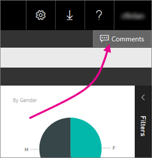

<properties
    pageTitle="Add comments to a report on a report server"
   description="Learn how to add comments to a paginated or a Power BI report on a Power BI Report Server or SQL Server Reporting Serices report server."
   services="powerbi"
   documentationCenter=""
   authors="maggiesMSFT"
   manager="erikre"
   backup=""
   editor=""
   tags=""
   qualityFocus="no"
   qualityDate=""/>
<tags
   ms.service="powerbi"
   ms.devlang="NA"
   ms.topic="article"
   ms.tgt_pltfrm="NA"
   ms.workload="powerbi"
   ms.date="06/01/2017"
   ms.author="maggies"/>

# Add or view comments for a report on a report server

You can add comments to a paginated or a Power BI report on a Power BI Report Server or SQL Server Reporting Serices report server. The comments live with the report, and anyone who can see the report can see the comments.

## Add or view comments

1. Open a paginated or Power BI report on a report server.

2. In the upper-right corner, select **Comments**.

    

    In the Comments pane, you can see any existing comments.

3. Write your comment, then select **Post Comment**.

    Your comment shows in the pane. 

## Next steps

- [Power BI Report Server user handbook](reportserver-user-handbook-overview.md)  

More questions? [Try asking the Power BI Community](https://community.powerbi.com/)