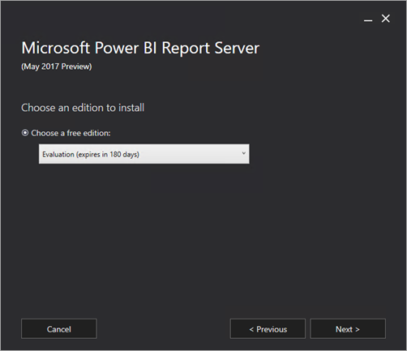
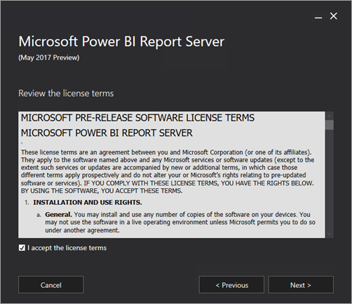
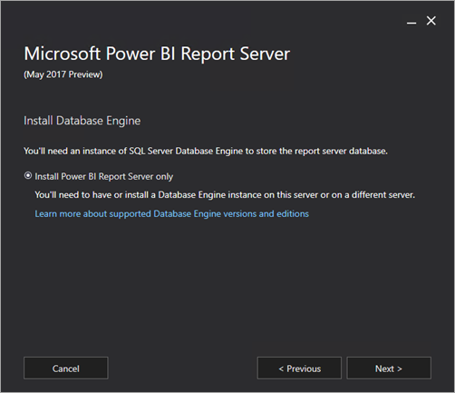
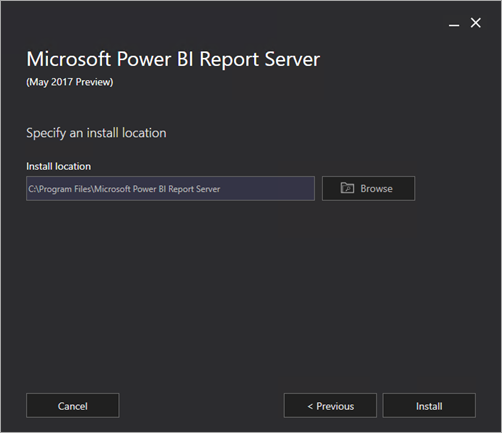
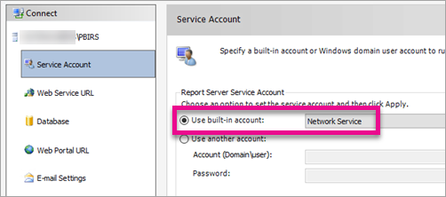

<properties
   pageTitle="Install Power BI Report Server"
   description="Learn how to install Power BI Report Server. "
   services="powerbi"
   documentationCenter=""
   authors="guyinacube"
   manager="erikre"
   backup=""
   editor=""
   tags=""
   qualityFocus="no"
   qualityDate=""/>

<tags
   ms.service="powerbi"
   ms.devlang="NA"
   ms.topic="article"
   ms.tgt_pltfrm="NA"
   ms.workload="powerbi"
   ms.date="05/09/2017"
   ms.author="asaxton"/>
# Install Power BI Report Server

Learn how to install Power BI Report Server.

 **Download** 

To download Power BI Report Server, go to the [Microsoft download center](https://go.microsoft.com/fwlink/?linkid=839351).

 For the current release notes, see [Power BI Report Server - Release notes](reportserver-release-notes.md).

[!INCLUDE [ssrs-documentation](../../includes/ssrs-documentation.md)]

## Requirements

Power BI Report Server will install default values to configure the core settings required to make a report server operational. It has the following requirements:

- A SQL Server Database Engine must be available after setup and before you configure the database for the report server. The Database Engine instance hosts the report server database that Reporting Services Configuration Manager will create. The Database Engine is not required for the actual setup experience.

- The user account used to run Setup must be a member of the local Administrators group.

- The user account used for Reporting Services Configuration Manager must have permission to access and create databases on the Database Engine instance that hosts the report server databases.

- Setup must be able to use the default values to reserve the URLs that provide access to the report server and the web portal. These values are port 80, a strong wildcard, and the virtual directory names in the format **ReportServer** and **Reports**.

 > [AZURE.IMPORTANT] While the report server can be installed in an environment that has a Read-Only Domain Controller (RODC), Reporting Services needs access to a Read-Write Domain Controller to function properly. If Reporting Services only has access to a RODC, you may encounter errors when trying to administer the service.

## Install Reporting Services Standalone

Installing Power BI Report Server is straight forward. There are only a few steps to install the files.

> [AZURE.NOTE] You do not need a SQL Server Database Engine server available at the time of install. You will need one to configure Reporting Services after install.

1. Find the location of PowerBIReportServer.exe and launch the installer.

2. Select **Install Power BI Report Server**.

    

3. Choose an edition to install and then select **Next**.

    

4. Read and agree to the license terms and conditions and then select **Next**.

    

5. You will need to have a Database Engine available to store the report server database. Select **Next** to install the report server only.

    

6. Specify the install location for the report server. Select **Install** to continue.

    

    > [!NOTE]
    > The default path is C:\Program Files\Microsoft Power BI Report Server.

7. After a successful setup, select **Configure Report Server** to launch the Reporting Services Configuration Manager.

    

## Configuration your report server

After you select **Configure Report Server** in the setup, you will be presented with Reporting Services Configuration Manager. For more information, see [Reporting Services Configuration Manager](https://docs.microsoft.com/sql/reporting-services/install-windows/reporting-services-configuration-manager-native-mode).

You will need to [create a report server database](https://docs.microsoft.com/sql/reporting-services/install-windows/ssrs-report-server-create-a-report-server-database) in order to complete the initial configuration of Reporting Services. A SQL Server Database server is required to complete this step.

### Creating a database on a different server

If you are creating the report server database on a database server on a different machine, you will need to change the service account for the report server to a credential that is recognized on the database server. 

By default, the report server uses the virtual service account. If you try to create a database on a different server, you may receive the following error on the Applying connection rights step.

`System.Data.SqlClient.SqlException (0x80131904): Windows NT user or group '(null)' not found. Check the name again.`

To work around this, you can change the service account to either Network Service or a domain account. Changing the service account to Network Service will apply rights in the context of the machine account for the report server.

For more information, see [Configure the report server service sccount](https://docs.microsoft.com/sql/reporting-services/install-windows/configure-the-report-server-service-account-ssrs-configuration-manager).

## Windows Service

A windows service will be created as part of the installation. It will be displayed as **Power BI Report Server**. The service name is **PowerBIReportServer**.

## Default URL reservations

URL reservations are composed of a prefix, host name, port, and virtual directory:

|Part|Description|
|----------|-----------------|
|Prefix|The default prefix is HTTP. If you previously installed a Secure Sockets Layer (SSL) certificate, Setup will try to create URL reservations that use the HTTPS prefix.|
|Host name|The default host name is a strong wildcard (+). It specifies that the report server will accept any HTTP request on the designated port for any host name that resolves to the computer, including `http://<computername>/reportserver`, `http://localhost/reportserver`, or `http://<IPAddress>/reportserver.`|
|Port|The default port is 80. Note that if you use any port other than port 80, you will have to explicitly add it to the URL when you open web portal in a browser window.|
|Virtual directory|By default, virtual directories are created in the format of ReportServer for the Report Server Web service and Reports for the web portal. For the Report Server Web service, the default virtual directory is **reportserver**. For the web portal, the default virtual directory is **reports**.|

An example of the complete URL string might be as follows:

- `http://+:80/reportserver`, provides access to the report server.

- `http://+:80/reports`, provides access to the web portal.

## Firewall

If you are accessing the report server from a remote machine, you will want to make sure you have configured any firewall rules if there is a firewall present.

You will need to open up the TCP port that you have configured for your Web Service URL and Web Portal URL. By default, these are configured on TCP port 80.

## Additional configuration

- To configure integration with the Power BI service so you can pin report items to a Power BI dashboard, see [Integrate with the Power BI service](https://docs.microsoft.com/sql/reporting-services/install-windows/power-bi-report-server-integration-configuration-manager).

- To configure email for subscriptions processing, see [E-Mail settings](https://docs.microsoft.com/sql/reporting-services/install-windows/e-mail-settings-reporting-services-native-mode-configuration-manager) and [E-Mail delivery in a report server](https://docs.microsoft.com/sql/reporting-services/subscriptions/e-mail-delivery-in-reporting-services).

- To configure the web portal so you can access it on a report computer to view and manage reports, see [Configure a firewall for report server access](https://docs.microsoft.com/sql/reporting-services/report-server/configure-a-firewall-for-report-server-access) and [Configure a report server for remote administration](https://docs.microsoft.com/sql/reporting-services/report-server/configure-a-report-server-for-remote-administration).

## Next steps

[Administrator handbook]  
[Verify a reporting services installation](https://docs.microsoft.com/sql/reporting-services/install-windows/verify-a-reporting-services-installation)   
[Configure the report server service account](https://docs.microsoft.com/sql/reporting-services/install-windows/configure-the-report-server-service-account-ssrs-configuration-manager)   
[Configure report server URLs](https://docs.microsoft.com/sql/reporting-services/install-windows/configure-report-server-urls-ssrs-configuration-manager)   
[Configure a report server database connection](https://docs.microsoft.com/sql/reporting-services/install-windows/configure-a-report-server-database-connection-ssrs-configuration-manager)    
[Initialize a report server](https://docs.microsoft.com/sql/reporting-services/install-windows/ssrs-encryption-keys-initialize-a-report-server)   
[Configure SSL connections on a report server](https://docs.microsoft.com/sql/reporting-services/security/configure-ssl-connections-on-a-native-mode-report-server)   
[Configure windows service accounts and permissions](https://docs.microsoft.com/sql/database-engine/configure-windows/configure-windows-service-accounts-and-permissions)   
More questions? [Try the Power BI Community](http://community.powerbi.com/)
