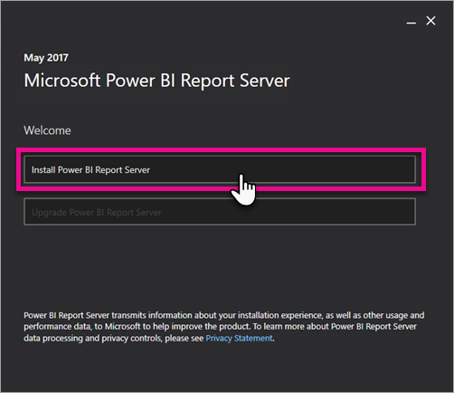
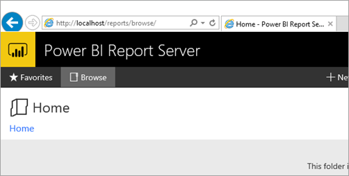

<properties
   pageTitle="Quickstart: Install Power BI Report Server"
   description="Installing Power BI Reports Server itself is very quick. From downloading, to installing and configuring, you should be up and running within a few minutes."
   services="powerbi"
   documentationCenter=""
   authors="guyinacube"
   manager="erikre"
   backup=""
   editor=""
   tags=""
   qualityFocus="no"
   qualityDate=""/>

<tags
   ms.service="powerbi"
   ms.devlang="NA"
   ms.topic="article"
   ms.tgt_pltfrm="NA"
   ms.workload="powerbi"
   ms.date="05/15/2017"
   ms.author="asaxton"/>

# Quickstart: Install Power BI Report Server

Installing Power BI Report Server itself is very quick. From downloading, to installing and configuring, you should be up and running within a few minutes.

This is a quick look at how to install a report server if you just want to get up and running with a new server. For more detail information on installing a report server, see [Install Power BI Report Server](reportserver-install-report-server.md).

 **Download** 

To download Power BI Report Server, and Power BI Desktop optimized for Power BI Report Server, go to the [Microsoft download center](https://go.microsoft.com/fwlink/?linkid=837581).

 For the current release notes, see [Power BI Report Server - Release notes](reportserver-release-notes.md).

## Before you begin

Before you install Power BI Report Server, it is recommended that you review the [Hardware and Software Requirements for installing Power BI Report Server](reportserver-system-requirements.md).

## Step 1: Download

Download the installation files, for Power BI Report Server, locally. To download Power BI Report Server, go to the [Microsoft download center](https://go.microsoft.com/fwlink/?linkid=839351).

## Step 2: Run installer

Run the PowerBIReportServer.exe file that you downloaded and step through the installation screens. You will have the opportunity to select the the installation path as well as select the edition you want to install. You can choose between an evaluation that expires within 180 days, a developer edition or to provide a product key.

## Step 3: Configure the server

After you are done installing, you will run the configuration manager to finish setting up your server. You will need to create a ReportServer catalog database as well as confirm the web portal and web service URLs.

## Step 4: Browse to web portal

Now that you are configured, you should be able to open a browser to the web portal of your server. By default, this will be `http://localhost/reports`. You will also be able to browse using the machine name instead of using localhost by default, assuming you are not being blocked by any type of firewall.

## Next steps

[Administrator handbook](reportserver-admin-handbook-overview.md)  
[Install Power BI Report Server](reportserver-install-report-server.md)  
[Install Power BI Desktop optimized for Power BI Report Server](reportserver-install-powerbi-desktop.md)  
[Browser support for Power BI Report Server](reportserver-browser-support.md)

More questions? [Try asking the Power BI Community](https://community.powerbi.com/)