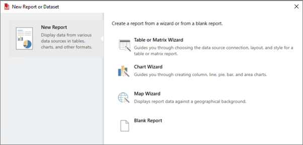
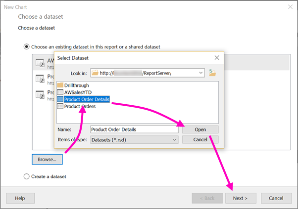
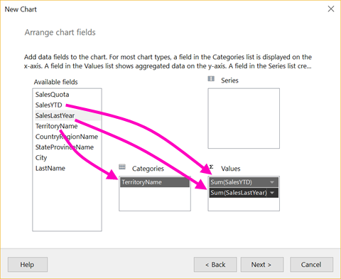
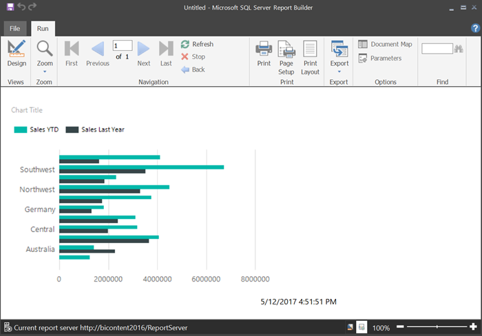
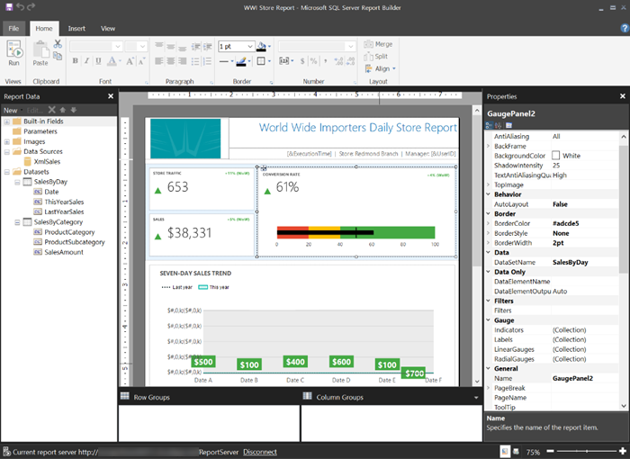

<properties
    pageTitle="Quickstart: Create a paginated report for Power BI Report Server"
   description="Learn how to create a paginated report for Power BI Report Server in a few simple steps."
   services="powerbi"
   documentationCenter=""
   authors="maggiesMSFT"
   manager="erikre"
   backup=""
   editor=""
   tags=""
   qualityFocus="no"
   qualityDate=""/>
<tags
   ms.service="powerbi"
   ms.devlang="NA"
   ms.topic="article"
   ms.tgt_pltfrm="NA"
   ms.workload="powerbi"
   ms.date="06/12/2017"
   ms.author="maggies"/>

# Quickstart: Create a paginated report for Power BI Report Server

As the name suggests, paginated reports can run to many pages. They're great for reports laid out in a fixed format, and offer precise customization.

You can store and manage paginated reports in the Power BI Report Server web portal, just as you can in the SQL Server Reporting Services (SSRS) web portal. You create and edit them in Report Builder, and then publish them to the web portal just the same. Then report readers in your organization can view them in a browser or in a Power BI mobile app on their mobile device.

If you've already created paginated reports in Report Builder or Report Designer in SQL Server Data Tools (SSDT), then you're ready to create paginated reports for Power BI Report Server. If not, here are some quick steps to get you started.

## Step 1: Install and start Report Builder

You may already have installed Report Builder to create reports for an SSRS server. You can use the same version or Report Builder to create reports for Power BI Report Server. If you haven't installed it, the process is easy.

1. Select **New** > **Paginated Report**.

    

    If you don't have Report Builder installed already, it leads you through the installation process now.

2. Report Builder opens to the **New Report or Dataset** screen.

    

3. Select the wizard for the kind of report you want to create:

     - Table or matrix
     - Chart
     - Map
     - Blank

4. Let's start with the Chart wizard.

    The Chart wizard walks you the steps of creating a basic chart in a report. From there, you can customize your report in almost unlimited ways.

## Step 2: Go through the Chart wizard

The Chart wizard walks you through the basic steps of creating a visualization in a report.

Paginated reports can connect to a wide variety of data sources, from Microsoft SQL Server and Microsoft Azure SQL Database to Oracle, Hyperion, and many more. Read about [data sources supported by paginated reports](reportserver-connect-data-sources.md).

In the first page in the Chart wizard, **Choose a dataset**, you can create a dataset or choose a shared dataset on a server.

> [AZURE.TIP] *Datasets* return report data from a query on an external data source.

1. Select **Browse** > select a shared dataset on a server > **Open** > **Next**.

    

     > [AZURE.NOTE] Need to create a dataset? See [Create a shared or embedded dataset](https://docs.microsoft.com/sql/reporting-services/report-data/create-a-shared-dataset-or-embedded-dataset-report-builder-and-ssrs).

2. Choose a chart type -- in this case, a bar chart.

    

3. Arrange the fields by dragging them to the **Categories**, **Series**, and **Values** boxes.

    

4. Select **Finish**.

## Step 3: Design your report

Now you're in Report Design view. Notice the data is placeholder data, not your data.

- To view your data, select **Run**.

     

- To go back to Design view, select **Design**.

Now you can modify the chart you just created, changing the layout, values, legend... really just about anything.

And you can add all sorts of other visualizations: gauges, tables, matrixes, tables, maps, and more. You can add headers and footers for multiple pages. See the [Report Builder tutorials](https://docs.microsoft.com/sql/reporting-services/report-builder-tutorials) to try them for yourself.

## Step 4: Save your report to the report server

When your report is ready, you save it to Power BI Report Server.

1. On the **File** menu, select **Save as**, and save it to the Power BI Report Server. 

2. Now you can view it in the browser.

    

## Next steps

There are many great resources for designing reports in Report Builder and in Report Designer in SQL Server Data Tools. The Report Builder tutorials are a good place to start.

- [Report Builder tutorials](https://docs.microsoft.com/sql/reporting-services/report-builder-tutorials)
- [Power BI Report Server user handbook](reportserver-user-handbook-overview.md)  

More questions? [Try asking the Power BI Community](https://community.powerbi.com/)