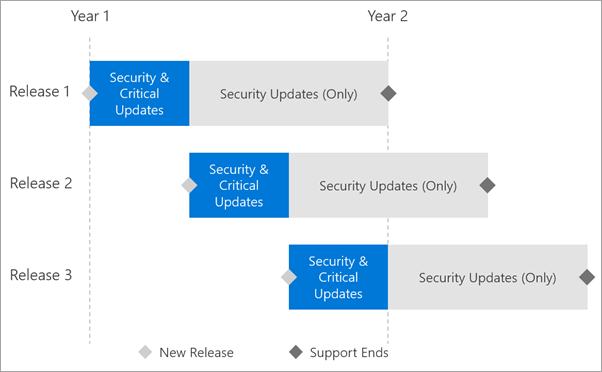

<properties
   pageTitle="Support timeline for Power BI Report Server"
   description="Power BI Report Server will be released a few times per year. Security and critical updates will available until the next release becomes generally available (GA)."
   services="powerbi"
   documentationCenter=""
   authors="guyinacube"
   manager="erikre"
   backup=""
   editor=""
   tags=""
   qualityFocus="no"
   qualityDate=""/>

<tags
   ms.service="powerbi"
   ms.devlang="NA"
   ms.topic="article"
   ms.tgt_pltfrm="NA"
   ms.workload="powerbi"
   ms.date="05/09/2017"
   ms.author="asaxton"/>
# Support timeline for Power BI Report Server

Power BI Report Server will be released a few times per year. Security and critical updates will available until the next release becomes generally available (GA). After the next release, the previous release will continue to receive security updates for the remainder of the 12 month release lifespan.

This support policy allows us to deliver innovation to customers at a rapid rate while providing flexibility for customers to adopt the innovation at their pace.

## Version history

As we release new updates, we will list the versions, availability and support end dates here.

 **Download** 

To download Power BI Report Server, and Power BI Desktop (Report Server), go to the [Microsoft download center](https://go.microsoft.com/fwlink/?linkid=839351).

 For the current release notes, see [Power BI Report Server - Release notes](reportserver-release-notes.md).

## Next steps

[What's new in Power BI Report Server](reportserver-whats-new.md)  
[Power BI Report Server release notes](reportserver-release-notes.md)  
[User handbook]  
[Administrator handbook]  
[Quickstart: Install Power BI Report Server](reportserver-quickstart-install-report-server.md)  

More questions? [Try the Power BI Community](http://community.powerbi.com/)