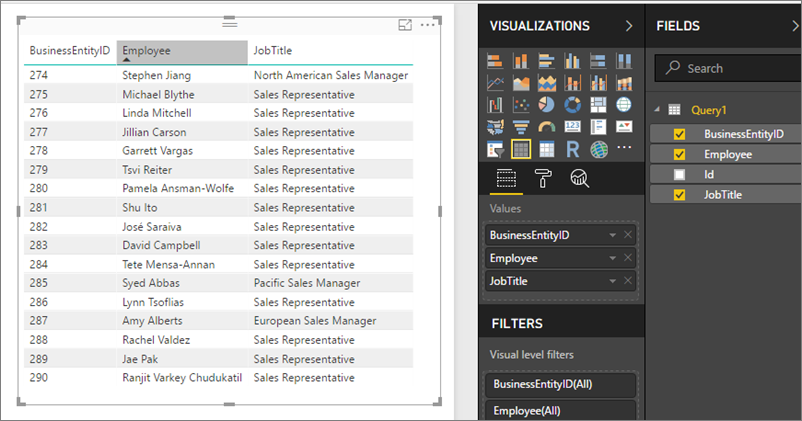

<properties
   pageTitle="What's new in Power BI Report Server"
   description="Learn about what's new in Power BI Report Server. This covers the major feature areas and is updated as new items are released."
   services="powerbi"
   documentationCenter=""
   authors="guyinacube"
   manager="kfile"
   backup=""
   editor=""
   tags=""
   qualityFocus="no"
   qualityDate=""/>

<tags
   ms.service="powerbi"
   ms.devlang="NA"
   ms.topic="article"
   ms.tgt_pltfrm="NA"
   ms.workload="powerbi"
   ms.date="10/28/2017"
   ms.author="asaxton"/>

# What's new in Power BI Report Server

Learn about what's new in Power BI Report Server. This covers the major feature areas and is updated as new items are released.

To download Power BI Report Server, and Power BI Desktop optimized for Power BI Report Server, go to [On-premises reporting with Power BI Report Server](https://powerbi.microsoft.com/report-server/).

 For the current release notes, see [Power BI Report Server - Release notes](reportserver-release-notes.md).

***Note:*** *For related "What's New" information, see:*

- [What's new in the Power BI service](../powerbi-service-whats-new.md)
- [What's new in Power BI Desktop](../powerbi-desktop-latest-update.md)
- [What's new in the mobile apps for Power BI](../powerbi-mobile-whats-new-in-the-mobile-apps.md)
- [Power BI team blog](https://powerbi.microsoft.com/blog/)

## October 2017 release

### Power BI report data sources

Power BI reports in Power BI Report Server can connect to a variety of data sources. You can import data and schedule data refresh, or query it directly using DirectQuery or a live connection to SQL Server Analysis Services. See the list of data sources that support scheduled refresh and those that support DirectQuery in "Power BI report data sources in Power BI Report Server".

### Scheduled data refresh for imported data

In Power BI Report Server, you can set up scheduled data refresh to keep data up to date in Power BI reports with an embedded model rather than a live connection or DirectQuery. With an embedded model you import the data, so it's disconnected from the original data source. It needs to be updated to keep the data fresh, and scheduled refresh is the way to do that. Read more about scheduled refresh for Power BI reports in Power BI Report Server.

### Large file upload/download

You can upload files up to 2 GB in size, though by default this limit is set to 1 GB in the Report Server settings in SQL Server Management Studio (SSMS).  These files are stored in the database just as they are for SharePoint, and no special configuration for the SQL Server catalog is required.  

You can open and edit Power BI report files (.pbix) from the server just as you can with .pbix files that use only SQL Server Analysis Services (SSAS), but you get back the original file you uploaded.  Meaning, if the data has been refreshed by the server, that won’t be reflected when you first open the file. You need to manually refresh it locally to see the change.

### Accessing shared datasets as OData feeds

You can access shared datasets from Power BI Desktop with an OData feed.

1. With the OData feed URL, you connect to the OData source.

    

2. After you bring the data into Power BI Desktop, you can modify it in the Query Editor.

    

3. Now you can use the data in designing reports.

    

Be sure to use **Advanced Options** so you can turn on Open Type Columns and format the columns accordingly in Power Query to meet your needs. 

Read more about [connecting to OData fields in Power BI Desktop](../powerbi-desktop-connect-odata.md).

### Scale-out

This release supports scale-out. Use a load-balancer and set server affinity for the best experience. Note that the scenario is not yet optimized for scale-out, so you'll see models potentially replicated across multiple nodes. The scenario will work without an NLB+sticky sessions. However, you'll not only see an over-use of memory across nodes as the model is loaded N times, but performance will slow in between connections as the model is streamed as it hits a new node in between requests.  

### Administrator settings

Administrators can set the following properties in SSMS Advanced Properties for the server farm:

- EnableCustomVisuals: True/False
- EnablePowerBIReportEmbeddedModels: True/False
- EnablePowerBIReportExportData: True/False
- MaxFileSizeMb: Default is now 1000
- ModelCleanupCycleMinutes: How often it checks to evict models from memory
- ModelExpirationMinutes: How long until model expires and is evicted, based on last time used
- ScheduleRefreshTimeoutMinutes: How long data refresh can take for a model. By default, this is two hours.  There is no hard upper limit.

Config file rsreportserver.config

 <Configuration>
              <Service>
               <PollingInterval>10</PollingInterval>
                <IsDataModelRefreshService>false</IsDataModelRefreshService>
                <MaxQueueThreads>0</MaxQueueThreads>
              </Service>
            </Configuration>

### Developer API

The developer API (REST API) introduced for SSRS 2017 has been extended for Power BI Report Server to work with both Excel files and .pbix files. One potential use case is to programmatically download files from the server, refresh them, and then republish them. This is the only way to refresh Excel workbooks with PowerPivot models, for example.

Note that there is a new separate API for large files, which will be updated in the Power BI Report Server version of Swagger. 

### SQL Server Analysis Services (SSAS) and the Power BI Report Server memory footprint

Power BI Report Server now hosts SQL Server Analysis Services (SSAS) internally. This isn't specific to scheduled refresh. Hosting SSAS can greatly expand the report server memory footprint. The AS.ini configuration file is available on the server nodes, so if you're familiar with SSAS, you may want to update the settings, including maximum memory limit and disk caching etc. See [Server properties in Analysis Services](https://docs.microsoft.com/sql/analysis-services/server-properties/server-properties-in-analysis-services) for details.

## August 2017 (preview)

This preview release contains new capabilities.

You can download the August 2017 preview of Power BI Report server, and Power BI Desktop optimized for Power BI Report Server (Preview) at [powerbi.com](https://powerbi.microsoft.com/report-server/). This cannot be installed side-by-side with an existing Power BI Report Server. If you have Power BI Report Server already installed, you will need to installthe preview on a separate server. 

### Support for data sources other than Analysis Services in Power BI Report Server

With the August 2017 preview of Power BI Report Server, you can connect to any data source in Power BI Desktop and publish your reports to Power BI Report Server. To enable this functionality, there is no special configuration required. Simply install and configure the preview on a separate server and you’re ready to go. You can then use Power BI Desktop (August 2017 Preview) to connect to your data source(s), create your report and publish directly to the server to share it with others in your organization.

There are a few limitations to keep in mind as you try out this preview.

- Scheduled data refresh is currently not available for reports using imported data.
- DirectQuery data connections are not currently supported.
- Scale-out environments are not currently supported.
- Reports must be smaller than 50 MB in size.

Support for these scenarios are planned for the GA release. The GA release is planned for Q4 of CY2017.

### Viewing and interacting with Excel workbooks

Excel and Power BI contain a portfolio of tools that is unique in the industry. Together, they enable business analysts to more easily gather, shape, analyze, and visually explore their data. In addition to viewing Power BI reports in the web portal, business users can now do the same with Excel workbooks in Power BI Report Server, giving them a single location to publish and view their self-service Microsoft BI content.

We’ve published a [walkthrough of how to add Office Online Server (OOS) to your Power BI Report Server preview environment](reportserver-excel-oos.md). Customers with a Volume Licensing account can download OOS from the Volume License Servicing Center at no cost and will have view-only functionality. Once configured, users can view and interact with Excel workbooks that:

- Have no external data source dependencies
- Have a live connection to an external SQL Server Analysis Services data source
- Have a PowerPivot data model

### Support for new table and matrix viuals

The August 2017 preview of Power BI Report Server includes support for the new Power BI table and matrix visuals. To create reports with these visuals, you will need an updated Power BI Desktop release for the August 2017 preview. It cannot be installed side-by-side with Power BI Desktop (June 2017) release. 

## June 2017

* Power BI Report Server made generally available (GA).

## May 2017

* Power BI Report Server Preview made available
* Ability to publish Power BI reports on-premises
    * Suppport for custom visuals
    * Support for Analysis Services live connections only with more data sources to come.
    * Power BI Mobile app updated to display Power BI reports hosted in Power BI Report Server
* Enhanced collaboration in reports with comments

## Next steps

[Power BI Report Server release notes](reportserver-release-notes.md)  
[User handbook](reportserver-user-handbook-overview.md)  
[Administrator handbook](reportserver-admin-handbook-overview.md)  
[Quickstart: Install Power BI Report Server](reportserver-quickstart-install-report-server.md)  
[Install Report Builder](https://docs.microsoft.com/sql/reporting-services/install-windows/install-report-builder)  
[Download SQL Server Data Tools (SSDT)](http://go.microsoft.com/fwlink/?LinkID=616714)

More questions? [Try asking the Power BI Community](https://community.powerbi.com/)