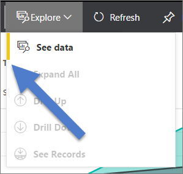

# Create images in markdown

## Image folder creation and link syntax

For a new article, you'll need to create a folder in the following location on your local file system:

    /articles/media/<article-name>/

For example:

    /articles/media/powerbi-analysis-services-connector/

After you create the folder and added images to it, use the following syntax to create images in your article:

```markdown

```

Then use the standard sync and pull request process so that your new images are merged into the master repo.

Example:

See [the markdown template](https://raw.githubusercontent.com/Azure/powerbi-content-pr/master/examples/_markdown-template.md) for an example.  The image call references in this markdown template are designed so the calls are made to image references at the bottom of the template.

## Guidelines specific to powerbi.microsoft.com

> [!NOTE]
> We will revise this section based on art guidelines specific to Power BI.

Screenshots are currently encouraged if it's not possible to include repro steps. Do write your content so that the content can stand without the screenshots if necessary.

Use the following guidelines when creating and including art files:

* Do not share art files across documents. Copy the file you need and add it to the media folder for your specific topic. Sharing between files is discouraged because it is easier to remove deprecated content and images which keeps the repo clean.
* .png files are highly preferred over other formats.
* When possible, create your screengrabs using the Retail Analysis sample that is included with Power BI. If that sample doesn't work for what you're trying to demonstrate, use one of the other official sanctioned Power BI samples (to see the samples, in Power BI service, Get data > Samples).
* Use pink squares of the default width provided in Paint (5 px) or SnagIt to call attention to particular elements in screenshots.  
  
    Example:
  
    
* Use blue arrows (default size and shape in SnagIt!) to call attention to particular elements in screenshots...when a pink box is not enough, or to show a particular order of steps, or to point out something small.
  
  Example:
  
  
* Avoid whitespace on edges of screenshots. If you crop a screenshot in a way that leaves white background at the edges, add a single pixel gray border around the image.  If using Paint, use the lighter gray in the default color palette (0xC3C3C3). If using some other graphic app, the RGB color is R195, G195, 195. You can easily add a gray border around an image in Visio--to do this, select the image, select Line, and ensure the correct color is set, and then change the line weight to 1 1/2 pt.  Screenshots should have a 1-pixel-wide gray border so that white areas of the screenshot do not blur into the web page.
  
    Example:
  
    
* Conceptual images with whitespace are allowed to not have a gray border.  
  
    Example:
  
    
* Try not to make an image too wide.  Images will be automatically resized if they are too wide. However, the resizing sometimes causes fuzziness, so we recommend that you limit the width of your images to a maximum of 780 px, and manually resize images before submission if necessary.
* We recommend the following sizes: 780 pixels wide as a maximum.  5 inches wide at 120dpi for large screenshots.  4 inches wide at 120dpi for others.  Smaller than 4 inches is fine as long as the screenshot conveys what it needs at the smaller size. And, as mentioned above, try to capture what is needed at the pixel width and size that you need so that no resizing is necessary.
* For inline icons, size to be at least 30 pixels x 30 pixels.  
  
  Example:
  
  
* Show command outputs in screenshots.  If your article includes steps where the user is working within a shell, it's useful to show command output in screenshots. In this case, restricting your shell width to about 72 characters generally ensures that your image will remain within the 780 px width guideline. Before taking a screenshot of output, resize the window so that just the relevant command and output is shown (optionally with a blank line on either side).
* Maximum size of screenshots: Take whole screenshots of windows when possible. When taking a screenshot of a browser window, resize your browser window to 780 px wide or less, and keep the height of the browser window as short as possible such that your application fits within the window.  
  
    Example:
  
    
* Use caution with what information is revealed in screenshots.  Do not reveal internal company information or personal information.  If you can't avoid including personal information, use the blur tool to obscure it or cut it out and replace with matching color.
* In conceptual art or diagrams, use the official icons in the Cloud and Enterprise symbol and icon set. A public set is available at http://aka.ms/CnESymbols.

### Contributors' Guide Links
* [Overview article](../README.md)
* [Index of guidance articles](contributor-guide-index.md)