# Visual Studio Code - Flow
This will walk through how you can use Visual Studio Code with the Power BI Git repo. You can download VS Code from https://code.visualstudio.com/.

## Advantages
There are a few advantages to using Visual Studio Code instead of another tool, like ATOM.  Mainly because of the Git integration that makes the process a little smoother, and allows you to work within a single tool for most activities. There is also a working files section which makes it nice to ignore the other articles.

## Update your local repro first
You still need to use the Git command line for a few operations.  The first of which is that we should always do a pull before you begin making changes.  This makes sure that your repo/branch is in line with the main Azure master branch.

To pull the updates from MicrosoftDocs/powerbi-docs-pr, run the following command.

    git pull MicrosoftDocs master

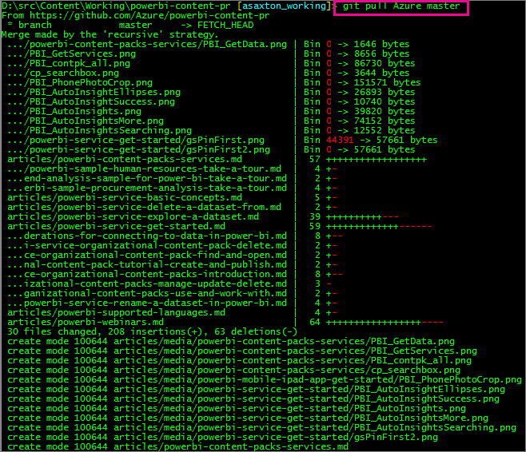

You will see **MicrosoftDocs** listed in the command above.  In your case, it may be **upstream**.  You will get an error indicating it doesn't exist.  Also, it is *case sensitive*!  You can verify what yours is by doing a *git remote show*.

It is a good idea to run a status command to make sure we are in sync.

    git status

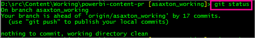

In this case, the local repo was ahead of **origin**.

As it indicates, just do a **push** and **origin** should match your local repo.  

    git push

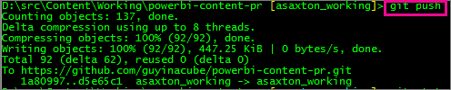

## Local folder
This assumes that you already have cloned the repro to your computer, and it resides in a local folder. 

After you open VS Code, go to **File** > **Open folder...**.  Point it to your local clone folder.  This will display all files in that structure.

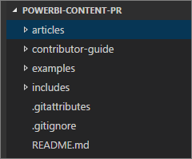

## Working files
As you edit files, they will display in the **Working files** section. You can remove them from working files by clicking on the X next to it.  

This list will persist as you open and close VS Code. It makes for a hand way to focus on the files you won, and ignore the others as noise. The only downside to this area is you can't resize it.

## Markdown preview
You can see the preview of the markdown by doing one of the following.

* Right click on a file and select **Open Preview**.
  
    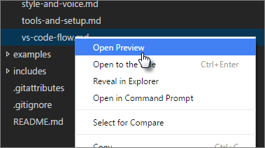
* Select the **Open Preview** icon in the upper right, when you have the article opened.
  
    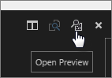

## Git Commits
This is where VS Code is nice.  As you make changes, VS Code will track the changes you make for checkin purposes.  As you change items, the Git icon, on the left, will have a number indicator next to it showing the number of changes.

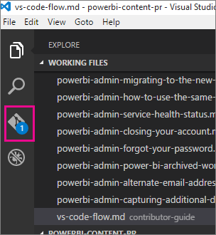

Selecting that icon will show us the list of changes.

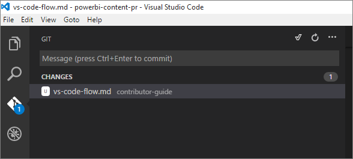

You can select the **+** on the **Changes** bar by hovering over it.  Or, you can select a **+** next to each individual file that you want to commit.  Selecting the **+** will *stage* the file.

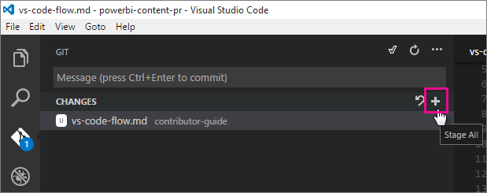

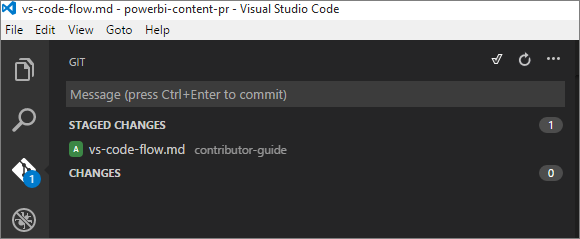

Once you have your files staged, you can add a comment in the message box, and then select the check icon.  The checkmark icon will actually do the commit action for Git.

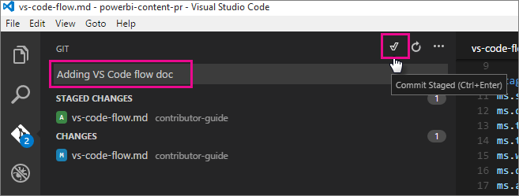

## Pushing the files back to GitHub
Once you have committed some files, you will need to go back to the git command shell and issue a **push** command to send it back to GitHub.

    git push

You can keep going back into edit files, commit, and push as you work.

## Pull Request
Once you are don with all of your changes, you will need to issue a **Pull Request** which is done on the GitHub site itself.

