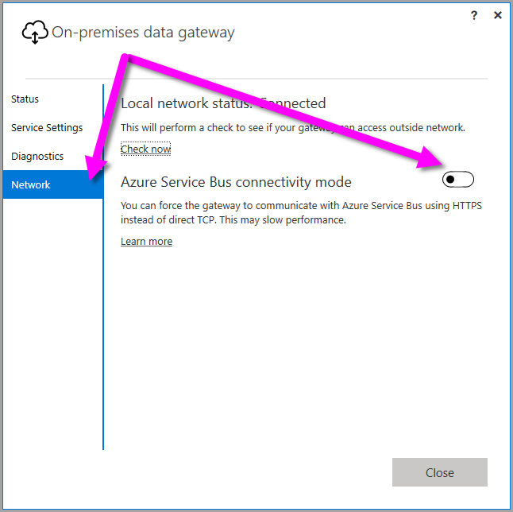
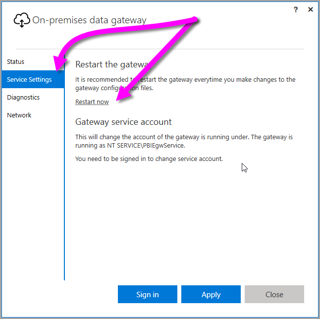

## Sign in account

Users will sign in with either a work or school account. This is your organization account. If you signed up for an Office 365 offering and didn’t supply your actual work email, it may look like nancy@contoso.onmicrosoft.com. Your account, within a cloud service, is stored within a tenant in Azure Active Directory (AAD). In most cases, your AAD account’s UPN will match the email address.

## Windows Service account

The on-premises data gateway is configured to use *NT SERVICE\PBIEgwService* for the windows service logon credential. By default, it has the right of Log on as a service. This is in the context of the machine that you are installing the gateway on.

> [AZURE.NOTE]  If you selected personal mode, you configure the windows service account separately.

This is not the account used to connect to on-premises data sources.  This is also not your work or school account that you sign into cloud services with.

If you encounter issues with your proxy server, due to authentication, you may want to change the Windows service account to a domain user or managed service account. You can learn how to change the account in [proxy configuration](powerbi-gateway-proxy.md#changing-the-gateway-service-account-to-a-domain-user).

## Ports

The gateway creates an outbound connection to Azure Service Bus. It communicates on outbound ports: TCP 443 (default), 5671, 5672, 9350 thru 9354.  The gateway does not require inbound ports. [Learn more](https://azure.microsoft.com/documentation/articles/service-bus-fundamentals-hybrid-solutions/)

It is recommended that you whitelist the IP addresses, for your data region, in your firewall. You can download the [Microsoft Azure Datacenter IP list](https://www.microsoft.com/download/details.aspx?id=41653). This list is updated weekly. The gateway will communicate with Azure Service Bus using the IP address along with the fully qualified domain name (FQDN). If you are forcing the gateway to communicate using HTTPS it will strictly use FQDN only, and no communication will happen using IP addresses.

> [AZURE.NOTE]  The IP Addresses listed in the Azure Datacenter IP list are in CIDR notation. For example, 10.0.0.0/24 does not mean 10.0.0.0 thru 10.0.0.24. Learn more about the [CIDR notation](http://whatismyipaddress.com/cidr).

Here is a listing of the fully qualified domain names used by the gateway.

|Domain names|Outbound ports|Description|
|---|---|---|
|*.download.microsoft.com|80|HTTP used to download the installer.|
|*.powerbi.com|443|HTTPS|
|*.analysis.windows.net|443|HTTPS|
|*.login.windows.net|443|HTTPS|
|*.servicebus.windows.net|5671-5672|Advanced Message Queuing Protocol (AMQP)|
|*.servicebus.windows.net|443, 9350-9354|Listeners on Service Bus Relay over TCP (requires 443 for Access Control token acquisition)|
|*.frontend.clouddatahub.net|443|HTTPS|
|*.core.windows.net|443|HTTPS|
|login.microsoftonline.com|443|HTTPS|
|*.msftncsi.com|443|Used to test internet connectivity if the gateway is unreachable by the Power BI service.|
|*.microsoftonline-p.com|443|Used for authentication depending on configuration.|

> [AZURE.NOTE] Traffic going to visualstudio.com or visualstudioonline.com are for app insights and are not required for the gateway to function.

## Forcing HTTPS communication with Azure Service Bus

You can force the Gateway to communicate with Azure Service Bus using HTTPS instead of direct TCP. This may have an impact on performance. To do so, modify the *Microsoft.PowerBI.DataMovement.Pipeline.GatewayCore.dll.config* file by changing the value from `AutoDetect` to `Https`, as shown in the code snippet directly following this paragraph. That file is located (by default) at *C:\Program Files\On-premises data gateway*.

```
<setting name="ServiceBusSystemConnectivityModeString" serializeAs="String">
    <value>Https</value>
</setting>
```

Alternatively, you can force the Gateway to adopt this behavior using the Gateway user interface, beginning with the [March 2017](https://powerbi.microsoft.com/blog/power-bi-gateways-march-update/) release. In the Gateway user interface select **Network**, then toggle the **Azure Service Bus connectivity mode** to **On**.



Once changed, select **Apply** (which only appears when you make a change). You must then  restart the gateway Windows service for the change to take effect, which you can do from the same user interface dialog by selecting **Service Settings** then select *Restart Now*.



## High Availability

High availability options are in the roadmap for the gateway. Stay tuned for more updates.

## How to restart the gateway

The gateway runs as a windows service. You can start and stop it like any windows service. There are multiple ways to do this. Here is how you can do it from the command prompt.

1.	On the machine where the gateway is running, launch an admin command prompt.

2.	Use the following command to stop the service.

    net stop PBIEgwService

3.	Use the following command to start the service.

    net start PBIEgwService
