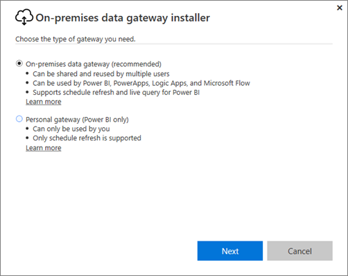
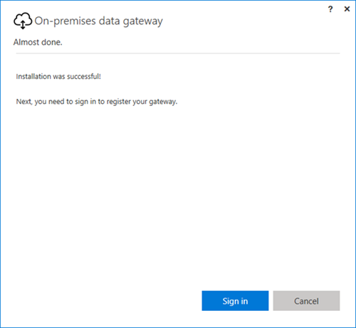
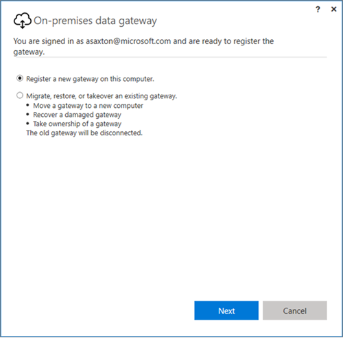

## Install the On-premises data gateway

The data gateway installs and runs on your computer. It is best to install the gateway on a machine that can be left running all the time.

> [AZURE.NOTE] The gateway is supported only on 64-bit Windows operating systems.

For Power BI, the first choice you have to make is the mode of the gateway.

-	**On-premises data gateway:** Multiple users can share and reuse a gateway in this mode. This gateway can be used by Power BI, PowerApps, Flow or Logic Apps. For Power BI, this includes support for both schedule refresh and DirectQuery

-	**Personal:** This is for Power BI only and can be used as an individual without any administrator configuration. This can only be used for on-demand refresh and schedule refresh. This will launch the installation of the personal gateway.

> [AZURE.NOTE] If you install the gateway in personal mode, you will not be able to install another gateway on the same machine. 

Here are a few things to consider before installing the gateway.

-	If you are installing on a laptop, and your laptop is turned off, not connected to the internet, or asleep the gateway won’t work and the data in the cloud service will not be synchronized with your on-premises data.

-	If your machine is connected to a wireless network, the gateway may perform more slowly which will cause it to take longer to synchronize the data in the cloud service with your on-premises data.

Once the gateway is installed, you will need to sign in with your work or school account.

After you are signed in, you will have the option to configure a new gateway, or to migrate, restore, or take over an existing gateway.

## Configure a new gateway

1.	Enter a **name** for the gateway

2.	Enter a **recovery key**. This has to be a minimum of 8 characters.

3.	Select **Configure**.

> [AZURE.NOTE] The recovery key will be needed if you ever need to migrate, restore or take over a gateway. Be sure to keep this key in a safe place.

### Migrate, restore or take over an existing gateway

You will need to select the gateway you want to recover and supply the recovery key that was used to first create the gateway. 

### On-premises data gateway connected

Once the gateway is configured, you will be able to make use of it to connect to on-premises data sources. 

If the gateway is for Power BI, you will need to add your data sources to the gateway within the Power BI service. For PowerApps, you will need to select a gateway for a defined connection for supported data sources.

For Flow and Logic Apps, this gateway is ready to be used with your on-premises connections 