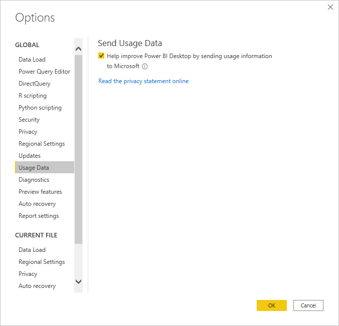
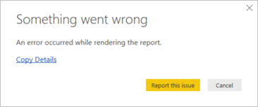

# Power BI Desktop Privacy

Microsoft collects certain information about your usage of Power BI Desktop to help diagnose problems and improve the product. For more details about Microsoft’s privacy practices, review the [Microsoft Privacy Statement](https://privacy.microsoft.com/privacystatement). It applies to the data we collect from your use of **Power BI Desktop**.

**Power BI Desktop** collects information from users like data on the operating system, Power BI Desktop information, and Internet Explorer versions.

If you want to opt out of this data collection, you can go to **File > Options and Settings > Options**, and on the **Usage Data** tab, uncheck the **Send Usage Data** check box, as shown in the following image.

## Sending additional information

If you encounter crashes or other issues, you can choose to send error reports and additional information. These reports are used to  help develop fixes for future releases. **Power BI Desktop** also collects information about the state of the file before the error occurred, such as document locale, preview features that are enabled, and storage mode. The collected information can include screenshots, error messages, and formulas from your model. These items might include the contents of files you were using when an error occurred, so you should review them before sending. Before sending the error report, you can choose which information is sent to Microsoft.  

If you don’t want to send this information, you can select **Close** when an error occurs, or opt out of sending usage data as explained earlier.

