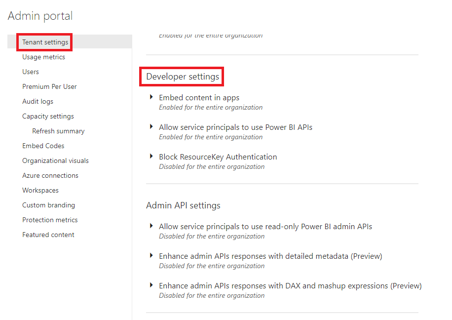

# Manage Power BI developer admin settings

As a Power BI admin for your organization, you can control how Power BI is used in your organization. You can enable or disable the following actions for the entire organization or for a specific subset of users:

* [Embed content in apps](#embed-content-in-apps)
* [Allow service principals to use Power BI APIs](#allow-service-principals-to-use-power-bi-apis)
* [Block ResourceKey Authentication](#block-resourcekey-authentication)

To manage Power BI developer settings, you must be a Global Admin in Office 365, or have been assigned the Power BI service administrator role. For more information about the Power BI service administrator role, see [Understanding the Power BI admin role](service-admin-role.md).

>[!NOTE]
>The developer settings in the Admin portal are different from and not related to the [developer mode](../developer/visuals/environment-setup.md#set-up-power-bi-service-for-developing-a-visual) setting for debugging visuals.

## Access the admin portal

To enable any of the settings described in the article, you'll need to access the admin portal.

1. In Power BI service, select **Settings**.

2. From the settings drop-down menu, select **Admin portal**.

    

3. In the Tenant settings tab, scroll down to **Developer settings**.

    

## Embed content in apps

To allow users in the organization to embed Power BI dashboards and reports in Web applications using [*Embed for your customers*](https://go.microsoft.com/fwlink/?linkid=2141877), enable the **Embed content in apps** setting.

1. Expand the **Embed content in apps** arrow.
1. Slide the switch to **Enabled** or **Disabled**.
1. If you selected Enabled, select if you want this to apply to the entire organization or just to specific security groups.
1. Click **Apply**

    

## Allow service principals to use Power BI APIs

Web apps registered in Azure Active Directory (Azure AD) will use an assigned [service principal](https://go.microsoft.com/fwlink/?linkid=2055030) to access Power BI APIs without a signed in user. To allow an app to use service principal authentication its service principal must be included in an allowed security group.

You can control who can access service principals by creating dedicated security groups and using these groups in any Power BI tenant level-settings.

1. Expand the **Allow service principals to use Power BI APIs** arrow.
1. Slide the switch to **Enabled** or **Disabled**.
1. If you selected Enabled, select if you want this to apply to the entire organization or just to specific security groups.
1. Click **Apply**

    

## Block ResourceKey Authentication

For extra security, you can block the use of resource key based authentication. This means users are not allowed to use streaming datasets API using resource key. This setting applies to the entire organization. You can't apply it only to a select security group.

1. Expand the **Block ResourceKey Authentication** arrow.
1. Slide the switch to **Enabled** or **Disabled**.
1. Click **Apply**

    

## Next steps

>[!div class="nextstepaction"]
>[Administering Power BI in the admin portal](service-admin-portal.md)

>[!div class="nextstepaction"]
>[What is Power BI embedded analytics?](../developer/embedded/embedded-analytics-power-bi.md)

