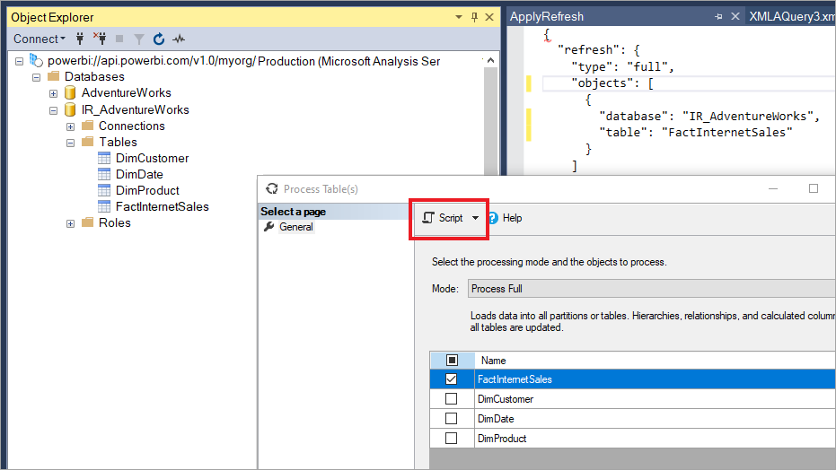

# Incremental refresh in Power BI

Incremental refresh enables very large datasets in Power BI with the following benefits:

> [!div class="checklist"]
> * **Refreshes are faster** - Only data that has changed needs to be refreshed. For example, refresh only the last five days of a ten-year dataset.
> * **Refreshes are more reliable** - Long-running connections to volatile source systems aren't necessary.
> * **Resource consumption is reduced** - Less data to refresh reduces overall consumption of memory and other resources.

Incremental refresh is available for Power BI Pro and Premium subscriptions and datasets.

Specify RangeStart and RangeEnd parameters.
Filter dataset on RangeStart and RangeEnd parameters.
Define incremental refresh policy.
Publish to the service.
Refresh dataset.

This article provides a thorough overview of incremental refresh for datasets. To get started right away, see [Configure incremental refresh](incremental-refresh.md).

## RangeStart and RangeEnd parameters

For incremental refresh, datasets are filtered by using Power Query date/time parameters with the reserved, case-sensitive names **RangeStart** and **RangeEnd**. These parameters, defined in the Manage Parameters dialog in Power Query Editor are used to filter the data imported into Power BI Desktop. When the model is published to the service, the parameters are used to dynamically partition the data into ranges. They are then overridden automatically by the service according to incremental refresh policy settings.


## Filter data

With RangeStart and RangeEnd parameters defined, you can then apply the filter by selecting the **Custom Filter** menu option for a column.


Ensure rows are filtered where the column value *is after or equal to* **RangeStart** and *before* **RangeEnd**. Other filter combinations may result in double counting of rows.


> [!IMPORTANT]
> Verify queries have an equal to (=) on either **RangeStart** or **RangeEnd**, but not both. If the equal to (=) exists on both parameters, a row could satisfy the conditions for two partitions, which could lead to duplicate data in the model. For example,  
> \#"Filtered Rows" = Table.SelectRows(dbo_Fact, each [OrderDate] **>= RangeStart** and [OrderDate] **<= RangeEnd**) could result in duplicate data.

> [!TIP]
> While the data type of the parameters must be date/time, it's possible to convert them to match the requirements of the datasource. For example, the following Power Query function converts a date/time value to resemble an integer surrogate key of the form *yyyymmdd*, which is common for data warehouses. The function can be called by the filter step.
>
> `(x as datetime) => Date.Year(x)*10000 + Date.Month(x)*100 + Date.Day(x)`

Select **Close and Apply** from the Power Query Editor. You should have a subset of the dataset in Power BI Desktop.

## XMLA endpoint benefits for incremental refresh

The [XMLA endpoint](service-premium-connect-tools.md) for datasets in a Premium capacity can be enabled for read-write operations, which can provide considerable benefits for incremental refresh. Refresh operations through the XMLA endpoint are not limited to [48 refreshes per day](../connect-data/refresh-data.md#data-refresh), and the [scheduled refresh timeout](../connect-data/refresh-troubleshooting-refresh-scenarios.md#scheduled-refresh-timeout) is not imposed.

### Refresh management with SQL Server Management Studio (SSMS)

With XMLA endpoint read-write enabled, SSMS can be used to view and manage partitions generated by the application of incremental refresh policies. This allows, for example, to refresh a specific historical partition not in the incremental range to perform a back-dated update without having to refresh all historical data. You can also use SSMS to load historical data for very large datasets by incrementally adding/refreshing historical partitions in batches.


#### Override incremental refresh behavior

With SSMS, you also have more control over how to invoke incremental refreshes by using [Tabular Model Scripting Language (TMSL)](/analysis-services/tmsl/tabular-model-scripting-language-tmsl-reference?view=power-bi-premium-current) and the [Tabular Object Model (TOM)](/analysis-services/tom/introduction-to-the-tabular-object-model-tom-in-analysis-services-amo?view=power-bi-premium-current). For example, in SSMS, in Object Explorer, right-click a table and then select the **Process Table** menu option. Then click the **Script** button to generate a TMSL refresh command.



The following parameters can be used with the TMSL refresh command to override the default incremental refresh behavior:

- **applyRefreshPolicy** – If a table has an incremental refresh policy defined, applyRefreshPolicy will determine if the policy is applied or not. If the policy is not applied, a process full operation will leave partition definitions unchanged and all partitions in the table will be fully refreshed. Default value is true.

- **effectiveDate** – If an incremental refresh policy is being applied, it needs to know the current date to determine rolling window ranges for the historical range and the incremental range. The effectiveDate parameter allows you to override the current date. This is useful for testing, demos, and business scenarios where data is incrementally refreshed up to a date in the past or the future (for example, budgets in the future). The default value is the current date.

```json
{ 
  "refresh": {
    "type": "full",

    "applyRefreshPolicy": true,
    "effectiveDate": "12/31/2013",

    "objects": [
      {
        "database": "IR_AdventureWorks", 
        "table": "FactInternetSales" 
      }
    ]
  }
}
```

To learn more about overriding default incremental refresh behavior with TMSL, see [Refresh command](/analysis-services/tmsl/refresh-command-tmsl?view=power-bi-premium-current).

### Custom queries for detect data changes

You can use TMSL and/or TOM to override the detected data changes behavior. Not only can this be used to avoid persisting the last-update column in the in-memory cache, it can enable scenarios where a configuration/instruction table is prepared by ETL processes for the purpose of flagging only the partitions that need to be refreshed. This can create a more efficient incremental refresh process where only the required periods are refreshed, no matter how long ago data updates took place.

The pollingExpression is intended to be a lightweight M expression or name of another M query. It must return a scalar value and will be executed for each partition. If the value returned is different to what it was the last time an incremental refresh occurred, the partition is flagged for full processing.

The following example covers all 120 months in the historical range for backdated changes. Specifying 120 months instead of 10 years means data compression may not be quite as efficient, but avoids having to refresh a whole historical year, which would be more expensive when a month would be sufficient for a backdated change.

```json
"refreshPolicy": {
    "policyType": "basic",
    "rollingWindowGranularity": "month",
    "rollingWindowPeriods": 120,
    "incrementalGranularity": "month",
    "incrementalPeriods": 120,
    "pollingExpression": "<M expression or name of custom polling query>",
    "sourceExpression": [
    "let ..."
    ]
}
```

## Metadata-only deployment

When publishing a new version of a PBIX file from Power BI Desktop to a workspace, if a dataset with the same name already exists, you're prompted to replace the existing dataset.


In some cases you may not want to replace the dataset, especially with incremental refresh. The dataset in Power BI Desktop could be much smaller than the one in the service. If the dataset in the service has an incremental refresh policy applied, it may have several years of historical data that will be lost if the dataset is replaced. Refreshing all the historical data could take hours and result in system downtime for users.

Instead, it's better to perform a metadata-only deployment. This allows deployment of new objects without losing the historical data. For example, if you have added a few measures, you can deploy only the new measures without needing to refresh the data, saving a lot of time.

For Power BI Premium workspaces assigned to a capacity configured for XMLA endpoint read-write, compatible tools enable metadata-only deployment. For example, the ALM Toolkit is a schema diff tool for Power BI datasets and can be used to perform deployment of metadata only.

Download and install the latest version of the ALM Toolkit from the [Analysis Services Git repo](https://github.com/microsoft/Analysis-Services/releases). Documentation links and information on supportability are available on the Help ribbon. To perform a metadata only deployment, perform a comparison and select the running Power BI Desktop instance as the source, and the existing dataset in the service as the target. Consider the differences displayed and skip the update of the table with incremental refresh partitions, or use the Options dialog to retain partitions for table updates. Validate the selection to ensure the integrity of the target model and then update.


## Troubleshooting