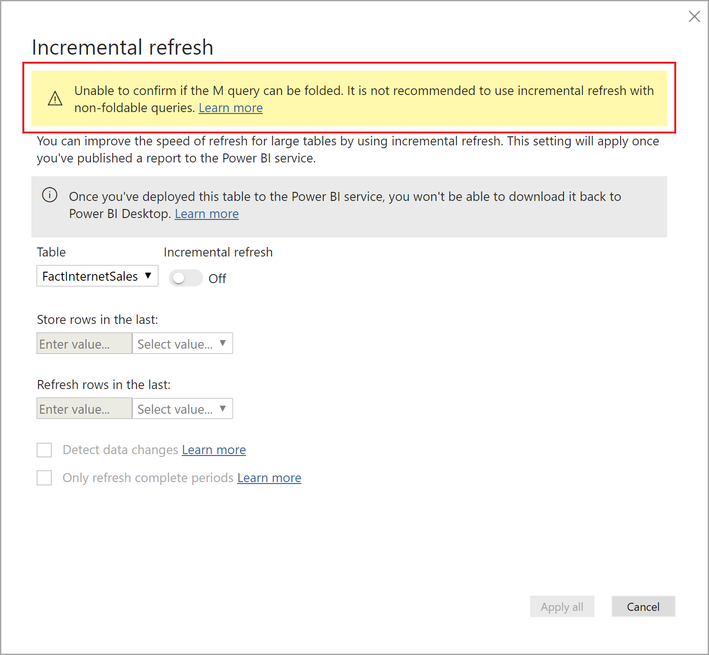
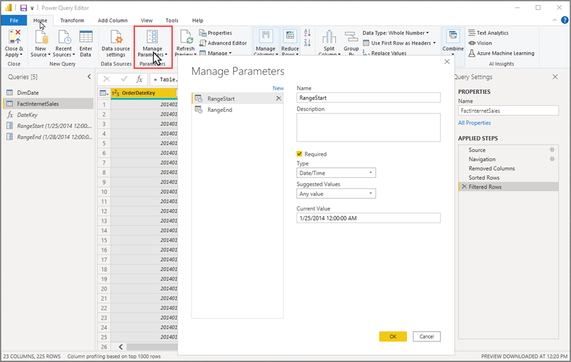
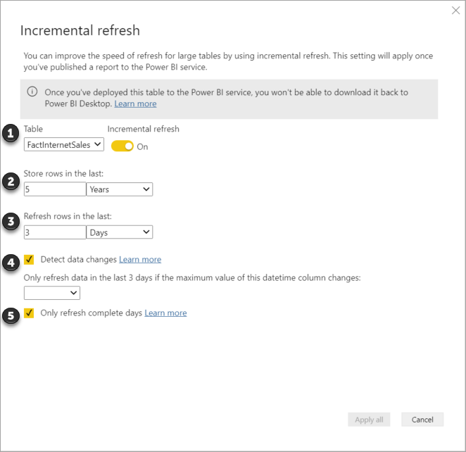

# Incremental refresh in Power BI

Incremental refresh can be beneficial for any dataset, but it's particularly helpful with larger datasets.

> [!div class="checklist"]
> * **Refreshes are faster** - Only data that has changed needs to be refreshed. For example, refresh only the last five days of a ten-year dataset.
> * **Refreshes are more reliable** - Long-running connections to volatile data sources aren't necessary.
> * **Resource consumption is reduced** - Less data to refresh reduces overall consumption of memory and other resources.

When configuring incremental refresh, there are five steps:

Specify RangeStart and RangeEnd parameters.
Filter dataset on RangeStart and RangeEnd parameters.
Define incremental refresh policy.
Publish to the service.
Refresh dataset.

## Requirements

Incremental refresh is supported for Power BI Premium, Premium per user, and Power BI Pro shared subscriptions and datasets. To further extend advanced incremental refresh scenarios by using features supported with the XMLA endpoint, Premium per user workspaces or workspaces assigned to a Premium capacity are required.

#### Date column

Your model table must contain a date column of Date/Time data type. The RangeStart and RangeEnd parameters filter table data based on the date column. If your table contains a date column of integer surrogate keys in the form of yyyymmdd, you can create a function that converts the date/time value in the parameters to match the integer surrogate key of the data source table. To learn more, see [Convert DateTime to integer](incremental-refresh-configure.md#convert-datetime-to-integer).

#### Query folding

It's important the partition filters are pushed to the source system when queries are submitted for refresh operations. To push filtering down means the data source should support *query folding*.

Query folding is the ability for a Power Query query to generate a single query statement to retrieve and transform data source data. Most data sources that support SQL queries support query folding. However, data sources like flat files, blobs, and web feeds typically do not. In cases where the filter is not supported by the data source back-end, it cannot be pushed down. In such cases, the query mashup engine compensates and applies the filter locally, which may require retrieving the full dataset from the data source. This can cause incremental refresh to be very slow, and the process can run out of resources either in the Power BI service or in the on-premises data gateway if used.

Given the various levels of query folding support for each data source, it's recommended verification is performed to ensure the filter logic is included in the source queries. To make this easier, Power BI Desktop attempts to perform this verification for you before you begin configuring the incremental refresh policy. If unable to verify, a warning is displayed in the Incremental refresh dialog when defining the incremental refresh policy. SQL based data sources such as SQL, Oracle, and Teradata can rely on this warning. Other data sources may be unable to verify without tracing queries. If Power BI Desktop is unable to confirm, a  warning is shown in the Incremental refresh policy conf. If you see this warning and want to check that the necessary query folding is occurring, you can use the Query Diagnostics feature, or trace queries received by the source database.

 

## RangeStart and RangeEnd parameters

For incremental refresh, datasets are filtered by using Power Query date/time parameters with the reserved, case-sensitive names **RangeStart** and **RangeEnd**. These parameters, defined in the Manage Parameters dialog in Power Query Editor are used to filter the data imported into Power BI Desktop. When the model is published to the service, the parameters are used to dynamically partition the data into ranges. They are then overridden automatically by the service according to the incremental refresh policy settings.

## Filter data

With RangeStart and RangeEnd parameters defined, you can then apply the filter by selecting the **Custom Filter** menu option for a column.

Ensure rows are filtered where the column value *is after or equal to* **RangeStart** and *before* **RangeEnd**. Other filter combinations may result in double counting of rows.

> [!TIP]
> While the data type of the parameters must be date/time, it's possible to convert them to match the requirements of the datasource. For example, the following Power Query function converts a date/time value to resemble an integer surrogate key of the form *yyyymmdd*, which is common for data warehouses. The function can be called by the filter step.
>
> `(x as datetime) => Date.Year(x)*10000 + Date.Month(x)*100 + Date.Day(x)`

Select **Close and Apply** from the Power Query Editor. You should have a subset of the dataset in Power BI Desktop.

## Define the policy

#### 1 - Table

The Table listbox defaults to the table you selected

#### 2 - Store rows in the last

#### 3 - Refresh rows in the last

This setting is required. It's also one of the most important.

#### 4 - Detect data changes

This setting is optional. Incremental refresh of ten days is more efficient than full refresh of five years. However, it's possible to do even better. With the **Detect data changes** option, you can select a date/time column to be used to identify and refresh only those days where the data has changed. This assumes such a column exists in the source system, which is typically for auditing purposes. **This should not be the same column used to partition the data with the RangeStart/RangeEnd parameters.** The maximum value of this column is evaluated for each of the periods in the incremental range. If it has not changed since the last refresh, there is no need to refresh the period. In the example, this could further reduce the days incrementally refreshed from ten to around two.

> [!TIP]
> The current design requires that the column to detect data changes is persisted and cached into memory. You may want to consider one of the following techniques to reduce cardinality and memory consumption.
>
> Persist only the maximum value of this column at time of refresh, perhaps using a Power Query function.
>
> Reduce the precision to a level that is acceptable given your refresh-frequency requirements.
>
> Define a custom query for detecting data changes using the XMLA endpoint and avoid persisting the column value altogether. See custom queries for detect data changes below for more information.

In some cases, enabling the Detect data changes option can produce unwanted results. For example, you may want to avoid persisting a last-update column in the in-memory cache, or enable scenarios where a configuration/instruction table is prepared by ETL processes for flagging only those partitions that need to be refreshed. In cases like these, for Premium capacities with the XMLA endpoint enabled, you can use TMSL and/or TOM to override the detect data changes behavior. To learn more, see [Custom queries for detect data changes](incremental-refresh-xmla.md#custom-queries-for-detect-data-changes).

#### 5 - Only refresh complete days

Let's say your refresh is scheduled to run at 4:00 AM every morning. If data appears in the source system during those four hours between midnight and 4:00 AM, you may not want to account for it. Some business metrics such as barrels per day in the oil and gas industry make no sense with partial days.

Another example is refreshing data from a financial system where data for the previous month is approved on the 12th calendar day of the month. You could set the incremental range to 1 month and schedule the refresh to run on the 12th day of the month. With this option checked, it would for example refresh January data on February 12th.

It's important to keep in mind, refresh operations in the service run under UTC time. This can determine the effective date and affect complete periods. In a future release, an option to override the effective date for a refresh operation may be added.

### Handling deletes

## Metadata-only deployment

When publishing a new version of a PBIX file from Power BI Desktop to a workspace, if a dataset with the same name already exists, you're prompted to replace the existing dataset.

In some cases you may not want to replace the dataset, especially with incremental refresh. The dataset in Power BI Desktop could be much smaller than the one in the service. If the dataset in the service has an incremental refresh policy applied, it may have several years of historical data that will be lost if the dataset is replaced. Refreshing all the historical data could take hours and result in system downtime for users.

Instead, it's better to perform a metadata-only deployment. This allows deployment of new objects without losing the historical data. For example, if you have added a few measures, you can deploy only the new measures without needing to refresh the data, saving a lot of time.

For Power BI Premium workspaces assigned to a capacity configured for XMLA endpoint read-write, compatible tools enable metadata-only deployment. For example, the ALM Toolkit is a schema diff tool for Power BI datasets and can be used to perform deployment of metadata only.

Download and install the latest version of the ALM Toolkit from the [Analysis Services Git repo](https://github.com/microsoft/Analysis-Services/releases). Documentation links and information on supportability are available on the Help ribbon. To perform a metadata only deployment, perform a comparison and select the running Power BI Desktop instance as the source, and the existing dataset in the service as the target. Consider the differences displayed and skip the update of the table with incremental refresh partitions, or use the Options dialog to retain partitions for table updates. Validate the selection to ensure the integrity of the target model and then update.

## Troubleshooting