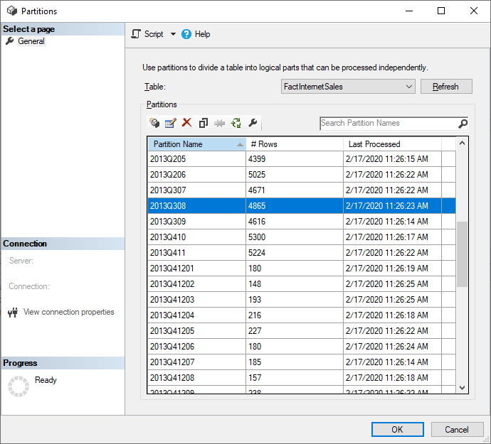

# Advanced incremental refresh with the XMLA endpoint

Datasets in a Premium capacity with the [XMLA endpoint](service-premium-connect-tools.md) enabled for **read-write** operations allow more advanced dataset refresh, partition management, and metadata only deployments through tool, scripting, and API support. In addition, refresh operations through the XMLA endpoint are not limited to [48 refreshes per day](../connect-data/refresh-data.md#data-refresh), and the [scheduled refresh timeout](../connect-data/refresh-troubleshooting-refresh-scenarios.md#scheduled-refresh-timeout) is not imposed.

## Partitions

Partitions divide portions of data you need to refresh frequently from data that can be refreshed less frequently. Partitions work by dividing a table into logical partition objects. Individual partitions, each containing a unique segment of data, can then be refreshed individually, sequentially, or in parallel independent of other partitions, or excluded from refresh operations altogether.

For Power BI Desktop models with an incremental refresh policy configured, when you first publish the model to the service, each table in the dataset has one partition that contains all rows in the table. When you perform the first dataset refresh operation, tables *with no* incremental refresh policy will refresh all rows contained in that table's default single partition. Tables *with an* incremental refresh policy applied are partitioned according to the incremental refresh policy. This process, and any partitions created from it, are not visible in the service. They are, however, visible and can be managed through the XMLA endpoint.

## Refresh management with SQL Server Management Studio (SSMS)

SSMS can be used to view and manage partitions created by the application of incremental refresh policies. This allows, for example, to refresh a specific historical partition not in the incremental range to perform a back-dated update without having to refresh all historical data. SSMS can also be used to load historical data for very large datasets by incrementally adding/refreshing historical partitions in batches.



### Override incremental refresh behavior

With SSMS, you also have more control over how to invoke incremental refreshes by using [Tabular Model Scripting Language (TMSL)](/analysis-services/tmsl/tabular-model-scripting-language-tmsl-reference?view=power-bi-premium-current) and the [Tabular Object Model (TOM)](/analysis-services/tom/introduction-to-the-tabular-object-model-tom-in-analysis-services-amo?view=power-bi-premium-current). For example, in SSMS, in Object Explorer, right-click a table and then select the **Process Table** menu option, and then click the **Script** button to generate a TMSL refresh command.


These parameters can be used with the TMSL refresh command to override the default incremental refresh behavior:

- **applyRefreshPolicy** – If a table has an incremental refresh policy defined, applyRefreshPolicy will determine if the policy is applied or not. If the policy is not applied, a process full operation will leave partition definitions unchanged and all partitions in the table will be fully refreshed. Default value is true.

- **effectiveDate** – If an incremental refresh policy is being applied, it needs to know the current date to determine rolling window ranges for the historical range and the incremental range. The effectiveDate parameter allows you to override the current date. This is useful for testing, demos, and business scenarios where data is incrementally refreshed up to a date in the past or the future (for example, budgets in the future). The default value is the current date.

```json
{ 
  "refresh": {
    "type": "full",

    "applyRefreshPolicy": true,
    "effectiveDate": "12/31/2013",

    "objects": [
      {
        "database": "IR_AdventureWorks", 
        "table": "FactInternetSales" 
      }
    ]
  }
}
```

To learn more about overriding default incremental refresh behavior with TMSL, see [Refresh command](/analysis-services/tmsl/refresh-command-tmsl?view=power-bi-premium-current).

## Custom queries for detect data changes

TMSL and/or TOM can be used to override the detected data changes behavior. Not only can this be used to avoid persisting the last-update column in the in-memory cache, it can enable scenarios where a configuration/instruction table is prepared by ETL processes for the purpose of flagging only the partitions that need to be refreshed. This can create a more efficient incremental refresh process where only the required periods are refreshed, no matter how long ago data updates took place.

The pollingExpression is intended to be a lightweight M expression or name of another M query. It must return a scalar value and will be executed for each partition. If the value returned is different to what it was the last time an incremental refresh occurred, the partition is flagged for full processing.

The following example covers all 120 months in the historical range for backdated changes. Specifying 120 months instead of 10 years means data compression may not be quite as efficient, but avoids having to refresh a whole historical year, which would be more expensive when a month would be sufficient for a backdated change.

```json
"refreshPolicy": {
    "policyType": "basic",
    "rollingWindowGranularity": "month",
    "rollingWindowPeriods": 120,
    "incrementalGranularity": "month",
    "incrementalPeriods": 120,
    "pollingExpression": "<M expression or name of custom polling query>",
    "sourceExpression": [
    "let ..."
    ]
}
```

> [!TIP]
> Be sure to check out videos, blogs, and more provided by Power BI's vibrant community of BI experts.  
>- [**Search for Power BI Incremental refresh detect data changes on Bing**](https://www.bing.com/videos/search?q=power+bi+incremental+refresh+detect+data+changes).

## Metadata-only deployment

When publishing a new version of a PBIX file from Power BI Desktop to a workspace, if a dataset with the same name already exists, you're prompted to replace the existing dataset.


In some cases you may not want to replace the dataset, especially with incremental refresh. The dataset in Power BI Desktop could be much smaller than the one in the service. If the dataset in the service has an incremental refresh policy applied, it may have several years of historical data that will be lost if the dataset is replaced. Refreshing all the historical data could take hours and result in system downtime for users.

Instead, it's better to perform a metadata-only deployment. This allows deployment of new objects without losing the historical data. For example, if you've added a few measures you can deploy only the new measures without needing to refresh the data, saving a lot of time.

For Power BI Premium workspaces assigned to a capacity configured for XMLA endpoint read-write, compatible tools enable metadata-only deployment. For example, the ALM Toolkit is a schema diff tool for Power BI datasets and can be used to perform deployment of metadata only.

Download and install the latest version of the ALM Toolkit from the [Analysis Services Git repo](https://github.com/microsoft/Analysis-Services/releases). Step-by-step guidance on using ALM Toolkit is not included in Microsoft documentation. ALM Toolkit documentation links and information on supportability are available on the Help ribbon. To perform a metadata only deployment, perform a comparison and select the running Power BI Desktop instance as the source, and the existing dataset in the service as the target. Consider the differences displayed and skip the update of the table with incremental refresh partitions or use the Options dialog to retain partitions for table updates. Validate the selection to ensure the integrity of the target model and then update.


## Prevent timeouts on initial full refresh

After publishing to the service, the initial full refresh operation for the dataset creates partitions and loads and processes historical data for the entire period defined in the incremental refresh policy. For some datasets that will load and process large amounts of data, the amount of time the initial refresh operation takes can exceed the refresh timeout imposed by the service or a query timeout imposed by the data source.

> [!NOTE]
> The terms process and refresh are synonymous.

To prevent timeouts, prior to publishing the model to the service you can bootstrap the initial refresh operation. Bootstrapping allows the service to create table and partition objects for the dataset, but not load and process historical data into any of the partitions. When published, an initial refresh operation is performed on the dataset which creates table and partition objects for all tables, but data is only refreshed for those tables that haven't been bootstrapped. The bootstrap is then removed. Through the XMLA endpoint, SSMS is then used to selectively process partitions. Depending on the amount of data that will be loaded for each partition, you may want to process each partition sequentially or in small batches to reduce the potential for one or more of those partitions to cause a timeout.

There are couple ways to bootstrap the initial refresh, however, your options will largely depend on the data source type. The most common method we'll briefly describe here because it can work for any data source type. We'll use an example where an incremental refresh policy is defined for the FactInternetSales table.

Prior to publishing the model to the service, in Power Query Editor, we add an additional filter to the ProductKey column that filters out any value other than 0. This effectively filters out *all* data from the FactInternetSales table.


After clicking Close & Apply in Power Query Editor, and saving the model, we publish to the service. From the service, we then run the initial refresh operation on the dataset. Partitions for the FactInternetSales table are created according to the policy, but no data is loaded and processed because all data is filtered out. After the initial refresh operation is completed, back in Power Query Editor, the additional filter on the ProductKey column is removed. After clicking Close & Apply in Power Query Editor and saving, the model, however, is **not published again** because it would overwrite the incremental refresh policy settings and force a full refresh on the dataset when a subsequent refresh operation is performed from the service. Instead, we perform a metadata only deployment by using ALM Toolkit which removes the filter on the ProductKey column from the *dataset*. We then use SSMS to selectively process partitions. When all partitions have been fully processed (which must include a process recalc on all partitions) from SSMS, subsequent refresh operations on the dataset from the service refresh only the latest partition.

> [!TIP]
> Be sure to check out videos, blogs, and more provided by Power BI's vibrant community of BI experts.  
>- [**Search for prevent timeouts with incremental refresh on Bing**](https://www.bing.com/search?q=prevent+timeouts+with+incremental+refresh).

To learn more about processing tables and partitions from SSMS, see [Process database, table, or partitions (Analysis Services)](/analysis-services/tabular-models/process-database-table-or-partition-analysis-services?view=power-bi-premium-current&preserve-view=true). To learn more about processing datasets, tables, and partitions by using TMSL, see [Refresh command (TMSL)](/analysis-services/tmsl/refresh-command-tmsl?view=power-bi-premium-current&preserve-view=true).

## Next steps
