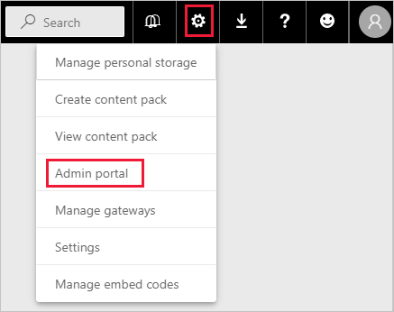
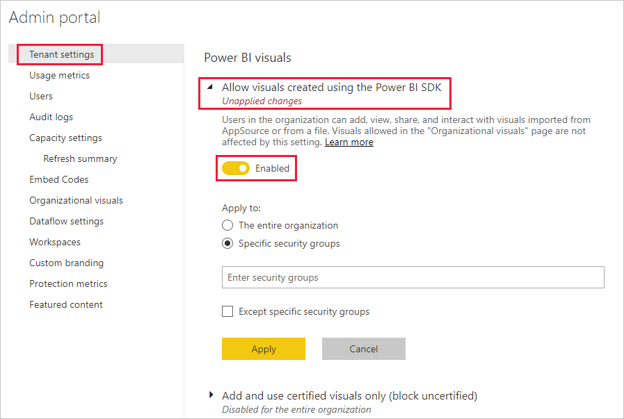
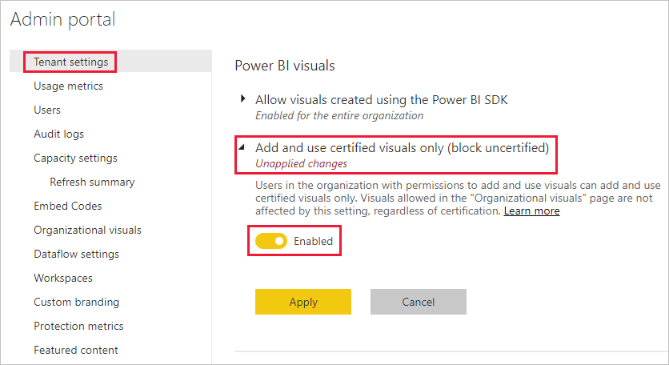
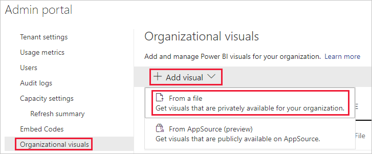
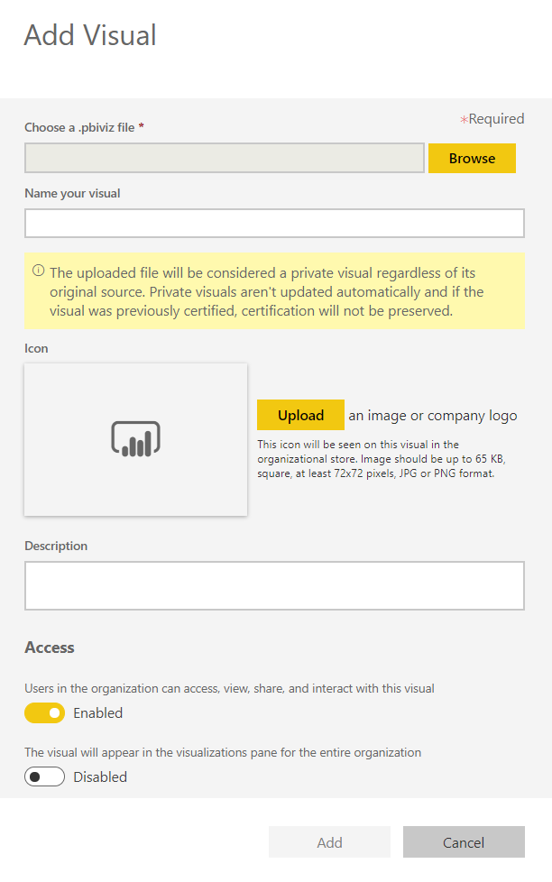
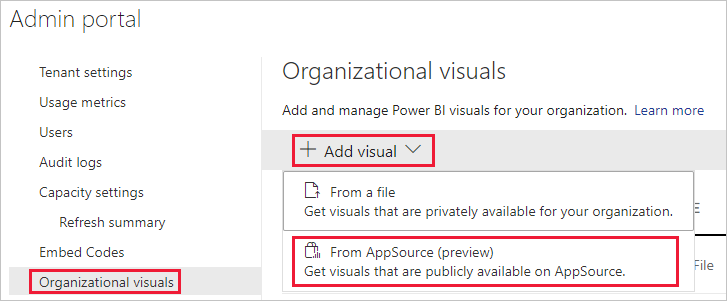
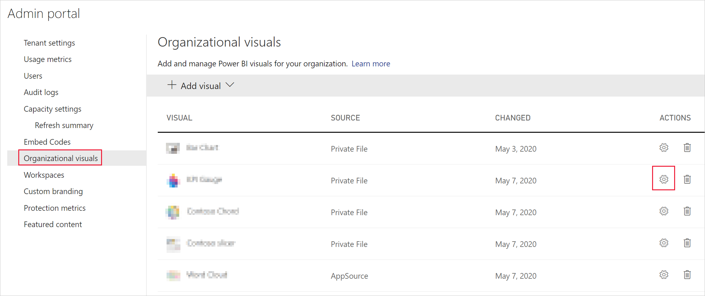
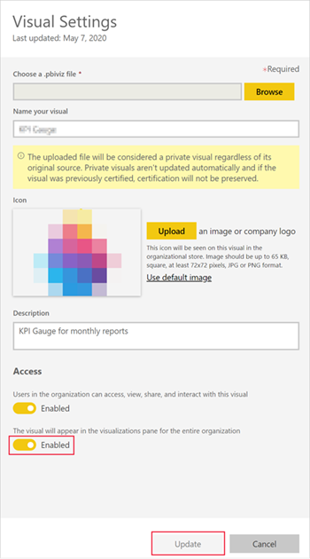

# Manage Power BI visuals admin settings

As a Power BI admin for your organization, you can control which type of Power BI visuals users can access across the organization.

To manage Power BI visuals, you must be a Global Admin in Office 365, or have been assigned the Power BI service administrator role. For more information about the Power BI service administrator role, see [Understanding the Power BI admin role](service-admin-role.md).

## Access the admin portal

To enable the settings described in the article, you'll need to access the admin portal.

1. In Power BI service, select **Settings**.

2. From the settings drop-down menu, select **Admin portal**.

    

## Power BI visuals tenant settings

As a Power BI admin for your organization, you can control which type of Power BI visuals users will be able to access across the organization.

The UI tenant settings only affect Power BI service. If you want these settings to take effect in Power BI Desktop, use group policies. A table at the end of each section provides details for enabling the setting in Power BI Desktop.

>[!NOTE]
>Changes to tenant settings do not affect Power BI visuals listed in the [organizational visuals](#organizational-visuals) tab.

### Visuals from AppSource or a file

Manage organizational access for the following type of Power BI visuals:

* Visuals created by developers and saved as a .pbiviz file.

* Visuals available from AppSource.

Follow the instructions below to enable users in your organization upload .pbiviz files, and add visuals from AppSource to their reports and dashboards.

1. Expand the **Allow visuals created using the Power BI SDK** settings.

2. Click **Enabled**.

3. Choose who can upload .pbiviz and AppSource visuals:

    * Select **The entire organization** option to allow everyone in your organization to upload .pbiviz files, and add visuals from AppSource.

     * Select the **Specific security groups** option to manage uploading .pbiviz files, and adding visuals from AppSource using security groups. Add the security groups you want to manage to the *Enter security groups* text bar. The security groups you specified are excluded by default. If you want to include these security groups and exclude everyone else in the organization, select the **Except specific security groups** option.

4. Click **Apply**.

UI changes to tenant settings apply only to Power BI service. To enable users in your organization upload .pbiviz files, and add visuals from AppSource to their visualization pane in  Power BI Desktop, use [Azure AD Group Policy](/azure/active-directory-domain-services/manage-group-policy).

|Key  |Value name  |Value  |
|---------|---------|---------|
|Software\Policies\Microsoft\Power BI Desktop\    |EnableCustomVisuals    |0 - Disable  1 - Enable (default)         |
|

### Certified Power BI visuals

When this setting is enabled, only [certified Power BI visuals](../developer/visuals/power-bi-custom-visuals-certified.md) will render in your organization's reports and dashboards. Power BI visuals from AppSource or files, that are not certified, will return an error message.

1. From the admin portal, select **Add and use certified visuals only**.

2. Click **Enabled**.

3. Click **Apply**.

UI changes to tenant settings apply only to Power BI service. To manage the certified visuals tenant setting in Power BI Desktop, use [Azure AD Group Policy](/azure/active-directory-domain-services/manage-group-policy).

|Key  |Value name  |Value  |
|---------|---------|---------|
|Software\Policies\Microsoft\Power BI Desktop\    |EnableUncertifiedVisuals    |0 - Disable  1 - Enable (default)         |
|

## Organizational visuals

As a Power BI admin, you can manage the list of Power BI visuals available in your organization's [organizational store](../developer/visuals/power-bi-custom-visuals.md#organizational-store). The **Organizational visuals** tab in the *Admin portal*, allows you to add and remove visuals, and decide which visuals will automatically display in the visualization pane of your organization's users. You can add to the list any type of visual including uncertified visuals and .pbiviz visuals, even if they contradict the [tenant settings](#power-bi-visuals-tenant-settings) of your organization.

Organizational visuals settings are automatically deployed to Power BI Desktop.

>[!NOTE]
>Organizational visuals are not supported in Power BI Report Server.

### Add a visual from a file

Use this method to add a new Power BI visual from a .pbiviz file.

> [!WARNING]
> A Power BI visual uploaded from a file, could contain code with security or privacy risks; make sure you trust the author and the source of the visual, before deploying to the organization's repository.

1. Select **Add visual** > **From a file**.

    

2. Fill in the following fields:

    * **Choose a .pbiviz file** - Select a visual file to upload.

    * **Name your visual** - Give a short title to the visual, so that report authors can easily understand what it does.

    * **Icon** - Upload an icon file to be displayed in the visualization pane.

    * **Description** - Provide a short description of the visual to give more context for the user.

    * **Access** - This section has two options:
    
        * Select whether users in your organization can access this visual. This setting is enabled by default.

        * Select whether this visual will appear in the visualization pane of the users in your organization. This setting is disabled by default. For more information, see [add a visual to the visualization pane](#add-a-visual-to-the-visualization-pane).

    

3. To initiate the upload request, select **Add** . Once uploaded, the visual will display in the organizational visuals list.

### Add a visual from AppSource

Use this method to add a new Power BI visual from AppSource.

AppSource Power BI visuals are automatically updated. Users in your organization will always have the latest version of the visual.

1. Select **Add visual** > **From AppSource**.

    

2. In the **Power BI visuals** window, find the AppSource visual you want to add, and click **Add**. Once uploaded, the visual will display in the organizational visuals list.

### Add a visual to the visualization pane

You can pick visuals from the organizational visuals page to automatically show on the visualization pane of all the users in your organization.

1. In the row of the visual you want to add , click **settings**.

    

2. Enable the visualization pane setting and click **Update**.

    

### Delete a visual uploaded from a file

To permanently delete a visual, select the trash bin icon for the visual in the repository.

> [!IMPORTANT]
> Deletion is irreversible. Once deleted, the visual immediately stops rendering in existing reports. Even if you upload the same visual again, it won't replace the one that was deleted. However, users can import the new visual again and replace the instance they have in their reports.

### Disable a .pbiviz visual

You can disable a .pbiviz visual from being available trough the [organizational store](../developer/visuals/power-bi-custom-visuals.md#organizational-store), while keeping it on the organizational visuals list.

1. In the row of the .pbiviz visual you want to disable , click **settings**.

2. In the **Access** section, disable the setting: *Users in the organization can access, view, share, and interact with this visual*.

After you disable the .pbiviz visual, the visual won't render in existing reports, and it displays the following error message:

*This custom visual is no longer available. Please contact your administrator for details.*

>[!NOTE]
>.pbiviz visuals that are bookmarked carry on working after they've been disabled.

### Update a visual

AppSource visuals are updated automatically. Once a new version is available from AppSource, it will replace an older version deployed via the organizational visuals list.

To update a .pbiviz visual, follow these steps to replace the visual.

1. In the row of the visual you want to add , click **settings**.

2. Click **Browse**, and select the .pbiviz you want to replace the current visual with.

3. Click **Update**.

## Next steps

> [!div class="nextstepaction"]
>[Administering Power BI in the admin portal](service-admin-portal.md)

> [!div class="nextstepaction"]
>[Where to find Power BI visuals](../developer/visuals/power-bi-custom-visuals.md)

> [!div class="nextstepaction"]
>[Organizational visuals in Power BI](../developer/visuals/power-bi-custom-visuals-organization.md)