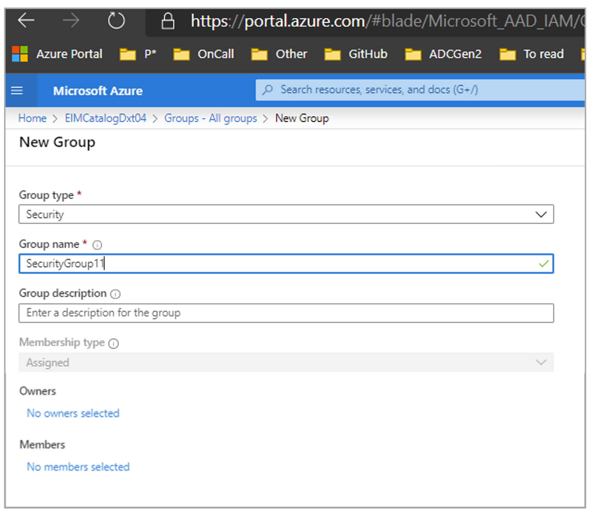
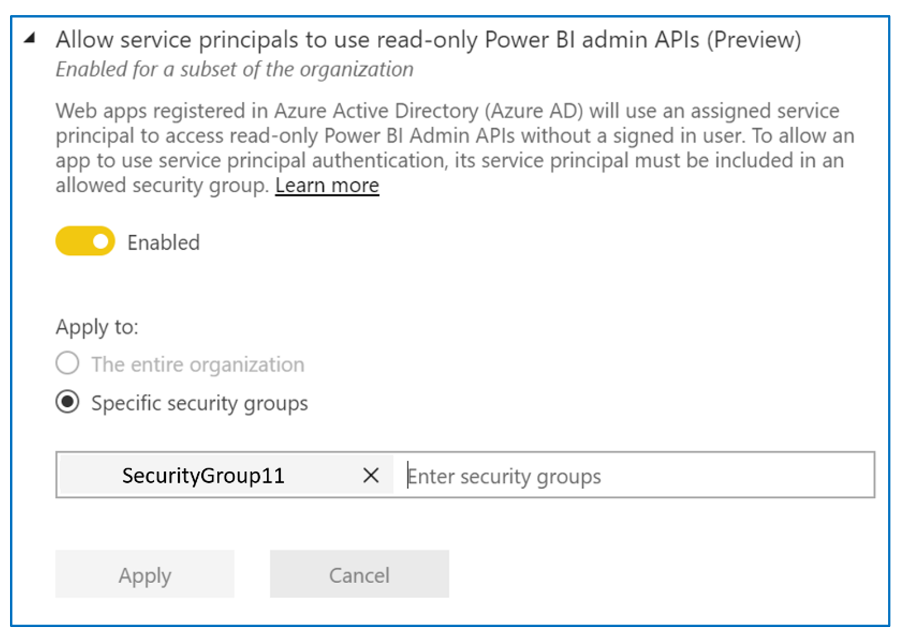

# Enable service principal authentication for read-only admin APIs

Service principal is an authentication method that can be used to let an Azure Active Directory (Azure AD) application access Power BI service content and APIs.
When you create an Azure AD app, a [service principal object](/azure/active-directory/develop/app-objects-and-service-principals#service-principal-object) is created. The service principal object, also known simply as the service principal, allows Azure AD to authenticate your app. Once authenticated, the app can access Azure AD tenant resources.

## Method

To enable service principal authentication for Power BI read-only APIs, follow these steps:

1. [Create an Azure AD app](/azure/active-directory/develop/howto-create-service-principal-portal). You can skip this step if you already have an Azure AD app you want to use. Take note of the App-Id for later steps. 
2. Create a new **Security Group** in Azure Active Directory. [Read more about how to create a basic group and add members using Azure Active Directory](/azure/active-directory/fundamentals/active-directory-groups-create-azure-portal). You can skip this step if you already have a security group you would like to use.
    Make sure to select **Security** as the Group type.

    

3. Add your App-Id as a member of the security group you created. To do so:
    1. Navigate to **Azure portal > Azure Active Directory > Groups**, and choose the security group you created in Step 2.
    1. Select **Add Members**.
    Note: Make sure the app you use does not have any Power BI admin roles set on it in Azure portal. To check this: 
       * Sign into the **Azure portal** as a Global Administrator, an Application Administrator, or a Cloud Application Administrator. 
        * Select **Azure Active Directory**, then **Enterprise applications**. 
        * Select the application you want to grant access to Power BI. 
        * Select **Permissions**. 

        > [!IMPORTANT]
        > Make sure there are no Power BI admin-consent-required permissions set on this application. See [Managing consent to applications and evaluating consent requests](/azure/active-directory/manage-apps/manage-consent-requests) for more information. 
4. Enable the Power BI service admin settings. To do this:
    1. Log into the Power BI admin portal. You need to be a Power BI admin to see the tenant settings page.
    1. Under **Admin API settings**, you will see **Allow service principals to use read-only Power BI admin APIs**. Set the toggle to Enabled, and then select the **Specific security groups** radio button and add the security group you created in Step 2 in the text field that appears below it, as shown in the figure below.

        

 5. Start using the read-only admin APIs. See the list of supported APIs below.

    >[!IMPORTANT]
    >Once you enable the service principal to be used with Power BI, the application's Azure AD permissions no longer have any effect. The application's permissions are then managed through the Power BI admin portal.

## Supported APIs

Service principal currently supports the following APIs:
* [GetGroupsAsAdmin](/rest/api/power-bi/admin/groups_getgroupsasadmin) with $expand for dashboards, datasets, reports, and dataflows 
* [GetGroupUsersAsAdmin](/rest/api/power-bi/admin/groups-get-group-users-as-admin)
* [GetDashboardsAsAdmin](/rest/api/power-bi/admin/dashboards_getdashboardsasadmin) with $expand tiles
* [GetDashboardUsersAsAdmin](/rest/api/power-bi/admin/dashboards-get-dashboard-users-as-admin)
* [GetAppsAsAdmin](/rest/api/power-bi/admin/apps-get-apps-as-admin)
* [GetAppUsersAsAdmin](/rest/api/power-bi/admin/apps-get-app-users-as-admin)
* [GetDatasourcesAsAdmin](/rest/api/power-bi/admin/datasets_getdatasourcesasadmin) 
* [GetDatasetToDataflowsLinksAsAdmin](/rest/api/power-bi/admin/datasets_getdatasettodataflowslinksingroupasadmin)
* [GetDataflowDatasourcesAsAdmin](/rest/api/power-bi/admin/dataflows_getdataflowdatasourcesasadmin) 
* [GetDataflowUpstreamDataflowsAsAdmin](/rest/api/power-bi/admin/dataflows_getupstreamdataflowsingroupasadmin) 
* [GetCapacitiesAsAdmin](/rest/api/power-bi/admin/getcapacitiesasadmin)
* [GetCapacityUsersAsAdmin](/rest/api/power-bi/admin/capacities-get-capacity-users-as-admin)
* [GetActivityLog](/rest/api/power-bi/admin/getactivityevents)
* [GetModifiedWorkspaces](/rest/api/power-bi/admin/workspace-info-get-modified-workspaces)
* [WorkspaceGetInfo](/rest/api/power-bi/admin/workspace-info-post-workspace-info)
* [WorkspaceScanStatus](/rest/api/power-bi/admin/workspace-info-get-scan-status)
* [WorkspaceScanResult](/rest/api/power-bi/admin/workspace-info-get-scan-result)
* [GetDashboardsInGroupAsAdmin](/rest/api/power-bi/admin/dashboards_getdashboardsasadmin)
* [GetTilesAsAdmin](/rest/api/power-bi/admin/dashboards_gettilesasadmin)
* [ExportDataflowAsAdmin](/rest/api/power-bi/admin/dataflows_exportdataflowasadmin)
* [GetDataflowsAsAdmin](/rest/api/power-bi/admin/dataflows_getdataflowsasadmin)
* [GetDataflowUsersAsAdmin](/rest/api/power-bi/admin/dataflows-get-dataflow-users-as-admin)
* [GetDataflowsInGroupAsAdmin](/rest/api/power-bi/admin/dataflows_getdataflowsingroupasadmin)
* [GetDatasetsAsAdmin](/rest/api/power-bi/admin/datasets_getdatasetsasadmin)
* [GetDatasetUsersAsAdmin](/rest/api/power-bi/admin/datasets-get-dataset-users-as-admin)
* [GetDatasetsInGroupAsAdmin](/rest/api/power-bi/admin/datasets_getdatasetsingroupasadmin)
* [Get Power BI Encryption Keys](/rest/api/power-bi/admin/getpowerbiencryptionkeys)
* [Get Refreshable For Capacity](/rest/api/power-bi/admin/getrefreshableforcapacity)
* [Get Refreshables](/rest/api/power-bi/admin/getrefreshables)
* [Get Refreshables For Capacity](/rest/api/power-bi/admin/getrefreshablesforcapacity)
* [GetImportsAsAdmin](/rest/api/power-bi/admin/imports_getimportsasadmin)
* [GetReportsAsAdmin](/rest/api/power-bi/admin/reports_getreportsasadmin)
* [GetReportUsersAsAdmin](/rest/api/power-bi/admin/reports-get-report-users-as-admin)
* [GetReportsInGroupAsAdmin](/rest/api/power-bi/admin/reports_getreportsingroupasadmin)

## Considerations and limitations

* You can't sign into the Power BI portal using service principal.
* Power BI admin rights are required to enable service principal in the Admin API settings in the Power BI admin portal.
