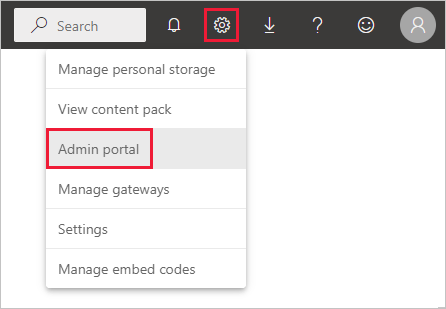
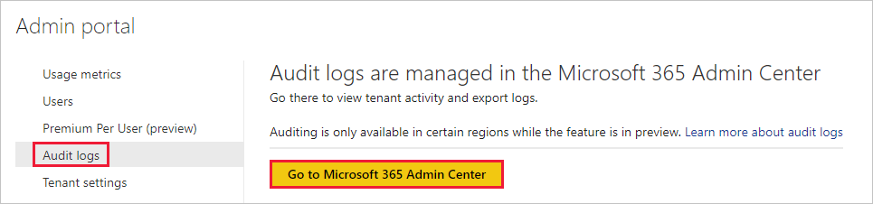
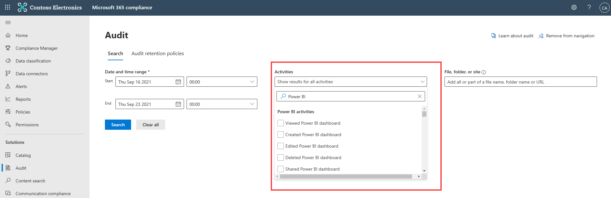
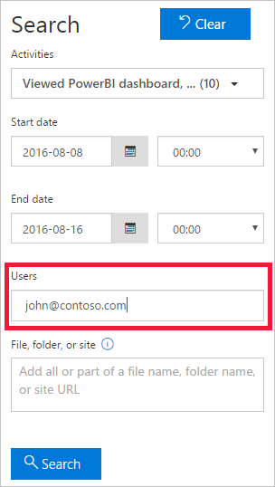
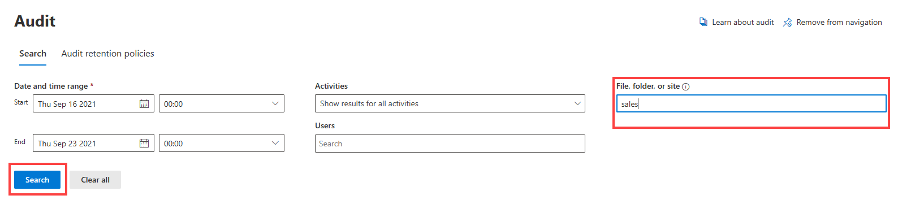
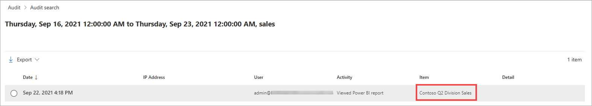
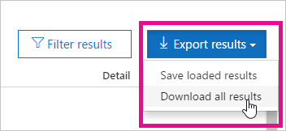

# Track user activities in Power BI

Knowing who is taking what action on which item in Power BI can be critical in helping your organization fulfill its requirements, like meeting regulatory compliance and records management. This article discusses two options to track user activity: The [Power BI activity log](#use-the-activity-log) and the [unified audit log](#use-the-audit-log). 

## Choosing a log source
The Power BI Activity Log and unified audit log both contain a complete copy of the [Power BI auditing data](#operations-available-in-the-audit-and-activity-logs). However, we highly recommend using the Power BI Activity Log for the following reasons:

- The Power BI Activity Log contains only the Power BI activities structured list of records (JSON array).
- The global administrator role isn't needed to access the Power BI Activity Log.

The differences between log sources are summarized in the following table.

| **Unified audit log** | **Power BI activity log** |
| --- | --- |
| Includes events from Power BI, plus events from SharePoint Online, Exchange Online, Dynamics 365, and other services. | Includes only the Power BI auditing events. |
| Only users with View-Only Audit Logs or Audit Logs permissions have access, such as global admins and auditors. | Global admins, Power Platform admins, and Power BI admins have access. |
| Global admins and auditors can search the unified audit log by using the Microsoft 365 Security Center and the Microsoft 365 Compliance Center. | There's no user interface to search the activity log yet. |
| Global admins and auditors can download audit log entries by using Microsoft 365 Management APIs and cmdlets. | Global admins, Power Platform admins, and Power BI admins can download activity log entries by using a Power BI REST API and management cmdlet. |
| Keeps audit data for 90 days | Keeps activity data for 30 days (public preview). |
| Keeps audit data, even if the tenant is moved to a different Azure region. | Doesn't keep activity data when the tenant is moved to a different Azure region. |


## Use the activity log

Power BI administrators can analyze usage for all Power BI resources at the tenant level by using custom reports that are based on the Power BI activity log. You download the activities by using a REST API or PowerShell cmdlet. Filter activity data by date range, user, and activity type.

> [!NOTE]
> You need to be familiar with the [Power BI Admin API](/rest/api/power-bi/admin) and [Power BI PowerShell modules](/powershell/power-bi/overview?view=powerbi-ps&preserve-view=true). PowerShell modules must be installed before you can run commands. 
>
> There can be a lag of up to 30 minutes to retrieve Power BI events.

### Activity log requirements

To access the Power BI activity log, you must meet these requirements:

- You have to be a global admin or a Power BI Administrator.
- Install the [Power BI Management cmdlets](https://www.powershellgallery.com/packages/MicrosoftPowerBIMgmt) locally or use the Power BI Management cmdlets in Azure Cloud Shell.

### ActivityEvents REST API

You can use an administrative application based on the Power BI REST APIs to export activity events into a blob store or SQL database. You can then build a custom usage report on top of the exported data. In the **ActivityEvents** REST API call, you must specify a start date and end date and optionally a filter to select activities by activity type or user ID. Because the activity log could contain a large amount of data, the **ActivityEvents** API currently only supports downloading up to one day of data per request. In other words, the start date and end date must specify the same day, as in the following example. Make sure you specify the DateTime values in UTC format.

```
https://api.powerbi.com/v1.0/myorg/admin/activityevents?startDateTime='2019-08-31T00:00:00'&endDateTime='2019-08-31T23:59:59'
```

If the number of entries is large, the **ActivityEvents** API returns only around 5,000 to 10,000 entries and a continuation token. Call the **ActivityEvents** API again with the continuation token to get the next batch of entries, and so forth, until you've gotten all entries and no longer receive a continuation token. The following example shows how to use the continuation token.

```
https://api.powerbi.com/v1.0/myorg/admin/activityevents?continuationToken='%2BRID%3ARthsAIwfWGcVAAAAAAAAAA%3D%3D%23RT%3A4%23TRC%3A20%23FPC%3AARUAAAAAAAAAFwAAAAAAAAA%3D'
```

No matter how many entries are returned, if the results include a continuation token, make sure you call the API again using that token to get the rest of the data, until a continuation token is no longer returned. It's possible for a call to return a continuation token without any event entries. The following example shows how to loop with a continuation token returned in the response:

```
while(response.ContinuationToken != null)
{
   // Store the activity event results in a list for example
    completeListOfActivityEvents.AddRange(response.ActivityEventEntities);

    // Make another call to the API with continuation token
    response = GetPowerBIActivityEvents(response.ContinuationToken)
}
completeListOfActivityEvents.AddRange(response.ActivityEventEntities);
```

> [!NOTE]
> It can take up to 24 hours for all events to show up, though full data is typically available much sooner.

If the time span between startDateTime and endDateTime exceeds 1 hour, it takes multiple requests to download the data through continuationUri in response.

The following example shows how to download data for 1 hour and 5 minutes:
```
GET https://wabi-staging-us-east-redirect.analysis.windows.net/v1.0/myorg/admin/activityevents?startDateTime='2020-08-13T07:55:00Z'&endDateTime='2020-08-13T09:00:00Z'
{
  "activityEventEntities": […],
  "continuationUri": https://wabi-staging-us-east-redirect.analysis.windows.net/v1.0/myorg/admin/activityevents?continuationToken='LDIwMjAtMDgtMTNUMDc6NTU6MDBaLDIwMjAtMDgtMTNUMDk6MDA6MDBaLDEsLA%3D%3D',
  "continuationToken": "LDIwMjAtMDgtMTNUMDc6NTU6MDBaLDIwMjAtMDgtMTNUMDk6MDA6MDBaLDEsLA%3D%3D",
  "lastResultSet": false
}

GET https://wabi-staging-us-east-redirect.analysis.windows.net/v1.0/myorg/admin/activityevents?continuationToken='LDIwMjAtMDgtMTNUMDc6NTU6MDBaLDIwMjAtMDgtMTNUMDk6MDA6MDBaLDEsLA%3D%3D'
{
  "activityEventEntities": [],
  "continuationUri": null,
  "continuationToken": null,
  "lastResultSet": false
}
```

To learn more about using the Power BI REST API, including examples of how to get audit activity events, see [Admin - Get Activity Events](/rest/api/power-bi/admin/getactivityevents) in the Power BI REST API reference documentation.

### Get-PowerBIActivityEvent cmdlet

Download activity events by using the Power BI Management cmdlets for PowerShell. The **Get-PowerBIActivityEvent** cmdlet  automatically handles the continuation token for you. The **Get-PowerBIActivityEvent** cmdlet takes a StartDateTime and an EndDateTime parameter with the same restrictions as the **ActivityEvents** REST API. In other words, the start date and end date must reference the same date value because you can only retrieve the activity data for one day at a time.

The following script demonstrates how to download all Power BI activities. The command converts the results from JSON into .NET objects for straightforward access to individual activity properties. These examples show the smallest and largest timestamps possible for a day to ensure no events are missed.

```powershell
Login-PowerBI

$activities = Get-PowerBIActivityEvent -StartDateTime '2019-08-31T00:00:00' -EndDateTime '2019-08-31T23:59:59' | ConvertFrom-Json

$activities.Count
$activities[0]

```

### Filter activity data

You can filter activity events by activity type and user ID. The following script demonstrates how to download only the event data for the **ViewDashboard** activity. For additional information about supported parameters, use the command `Get-Help Get-PowerBIActivityEvent`.

```powershell
Login-PowerBI

$activities = Get-PowerBIActivityEvent -StartDateTime '2019-08-31T00:00:00' -EndDateTime '2019-08-31T23:59:59' -ActivityType 'ViewDashboard' | ConvertFrom-Json

$activities.Count
$activities[0]

```

> [!NOTE]
> A PowerShell sample is available to help you learn how to filter and retrieve Power BI activity log events. For more information, see [Access the Power BI activity log](../guidance/admin-activity-log.md).

## Use the audit log

If your task is to track user activities across Power BI and Microsoft 365, you work with auditing in Microsoft 365 compliance or use PowerShell. Auditing relies on functionality in Exchange Online, which automatically supports Power BI.

You can filter the audit data by date range, user, dashboard, report, dataset, and activity type. You can also download the activities in a csv (comma-separated value) file to analyze offline.

### Audit log requirements

Meet these requirements to access audit logs:

- You must either be a global admin or assigned the Audit Logs or View-Only Audit Logs role in Exchange Online to access the audit log. By default, the Compliance Management and Organization Management role groups have roles assigned on the **Permissions** page in the Exchange admin center. For more information about the roles that can view audit logs, see [Requirements to search the audit log](/microsoft-365/compliance/search-the-audit-log-in-security-and-compliance#before-you-search-the-audit-log).

    To give non-admin accounts access to the audit log, add the user as a member of one of these role groups. Another option is to create a custom role group in the Exchange admin center, assign the Audit Logs or View-Only Audit Logs role to this group, and then add the non-admin account to the new role group. For more information, see [Manage role groups in Exchange Online](/Exchange/permissions-exo/role-groups).

    If you can't access the Exchange admin center from the Microsoft 365 admin center, go to https://outlook.office365.com/ecp and sign in using your credentials.

- If you have access to the audit log but aren't a global admin or Power BI Administrator, you can't get to the Power BI Admin portal. In this case, use a direct link to  [Microsoft 365 compliance](https://compliance.microsoft.com/auditlogsearch).

### Access your audit logs

To access logs, first enable logging in Power BI. For more information, see [Audit and usage settings](service-admin-portal.md#create-audit-logs-for-internal-activity-auditing-and-compliance) in the admin portal documentation. There may be up to a 48-hour delay between the time you enable auditing and when you can view audit data. If you don't see data immediately, check the audit logs later. You might experience a similar delay between getting permission to view audit logs and being able to access the logs.

The Power BI audit logs are available directly through [Microsoft 365 compliance](https://compliance.microsoft.com/auditlogsearch). There's also a link from the Power BI admin portal:

1. In Power BI, select **Settings** > **Admin portal**.

   

1. Select **Audit logs**.

1. Select **Go to Microsoft 365 Admin Center**.

   

### Search Power BI activities

Search for Power BI activities by following these steps. For a list of activities, see the list of [activities audited by Power BI](#operations-available-in-the-audit-and-activity-logs) later in this article.

1. On the **Audit** page, under **Search**, select the drop-down for **Activities**.

2. Enter **Power BI** to go to the list of Power BI activities.

   [](media/service-admin-auditing/audit-log-search-filter-by-powerbi.png#lightbox)

3. Select each of the Power BI activities that you want to track.

Your search will only return the selected Power BI activities.

### Search the audit logs by date

You can search the logs by date range using the **Start date** and **End date** fields. The default selection is the past seven days. The display presents the date and time in Coordinated Universal Time (UTC) format. The maximum date range that you can specify is 90 days. 

You'll receive an error if the selected date range is greater than 90 days. If you're using the maximum date range of 90 days, select the current time for **Start date**. Otherwise, you'll receive an error saying that the start date is earlier than the end date. If you've turned on auditing within the last 90 days, the date range can't start before the date that auditing was turned on.

  :::image type="content" source="media/service-admin-auditing/search-audit-log-by-date.png" alt-text="Screenshot of the Audit log search with Start Date and End Date options called out." :::

### Search the audit logs by users

You can search for audit log entries for activities done by specific users. Enter one or more user names in the **Users** field. The user name looks like an email address. Leave this box blank to return entries for all users (and service accounts) in your organization.



### Search the audit logs by file, folder, or site

If you're trying to determine who accessed a file, folder, or site, on the **Audit** page, enter all or part of a file name, folder name, or URL in the **File, folder, or site** field. Don't use any spaces or special characters. For example, you can enter all or part of the name of a dataset to find who has interacted with it recently.

In the example shown below, the search term "sales" was entered in the **File, folder, or site** field.

[](media/service-admin-auditing/search-audit-log-by-file.png#lightbox)

The search results for the "sales" filter show user activity for the Contoso Q2 Division Sales dataset.

[](media/service-admin-auditing/search-audit-log-by-file-results.png#lightbox)

### Combine filters to narrow results

You can combine any of the filters included on the Audit page to refine the results that are returned. When you combine filters, the search results will show only items that match all of the filter criteria.

### View search results

After you select **Search**, the search results load and display on the **Audit search** page.  When the search finishes, the display shows the number of results found. **Audit search** displays a maximum of 1000 events. If more than 1000 events meet the search criteria, the app displays the newest 1000 events.

The following information is shown for each event returned by the search. Select a column header under **Results** to sort the results.

| **Column** | **Definition** |
| --- | --- |
| Date |The date and time (in UTC format) when the event occurred. |
| IP address |The IP address of the device used for the logged activity. The app displays the IP address in either an IPv4 or IPv6 address format. |
| User |The user (or service account) who did the activity. |
| Activity |The activity done by the user. This value corresponds to the activities that you selected in the **Activities** drop down list. For an event from the Exchange admin audit log, the value in this column is an Exchange cmdlet. |
| Item |The object created or modified because of the corresponding activity. For example, the  viewed or modified file, or the updated user account. Not all activities have a value in this column. |
| Detail |More detail about an activity. Again, not all activities have a value. |

#### View the details for an event

To view more details about an event, select the event record in the list of search results. A **Detail** page appears that has the detailed properties from the event record. The **Detail** page displays properties depending on the Microsoft 365 service in which the event occurs.

All Power BI entries have a value of 20 for the RecordType property. For information about other properties, see [Detailed properties in the audit log](/microsoft-365/compliance/detailed-properties-in-the-office-365-audit-log/).

   

### Export search results

To export the Power BI audit log search results to a CSV file, follow these steps.

1. Do an audit search by following the steps in this article.

1. On the **Audit search** results page, select the drop-down next to **Export**, then select **Download all results**. The results are saved in CSV format and the file can be found in the user's **Downloads** folder.

    

### Use PowerShell to search audit logs

You can also use PowerShell to access the audit logs. The following example shows how to connect to Exchange Online PowerShell V2 (EXO V2) and then use the [Search-UnifiedAuditLog](/powershell/module/exchange/policy-and-compliance-audit/search-unifiedauditlog?view=exchange-ps&preserve-view=true/) command to pull Power BI audit log entries. To run the script, an admin must assign you the appropriate permissions, as described in the [Audit log requirements](#audit-log-requirements) section. Read [About the Exchange Online PowerShell V2 module](/powershell/exchange/exchange-online-powershell-v2?view=exchange-ps&preserve-view=true) and [Connect to Exchange Online PowerShell](/powershell/exchange/connect-to-exchange-online-powershell) to learn more about how this PowerShell module works.

You can download the EXO V2 module from the PowerShell gallery at https://www.powershellgallery.com/packages/ExchangeOnlineManagement/.

```powershell
#The first command sets the execution policy for Windows computers and allows scripts to run.
Set-ExecutionPolicy RemoteSigned

#The following command loads the Exchange Online management module.
Import-Module ExchangeOnlineManagement

#Next, you connect using your user principal name. A dialog will prompt you for your password and any multi-factor authentication requirements.
Connect-ExchangeOnline -UserPrincipalName <user@contoso.com>

#Now you can query for Power BI activity. In this example, the results are limited to 1,000, shown as a table, and the "more" command causes output to display one screen at a time. 
Search-UnifiedAuditLog -StartDate 09/16/2021 -EndDate 9/23/2021 -RecordType PowerBIAudit -ResultSize 1000 | Format-Table | More
```

### Use PowerShell to export audit logs

You can also use PowerShell to export the results of your audit logs search. The following example shows how to send from the [Search-UnifiedAuditLog](/powershell/module/exchange/policy-and-compliance-audit/search-unifiedauditlog?view=exchange-ps&preserve-view=true/) command, and export the results using the [Export-Csv](/powershell/module/microsoft.powershell.utility/export-csv) cmdlet. To run the script, an admin must assign you the appropriate permissions, as described in the [Audit log requirements](#audit-log-requirements) section.

```powershell
Set-ExecutionPolicy RemoteSigned

Import-Module ExchangeOnlineManagement
Connect-ExchangeOnline -UserPrincipalName <user@contoso.com>
Search-UnifiedAuditLog -StartDate 09/16/2021 -EndDate 9/23/2021 -RecordType PowerBIAudit -ResultSize 1000 | Export-Csv -Path "c:\temp\PowerBIAuditLog.csv" -NoTypeInformation

```

For more information on connecting to Exchange Online, see [Connect to Exchange Online PowerShell](/powershell/exchange/connect-to-exchange-online-powershell). For another example of using PowerShell with audit logs, see [Using Power BI audit log and PowerShell to assign Power BI Pro licenses](https://powerbi.microsoft.com/blog/using-power-bi-audit-log-and-powershell-to-assign-power-bi-pro-licenses/).

## Operations available in the audit and activity logs

The following operations are available in both the audit and activity logs.

> [!NOTE]
> We recently added many Power BI activities to the audit and activity logs. Friendly names can be found in Microsoft 365 Compliance, and we'll continue to update this list to identify the operation names used in REST API and PowerShell queries.

| Friendly name         | Operation name           | Notes                                  |
|-----------------------|--------------------------|----------------------------------------|
| Added data source to Power BI gateway   | AddDatasourceToGateway |     |
| Added external resource | AddExternalResource | |
| Added link to external resource | AddExternalResourceLink | |
| Added Power BI folder access  | AddFolderAccess     | Not currently used      |
| Added Power BI group members       | AddGroupMembers     |    |
| Added user to Power BI gateway cluster | | |
| Added user to Power BI gateway cluster datasource | | |
| Admin attached dataflow storage account to tenant | AdminAttachedDataflowStorageAccountToTenant | Not currently used     |
| Analyzed Power BI dataset  | AnalyzedByExternalApplication   | Generated when users interact with the service      |
| Analyzed Power BI report    | AnalyzeInExcel   | |
| [Applied sensitivity label to Power BI artifact](service-security-sensitivity-label-audit-schema.md) | SensitivityLabelApplied | |
| Assigned a workspace to a deployment pipeline | AssignWorkspaceToPipeline  | |
| Attached dataflow storage account     | AttachedDataflowStorageAccount | |
| Binded monikers to Power BI datasources | BindMonikerstoDatasources | |
| Binded Power BI dataset to gateway  | BindToGateway        |     |
| Canceled Power BI dataflow refresh    | CancelDataflowRefresh |    |
| Changed capacity state        | ChangeCapacityState  |      |
| Changed capacity user assignment      | UpdateCapacityUsersAssignment   |    |
| Changed Power BI dataset connections   | SetAllConnections         |         |
| Changed Power BI gateway admins   | ChangeGatewayAdministrators  |       |
| Changed Power BI gateway data source users  | ChangeGatewayDatasourceUsers   |       |
| [Changed sensitivity label for Power BI artifact](service-security-sensitivity-label-audit-schema.md) | SensitivityLabelChanged  | | 
| Connected to Power BI dataset from external app | ConnectFromExternalApplication | |
| Copied Power BI dashboard | CopyDashboard | |
| Copied Power BI report | CopyReport  |  |
| Created a Power BI scorecard goal | CreateGoal | |
| Created a Power BI goal value | CreateGoalValue | |
| Created a Power BI scorecard | CreateScorecard | |
| Created an organizational custom visual     | InsertOrganizationalGalleryItem   |    |
| Created deployment pipeline      | CreateAlmPipeline       |  |
| Created install ticket for installing Power BI template app | CreateTemplateAppInstallTicket | |
| Created Power BI app      | CreateApp           |       |
| Created Power BI dashboard    | CreateDashboard  |       |
| Created Power BI dataflow      | CreateDataflow            |                        |
| Created Power BI dataset         | CreateDataset          |           |
| Created Power BI dataset from external app | CreateDatasetFromExternalApplication | |
| Created Power BI email subscription   | CreateEmailSubscription       |            |
| Created Power BI folder   | CreateFolder           |              |
| Created Power BI gateway        | CreateGateway     |              |
| Created Power BI gateway cluster datasource | | |
| Created Power BI group      | CreateGroup            |       |
| Created Power BI report       | CreateReport <sup>1</sup>      |          |
| Created Power BI template app | CreateTemplateApp |  |
| Created workspace for Power BI template app | CreateTemplateApp | |
| Custom visual requested Azure AD access token         | GenerateCustomVisualAADAccessToken    |   |
| Custom visual requested Office Web Apps access token    | CustomVisualWACAccessToken          |     |
| Dataflow migrated to external storage account     | DataflowMigratedToExternalStorageAccount    | Not currently used                       |
| Dataflow permissions added   | DataflowPermissionsAdded       | Not currently used     |
| Dataflow permissions removed      | DataflowPermissionsRemoved                  | Not currently used       |
| Deleted an organizational custom visual     | DeleteOrganizationalGalleryItem               |        |
| Deleted deployment pipeline      | DeleteAlmPipeline     |   |
| Deleted current value connection of Power BI goal | | |
| Deleted link to external resource | DeleteExternalResourceLink | |
| Deleted member of Power BI gateway cluster | | |
| Deleted organizational Power BI content pack   | DeleteOrgApp     |       |
| Deleted Power BI comment   | DeleteComment      |      |
| Deleted Power BI dashboard      | DeleteDashboard       | Not currently used     |
| Deleted Power BI dataflow    | DeleteDataflow       | Not currently used     |
| Deleted Power BI dataset     | DeleteDataset         |         |
| Deleted Power BI dataset from external app | DeleteDatasetFromExternalApplication | |
| Deleted Power BI email subscription   | DeleteEmailSubscription   |          |
| Deleted Power BI folder   | DeleteFolder   |   |
| Deleted Power BI goal | DeleteGoal | |
| Deleted Power BI folder access     | DeleteFolderAccess     | Not currently used        |
| Deleted Power BI gateway      | DeleteGateway                  |        |
| Deleted Power BI gateway cluster | | |
| Deleted Power BI gateway cluster datasource | | |
| Deleted Power BI goal | DeleteGoal | |
| Deleted Power BI group      | DeleteGroup          |            |
| Deleted Power BI note | DeleteNote | |
| Deleted Power BI scorecard | DeleteScorecard | |
| Deleted Power BI report    | DeleteReport   |    |
| Deleted Power BI template app | DeleteTemplateApp | |
| [Deleted sensitivity label from Power BI artifact](service-security-sensitivity-label-audit-schema.md)  | SensitivityLabelRemoved | |
| Deleted snapshot for user in Power BI tenant | DeleteSnapshot | Generated when a user deletes a snapshot that describes a dataset |
| Deleted workspace for Power BI template app | DeleteTemplateApp | |
| Deployed to a pipeline stage     | DeployAlmPipeline    |        |
| Discovered Power BI dataset data sources      | GetDatasources       | |
| Downloaded Power BI report     | DownloadReport                   |       |
| Edited Power BI app endorsement | EditContentProviderProperties | |
| Edited Power BI certification permission    | EditCertificationPermission    | Not currently used    |
| Edited Power BI dashboard      | EditDashboard        | Not currently used       |
| Edited Power BI dataflow endorsement | EditDataflowProperties | |
| Edited Power BI dataset    | EditDataset         |       |
| Edited Power BI dataset endorsement | EditDatasetProperties | |
| Edited Power BI dataset from external app | EditDatasetFromExternalApplication | |
| Edited Power BI dataset properties    | EditDatasetProperties     |  |
| Edited Power BI report   | EditReport    |        |
| Edited Power BI report endorsement | EditReportProperties | |
| Encrypted credentials for Power BI gateway datasource | | |
| Encrypted credentials using Power BI gateway cluster | | |
| Export Power BI activity events | ExportActivityEvents | |
| Exported Power BI artifact to another file format | ExportArtifact | |
| Exported Power BI dataflow   | ExportDataflow |  |
| Exported Power BI report to another file format | ExportReport | |
| Exported Power BI report visual data    | ExportReport    |     |
| Exported Power BI tile data    | ExportTile       |         |
| Generated Power BI dataflow SAS token    | GenerateDataflowSasToken   |  |
| Generated Power BI Embed Token     | GenerateEmbedToken  |        |
| Generate screenshot     | GenerateScreenshot |   |
| Get Power BI group users | GetGroupUsers | |
| Imported file to Power BI   | Import   |           |
| Initiated Power BI gateway cluster authentication process | | |
| Inserted or updated current value connection of Power BI goal | UpsertGoalCurrentValueConnection | |
| Inserted or updated target value connection of Power BI goal | | |
| Inserted Power BI note | InsertNote | |
| Inserted snapshot for user in Power BI tenant | InsertSnapshot | Generated when user uploads a snapshot that describes their dataset |
| Installed Power BI app    | InstallApp     |       |
| Installed Power BI template app | InstallTemplateApp | |
| Mapped user principal names for tenant | | |
| Migrated dataflow storage location | MigratedDataflowStorageLocation | |
| Migrated workspace to a capacity    | MigrateWorkspaceIntoCapacity   |   |
| Patched Power BI goal | PatchGoal | |
| Patched Power BI goal value | PatchGoalValue | |
| Patched Power BI note | PatchNote | |
| Patched Power BI scorecard |PatchScorecard | |
| Posted Power BI comment     | PostComment  | |
| Printed Power BI Dashboard | PrintDashboard  |    |
| Printed Power BI report page   | PrintReport      |    |
| Promoted Power BI template app | PromoteTemplateAppPackage | |
| Published Power BI report to web     | PublishToWebReport <sup>2</sup>       |      |
| Ran Power BI email subscription | RunEmailSubscription | |
| Received Power BI dataflow secret from Key Vault  | ReceiveDataflowSecretFromKeyVault    |    |
| Reencrypted credentials using Power gateway cluster | | |
| Refreshed current value of Power BI goal | | |
| Refreshed target value of Power BI goal | | |
| Removed a workspace from a deployment pipeline  | UnassignWorkspaceFromPipeline  |  |
| Removed data source from Power BI gateway    | RemoveDatasourceFromGateway  |     |
| Removed Power BI group members     | DeleteGroupMembers          |       |
| Removed user from Power BI gateway cluster | | |
| Removed user from Power BI gateway cluster datasource | | |
| Removed workspace from a capacity    | RemoveWorkspacesFromCapacity  |  |
| Renamed Power BI dashboard   | RenameDashboard   |     |
| Requested account key for Power BI storage | AcquireStorageAccountKey | |
| Requested Power BI dataflow refresh   | RequestDataflowRefresh       | Not currently used      |
| Requested Power BI dataset refresh   | RefreshDataset     |       |
| Requested Power BI dataset refresh from external app | RefreshDatasetFromExternalApplication | |
| Requested SAS token for Power BI storage | AcquireStorageSASFromExternalApplication | |
| Restored Power BI workspace | RestoreWorkspace | |
| Retrieved all Power BI gateway cluster datasources | | |
| Retrieved all supported datasources for Power BI gateway cluster | | |
| Retrieved allowed Power BI gateway regions | | |
| Retrieved authentication details for Power BI gateway cluster datasource | | |
| Retrieved data sources from Power BI dataset | GetDatasetDatasourcesAsAdmin | |
| Retrieved data sources from Power BI dataflow | GetDataflowDatasourcesAsAdmin | |
| Retrieved goals of Power BI scorecard | GetGoal | |
| Retrieved links between datasets and dataflows |GetDatasetToDataflowsLinksAsAdmin | |
| Retrieved list of datasource users for Power BI gateway cluster | | |
| Retrieved list of modified workspaces in Power BI tenant | GetModifiedWorkspacesAPI | |
| Retrieved list of Power BI gateway installer principals | | |
| Retrieved member status of Power BI gateway cluster | | |
| Retrieved multiple Power BI gateway clusters | | |
| Retrieved multiple Power BI goal values | GetGoalValues | |
| Retrieved multiple Power BI scorecards | GetScorecards | |
| Retrieved Power BI app users | GetAppUsersAsAdmin | |
| Retrieved Power BI apps | GetAppsAsAdmin | |
| Retrieved Power BI apps for user | GetUserAppsAsAdmin | |
| Retrieved Power BI capacities for user | GetUserCapacitiesAsAdmin | |
| Retrieved Power BI capacity users | GetCapacityUsersAsAdmin | |
| Retrieved Power BI dashboards | GetDashboardsAsAdmin | |
| Retrieved Power BI dashboard tiles | GetDashboardTilesAsAdmin | |
| Retrieved Power BI dashboard users | GetDashboardUsersAsAdmin | |
| Retrieved Power BI dashboards for user | GetUserDashboardsAsAdmin | |
| Retrieved Power BI dataflows | GetDataflowsAsAdmin | |
| Retrieved Power BI dataflows for user | GetUserDataflowsAsAdmin | |
| Retrieved Power BI datasets | GetDatasetsAsAdmin | |
| Retrieved Power BI datasets for user | GetUserDatasetsAsAdmin  | |
| Retrieved Power BI data sources for user | GetUserDatasourcesAsAdmin | |
| Retrieved Power BI gateway cluster datasource | | |
| Retrieved Power BI gateway cluster datasources | | |
| Retrieved Power BI gateway datasource users | GetDatasourceUsersAsAdmin | |
| Retrieved Power BI gateway tenant key | | |
| Retrieved Power BI gateway tenant policy | | |
| Retrieved Power BI gateway users | GetGatewayUsersAsAdmin |  |
| Retrieved Power BI gateways for user | GetUserGatewaysAsAdmin | |
| Retrieved Power BI goal | GetGoal | |
| Retrieved Power BI goal value | GetGoalValue | |
| Retrieved Power BI group users | GetGroupUsersAsAdmin | |
| Retrieved Power BI groups for user | GetUserGroupsAsAdmin | |
| Retrieved Power BI imports | GetImportsAsAdmin | |
| Retrieved Power BI refresh history | GetRefreshHistory | |
| Retrieved Power BI refreshable by ID | GetRefreshablesForRefreshIdAsAdmin | |
| Retrieved Power BI refreshables | GetRefreshablesAsAdmin | |
| Retrieved Power BI refreshables for capacity | GetRefreshablesForCapacityAsAdmin | |
| Retrieved Power BI report users | GetReportUsersAsAdmin | |
| Retrieved Power BI reports for user | GetUserReportsAsAdmin | |
| Retrieved Power BI scorecard | GetScorecard | |
| Retrieved Power BI scorecard by using report ID | GetScorecardByReportId | |
| Retrieved Power BI tenant keys | GetTenantKeysAsAdmin | |
| Retrieved Power BI workspaces | GetWorkspaces | |
| Retrieved scan result in Power BI tenant | GetWorkspacesInfoResult | |
| Retrieved snapshots for user in Power BI tenant | GetSnapshots | Generated when user retrieves snapshots that describe a dataset |
| Retrieved status of Power BI gateway cluster | | |
| Retrieved status of Power BI gateway cluster datasource | | |
| Retrieved upstream dataflows from Power BI dataflow | GetDataflowUpstreamDataflowsAsAdmin | |
| Rotated Power BI gateway tenant key | | |
| Sent a scan request in Power BI tenant | GetWorkspacesInfoAPI | |
| Set dataflow storage location for a workspace   | SetDataflowStorageLocationForWorkspace      | |
| Set scheduled refresh on Power BI dataflow        | SetScheduledRefreshOnDataflow               |     |
| Set scheduled refresh on Power BI dataset         | SetScheduledRefresh                         |     |
| Shared Power BI dashboard     | ShareDashboard            |           |
| Shared Power BI dataset | ShareDataset | |
| Shared Power BI report    | ShareReport    |                                          |
| Started Power BI extended trial       | OptInForExtendedProTrial         | Not currently used               |
| Started Power BI trial       | OptInForProTrial        |      |
| Tested Power BI gateway datasource connection with single sign-on | | |
| Took over a Power BI datasource  | TakeOverDatasource          |   |
| Took over Power BI dataset     | TakeOverDataset                |          |
| Took ownership of Power BI dataflow | TookOverDataflow| |
| Unpublished Power BI app      | UnpublishApp      |     |
| Update capacity resource governance settings      | UpdateCapacityResourceGovernanceSettings    | Not currently in Microsoft 365 admin center |
| Updated an organizational custom visual    | UpdateOrganizationalGalleryItem                |   |
| Updated capacity admin    | UpdateCapacityAdmins                        |          |
| Updated capacity display name     | UpdateCapacityDisplayName                   |    |
| Updated capacity custom settings | UpdateCapacityCustomSettings | |
| Updated credentials for Power BI gateway cluster | | |
| Updated dataflow storage assignment permissions   | UpdatedDataflowStorageAssignmentPermissions |    |
| Updated deployment pipeline access   | UpdateAlmPipelineAccess |       |
| Updated deployment pipeline configuration   | SetConfigurationAlmPipeline |   |
| Updated featured tables | UpdateFeaturedTables <sup>3</sup> | |
| Updated organization's Power BI settings   | UpdatedAdminFeatureSwitch      |    |
| Updated parameters for installed Power BI template app | UpdateInstalledTemplateAppParameters | |
| Updated Power BI access request settings | | |
| Updated Power BI app   | UpdateApp     |       |
| Updated Power BI dataflow    | UpdateDataflow     |    |
| Updated Power BI dataset data sources   | UpdateDatasources  |   |
| Updated Power BI dataset parameters    | UpdateDatasetParameters     |    |
| Updated Power BI discoverable model settings | UpdateDiscoverableModelSettings | Generated when a report is set to feature on home |
| Updated Power BI gateway data source credentials | UpdateDatasourceCredentials | |
| Updated Power BI email subscription               | UpdateEmailSubscription                     |     |
| Updated Power BI folder                           | UpdateFolder                                |    |
| Updated Power BI folder access                    | UpdateFolderAccess                          |     |
| Updated Power BI gateway cluster datasource | | |
| Updated Power BI gateway data source credentials  | UpdateDatasourceCredentials                 |         |
| Updated Power BI workspace | UpdateWorkspace | |
| Updated Power BI workspace access | UpdateWorkspaceAccess | |
| Updated snapshots for user in Power BI tenant | UpdateSnapshot | Generated when user updates snapshots that describe their datasets |
| Updated the Power BI gateway | | |
| Updated the Power BI datasource | | |
| Updated settings for Power BI template app | UpdateTemplateAppSettings | |
| Updated testing permissions for Power BI template app | UpdateTemplateAppTestPackagePermissions | |
| Viewed Power BI dashboard    | ViewDashboard     |      |
| Viewed Power BI dataflow     | ViewDataflow       |     |
| Viewed Power BI metadata | ViewMetadata | | 
| Viewed Power BI report    | ViewReport     | Also generated per page when exporting a report|
| Viewed Power BI tile       | ViewTile      |     |
| Viewed Power BI usage metrics   | ViewUsageMetrics    |   |
|   |  |   |

<sup>1</sup> Publishing from Power BI Desktop to the service is a CreateReport event in the service.

<sup>2</sup> PublishtoWebReport refers to the [Publish to web](../collaborate-share/service-publish-to-web.md) feature.

<sup>3</sup> UpdateFeaturedTables refers to [Power BI featured tables in Excel](../collaborate-share/service-excel-featured-tables.md).

## Next steps

- [What is Power BI administration?](service-admin-administering-power-bi-in-your-organization.md)
- [Power BI Admin Portal](service-admin-portal.md)
- [Access the Power BI activity log](../guidance/admin-activity-log.md)
- Questions? [Try asking the Power BI Community](https://community.powerbi.com/)
- Suggestions? [Contribute ideas to improve Power BI](https://ideas.powerbi.com/)
