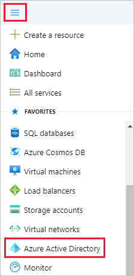
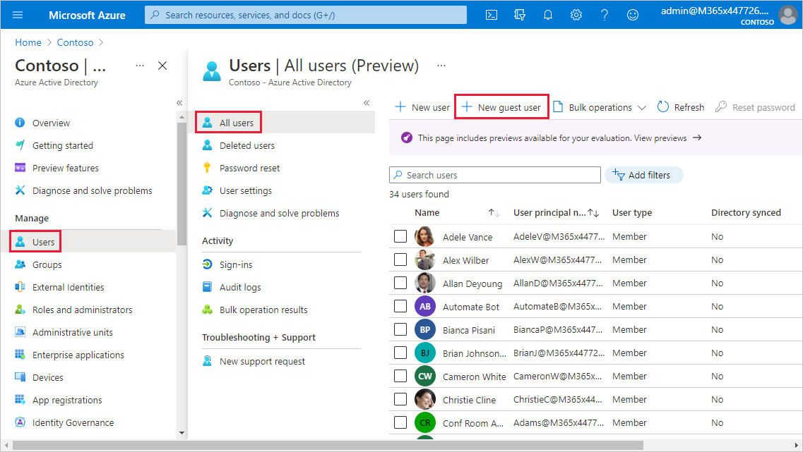
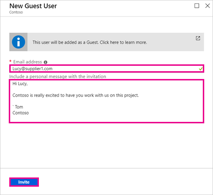
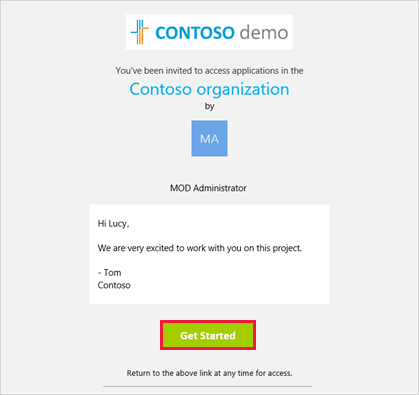
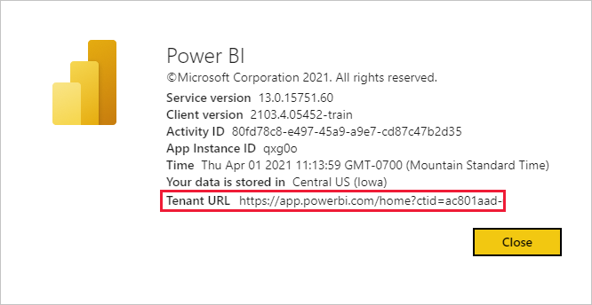

# Distribute Power BI content to external guest users with Azure AD B2B

Power BI enables sharing content with external guest users through Azure Active Directory Business-to-business (Azure AD B2B). By using Azure AD B2B, your organization enables and governs sharing with external users in a central place. By default, external guests have a consumption-only experience. Additionally, you can allow guest users outside your organization to edit and manage content within your organization.

This article provides a basic introduction to Azure AD B2B in Power BI. For more information, see [Distribute Power BI content to external guest users using Azure Active Directory B2B](../guidance/whitepaper-azure-b2b-power-bi.md).

## Enable access

Make sure you enable the [Share content with external users](service-admin-portal.md#export-and-sharing-settings) feature in the Power BI admin portal before inviting guest users. Even when this option is enabled, the user must be granted the Guest Inviter role in Azure Active Directory to invite guest users.  

The option to [allow external guest users to edit and manage content in the organization](service-admin-portal.md#allow-external-guest-users-to-edit-and-manage-content-in-the-organization) lets you give guest users the ability to see and create content in workspaces, including browsing your organization's Power BI. The guest user can only be subscribed to content in workspaces that are backed by a Premium capacity or a Premium Per User (PPU) license. 

> [!NOTE]
> The [Share content with external users](service-admin-portal.md#export-and-sharing-settings) setting controls whether Power BI allows inviting external users to your organization. After an external user accepts the invite, they become an Azure AD B2B guest user in your organization. They appear in people pickers throughout the Power BI experience. If the setting is disabled, existing guest users in your organization continue to have access to any items they already had access to and continue to be listed in people picker experiences. Additionally, if guests are added through the [planned invite](#planned-invites) approach they will also appear in people pickers. To prevent guest users from accessing Power BI, use an Azure AD conditional access policy.

## Who can you invite?

Most email addresses are supported for guest user invitations, including personal email accounts like gmail.com, outlook.com, and hotmail.com. Azure AD B2B calls these addresses *social identities*.

You can't invite users that are associated with a government cloud, like [Power BI for US Government](service-govus-overview.md).

## Invite guest users

Guest users only require invitations the first time you invite them to your organization. To invite users, use planned or ad hoc invites.

To use ad hoc invites, use the following capabilities:

* Report and Dashboard sharing
* App access list

Ad hoc invites aren't supported in the workspace access list. Use the [planned invites approach](#planned-invites) to add these users to your organization. After the external user becomes a guest in your organization, add them to the workspace access list.

### Planned invites

Use a planned invite if you know which users to invite. The Azure portal or PowerShell enables you to send the invites. You must be assigned the user admin role to invite people.

Follow these steps to send an invite in the Azure portal.

1. In the [Azure portal](https://portal.azure.com), select Menu button then select **Azure Active Directory**.

    

1. Under **Manage**, select **Users** > **All users** > **New guest user**.

    

1. Scroll down and enter an **email address** and **personal message**.

    

1. Select **Invite**.

To invite more than one guest user, use PowerShell or create a bulk invite in Azure AD. To use PowerShell for the bulk invite, follow the steps in [Tutorial: Use PowerShell to bulk invite Azure AD B2B collaboration users](/azure/active-directory/b2b/bulk-invite-powershell/). To use the Azure portal for the bulk invite, follow the steps in [Tutorial: Bulk invite Azure AD B2B collaboration users](/azure/active-directory/b2b/tutorial-bulk-invite/).

The guest user must select **Get Started** in the email invitation they receive. The guest user is then added to the organization.

### Ad hoc invites

To invite an external user at any time, add them to your dashboard or report through the share feature or to your app through the access page. Here is an example of what to do when inviting an external user to use an app.

The guest user gets an email indicating that you shared the app with them.

The guest user must sign in with their organization email address. They'll receive a prompt to accept the invitation after signing in. After signing in, the app opens for the guest user. To return to the app, they should bookmark the link or save the email.

## Licensing

The guest user must have the proper licensing in place to view the content that you shared. There are a few ways to make sure the user has a proper license: use Power BI Premium, assign a Power BI Pro license, get a Premium Per User (PPU) license, or use the guest's Power BI Pro license.

[Guest users who can edit and manage content in the organization](service-admin-portal.md#allow-external-guest-users-to-edit-and-manage-content-in-the-organization) need a Power BI Pro or Premium Per User (PPU) license to contribute content to workspaces or share content with others.

### Use Power BI Premium

Assigning the workspace to [Power BI Premium capacity](service-premium-what-is.md) lets the guest user use the app without requiring a Power BI Pro license. Power BI Premium also lets apps take advantage of other capabilities like increased refresh rates and large model sizes.

### Assign a Power BI Pro license to guest user

Assigning a Power BI Pro license from your organization to a guest user lets that guest user view content shared with them. For more information about assigning licenses, see [Assign licenses to users on the Licenses page](/office365/admin/manage/assign-licenses-to-users#assign-licenses-to-users-on-the-licenses-page). Before assigning Pro licenses to guest users, consult the [Product Terms site](https://www.microsoft.com/licensing/terms) to ensure you're in compliance with the terms of your licensing agreement with Microsoft.

### Guest user brings their own Power BI Pro license

The guest user may already have a Power BI Pro or Premium Per User (PPU) license that was assigned to them through their own organization.

## Guest users who can edit and manage content

When using the [allow external guest users to edit and manage content in the organization](service-admin-portal.md#allow-external-guest-users-to-edit-and-manage-content-in-the-organization) feature, the specified guest users get additional access to your organization's Power BI. Allowed guests can see any content that they have permissions for, access Home, browse workspaces, install apps, see where they are on the access list, and contribute content to workspaces. They can create, or be an Admin of, workspaces that use the new workspace experience. Some limitations apply. The Considerations and Limitations section lists those restrictions.

To help allowed guests sign in to Power BI, provide them with the Tenant URL. To find the tenant URL, follow these steps.

1. In the Power BI service, in the header menu, select help (**?**), then select **About Power BI**.

2. Look for the value next to **Tenant URL**. Share the tenant URL with your allowed guest users.

    

## Considerations and Limitations

* By default, external Azure AD B2B limits guests to consumption of content only. External Azure AD B2B guests can view apps, dashboards, reports, and export data. They can't access workspaces or publish their own content. To remove these restrictions, you can use the [Allow external guest users to edit and manage content in the organization](service-admin-portal.md#allow-external-guest-users-to-edit-and-manage-content-in-the-organization) feature.

* To invite guest users, a Power BI Pro or Premium Per User (PPU) license is needed. Pro Trial users can't invite guest users in Power BI.

* Some experiences are not available to [guest users who can edit and manage content in the organization](service-admin-portal.md#allow-external-guest-users-to-edit-and-manage-content-in-the-organization). To update or publish reports, guest users need to use the Power BI service, including Get Data, to upload Power BI Desktop files.  The following experiences aren't supported:
  * Direct publishing from Power BI desktop to the Power BI service
  * Guest users can't use Power BI desktop to connect to service datasets in the Power BI service
  * Classic workspaces tied to Microsoft 365 Groups
    * Guest users can't create or be Admins of these workspaces
    * Guest users can be members
  * Sending ad hoc invites isn't supported for workspace access lists
  * Power BI Publisher for Excel isn't supported for guest users
  * Guest users can't install a Power BI Gateway and connect it to your organization
  * Guest users can't install apps publish to the entire organization
  * Guest users can't use, create, update, or install organizational content packs
  * Guest users can't use Analyze in Excel
  * Guest users can't be @mentioned in commenting
  * Guest users can't create subscriptions
  * Guest users who use this capability should have a work or school account

* Guest users using social identities will experience more limitations because of sign-in restrictions.
  * They can use consumption experiences in the Power BI service through a web browser
  * They can't use the Power BI Mobile apps
  * They won't be able to sign in where a work or school account is required

* This feature isn't currently available with the Power BI SharePoint Online report web part.

* There are Azure Active Directory settings that can limit what external guest users can do within your overall organization. Those settings also apply to your Power BI environment. The following documentation discusses the settings:
  * [Manage External Collaboration Settings](/azure/active-directory/b2b/delegate-invitations#configure-b2b-external-collaboration-settings)
  * [Allow or block invitations to B2B users from specific organizations](/azure/active-directory/b2b/allow-deny-list)
  * [Use Conditional Access to allow or block access](/azure/active-directory/conditional-access/concept-conditional-access-cloud-apps)

* You can share content from a government cloud, like GCC, to an external commercial cloud user. However, the guest user can't use their own license. The content has to be in capacity assigned to Premium to enable access. Or, you can assign a Power BI Pro license to the guest account.

* Sharing outside your organization isn't supported for national clouds, like the Germany or China cloud instances. Instead, create user accounts in your organization that external users can use to access the content.

* If you share directly to a guest user, Power BI will send them an email with the link. To avoid sending an email, add the guest user to a security group and share to the security group.  

## Next steps

For more detailed info, including how row-level security works, check out the whitepaper: [Distribute Power BI content to external guest users using Azure AD B2B](../guidance/whitepaper-azure-b2b-power-bi.md).

For information about Azure AD B2B, see [What is Azure AD B2B collaboration?](/azure/active-directory/active-directory-b2b-what-is-azure-ad-b2b/).
