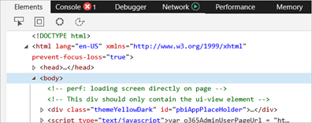
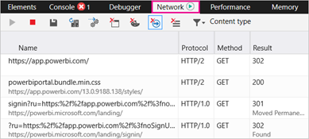

# Capture diagnostic information for Support from the Power BI service

If you need to contact Microsoft Support for help with a problem you're having with the Power BI service, we recommend you first collect some additional information from your browser session. A browser trace is a diagnostic file that can provide important details about what is happening in the Power BI service when the problem occurs.

Power BI admins can use the **Help + support** experience in the [Power Platform admin center](https://admin.powerplatform.microsoft.com/) to get self-help solutions and to contact Support. The diagnostic files that you collect using the steps below can be attached to your support request to help with troubleshooting. For additional support options, see [Power BI support options](service-support-options.md).

To collect a browser trace and other session information to send to Support, follow the steps below that are specific to the browser you use.

## Collect a browser trace

> [!IMPORTANT]
>Sign in to the [Power BI service](https://app.powerbi.com) *before* you start to collect browser trace information. This step is important to make sure that the trace information doesn't include sensitive information related to your sign-in.

#### [Google Chrome or Microsoft Edge](#tab/google-chrome-or-microsoft-edge)

Google Chrome and Microsoft Edge (Chromium) are both based on the [Chromium open source project](https://www.chromium.org/Home). The following steps show how to use the developer tools, which are very similar in the two browsers. For more information, see [Chrome DevTools](https://developers.google.com/web/tools/chrome-devtools) and [Microsoft Edge (Chromium) Developer Tools](/microsoft-edge/devtools-guide-chromium).

1. After signing in, press F12 on your keyboard. Or, in Microsoft Edge select **Settings and more (...)** > **More tools** > **Developer tools**. In Google Chrome, select **Customize and control Google Chrome** :::image type="content" source="media/service-admin-capturing-additional-diagnostic-information-for-power-bi/chromium-icon-settings.png" alt-text="Google Chrome settings menu." border="false"::: > **More tools** > **Developer tools**.
1. Prepare to collect the browser trace by setting trace options. You will also stop and clear any information that was collected before you start to reproduce the problem. By default, the browser keeps trace information only for the page that's currently loaded. Follow these steps to set up the browser to keep all trace information, even if your repro goes to more than one page:
    1. In the **Developer tools** window, select the **Network** tab. Then, select **Preserve log**.
    
       :::image type="content" source="media/service-admin-capturing-additional-diagnostic-information-for-power-bi/browsertrace-preservelog.png" alt-text="Developer tools with network tab and preserve log selected." :::

     2. Select the **Console** tab, then select **Settings** > **Preserve log**. 
   
           :::image type="content" source="media/service-admin-capturing-additional-diagnostic-information-for-power-bi/browsertrace-consolesettings.png" alt-text="Developer tools with console tab and preserve log selected." :::

        Select **Settings** again to close the **Console settings**.

     3. Next, stop and clear any recording in progress. Select the **Network** tab, select **Stop recording network log**, then clear the log.
   
           :::image type="content" source="media/service-admin-capturing-additional-diagnostic-information-for-power-bi/browsertrace-stoprecording.png" alt-text="Developer tools with network tab  and stop and clear recording options selected." :::
     
2. Now, you'll reproduce the problem that you were having in the Power BI service. To start, in **Developer tools** select the **Network** tab. Select **Record network log**. Refresh the browser page. Reproduce the steps that resulted in the problem you need help with.

     :::image type="content" source="media/service-admin-capturing-additional-diagnostic-information-for-power-bi/browsertrace-preservelog.png" alt-text="Developer tools with network tab and preserve log selected." :::

    As you reproduce the problem, you will see output similar to the following image in the **Developer tools** window.

    :::image type="content" source="media/service-admin-capturing-additional-diagnostic-information-for-power-bi/browsertrace-output.png" alt-text="Developer tools with network tab displaying session output." :::
    

#### [Apple Safari](#tab/apple-safari)

#### [Firefox](#tab/firefox)

---

After you have collected the diagnostic files, you can attach them to 
## Next steps

1. Browse to [Power BI](https://app.powerbi.com) with Microsoft Edge or Internet Explorer.

1. Press **F12** to open the Microsoft Edge developer tools.

   

1. Select the **Network** tab. It will list traffic it has already captured.

   

    You can:

    * Browse within the window and reproduce any problem you may come across.

    * Hide and show the developer tools window at any time during the session by pressing F12.

1. To stop profiling the session, you can select the red square on the **Network** tab of the developer tools area.

   

1. Select the diskette icon to export the data as an HTTP Archive (HAR) file.

   

1. Provide a file name and save the HAR file.

    The HAR file will contain all the information about network requests between the browser window and Power BI including:

    * The activity IDs for each request.

    * The precise timestamp for each request.

    * Any error information returned to the client.

    This trace will also contain the data used to populate the visuals shown on the screen.

1. You can provide the HAR file to support for review.

More questions? [Try asking the Power BI Community](https://community.powerbi.com/)
